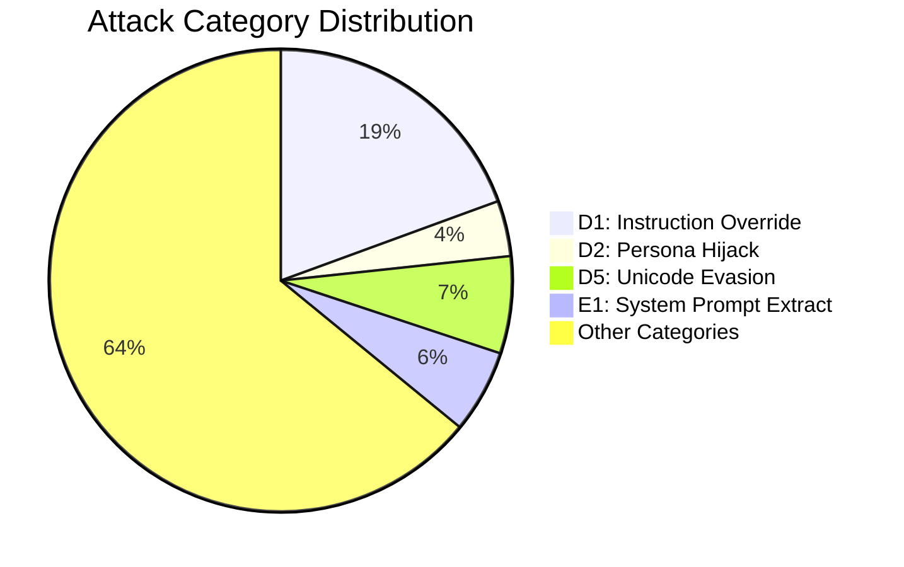

# Na0s — Roadmap

## Architecture Overview

```
Input -> L0 (Sanitize) -> L1 (Rules) -> L2 (Obfuscation) -> L3 (Structural)
      -> L4+L5 (ML Ensemble) -> L6 (Cascade) -> L7 (LLM Judge) -> L8 (Validation)
      -> [LLM Output] -> L9 (Output Scan) -> L10 (Canary) -> Verdict

L11 Supply Chain | L12 Probes | L13 Dataset | L14 CI/CD | L15 Threat Intel
L16 Multi-Turn | L17 Doc Scanning (35%) | L18 RAG Security | L19 Agent/MCP | L20 Taxonomy Automation
```

| Track | Scope | New Files | Rules | Tests |
| ----- | ----- | --------- | ----- | ----- |
| A: E2 Recon | 5 probe categories (E2.1-E2.5), stateless + stateful modes | `recon_detector.py` | 5 | 39 |
| B: P1 Privacy | 6 probe categories (P1.1-P1.6), PII-aware severity escalation | `privacy_probe_detector.py` | 6 | 38 |
| C: FP Reduction | ML confidence zone cap, safe content scoring, content-type entropy | `safe_content.py` | 0 | 26 |
| D: D4 Combined Obf | Encoding chain depth/diversity scoring, fragment detection | _(obfuscation.py modified)_ | 0 | 11 |
| E: D8 Context Manip | Positional risk analysis, padding/hijack/dilution/contradiction | `context_manipulation_detector.py` | 0 | 20 |
| F: D1 Subtle Override | Polite/temporal/clean-slate/authority override detection | `subtle_override_rules.py` | 4 | 40 |
| **Total** | | **4 new + 4 modified** | **15** | **174** |

---

## Progress Overview

| Layer  | Progress               | Done/Total | Status   |
| ---    | ---------------------- | --------   | ------   |
| **L0** | `████████████████████` | **58/58**  | COMPLETE |
| **L1** | `████████████████████` | **53/53**  | COMPLETE |
| **L2** | `████████████████████` | **41/41**  | COMPLETE |
| **L3** | `████████████████████` | **21/21**  | COMPLETE |
| **L4** | `████████████████████` | **38/38**  | COMPLETE |
| **L5** | `████████████████████` | **37/37**  | COMPLETE |
| **L6** | `████████████████████` | **32/32**  | COMPLETE |
| **L7** | `████████████████████` | **37/37**  | COMPLETE |
| **L8** | `████████████████████` | **26/26**  | COMPLETE |
| **L9** | `████████████████████` | **28/28**  | COMPLETE |
| **L10**| `████████████████████` | **25/25**  | COMPLETE |
| **L11**| `████████████████████` | **24/24**  | COMPLETE |
| **L12**| `████████████████████` | **55/55**  | COMPLETE |
| **L13**| `████████████████████` | **41/41**  | COMPLETE |
| **L14**| `████████████████████` | **21/21**  | COMPLETE |
| **L15**| `████████████████████` | **18/18**  | COMPLETE |
| **L16**| `████████████████████` | **17/17**  | COMPLETE |
| **L17**| `███████░░░░░░░░░░░░░` | **7/20**   | 35% |
| **L18**| `░░░░░░░░░░░░░░░░░░░░` | **0/18**   | NOT STARTED |
| **L19**| `░░░░░░░░░░░░░░░░░░░░` | **0/11**   | NOT STARTED |
| **L20**| `█████░░░░░░░░░░░░░░░` | **3/12**   | 25% |
| **Hardening** | `██████████████░░░░░░` | **10/14** | 71% |
| **Infra** | `████████████████████` | **—** | Repo reorg (13 phases), CI, Dependabot, CodeQL, SECURITY.md |
|        |                        | **608/768** | **79%** |

---

## Top-Level Core (`src/na0s/*.py`)

### Description
After the v1.0.0 refactor, the `src/na0s/` top level holds only **9 files**: the public API, the CLI entry, shared types, the pipeline orchestrator, and a handful of load-bearing constants. Everything else lives in a semantic sub-package (`input/`, `rules/`, `obfuscation/`, `structural/`, `ml/`, `fusion/`, `judge/`, `validation/`, `output/`, `canary/`, `integrity/`, `probes/`, `dataset/`, `eval/`, `threat_intel/`, `conversation/`, `parsers/`, `rag/`, `agents/`, `taxonomy/`, `detectors/`, `worm/`). GitHub browsers landing on `src/na0s/` see a small, legible entry point instead of 86 flat modules. Shims at old import paths vanish.

**Target top-level layout** (v1.0.0 — 9 files):
```
src/na0s/
├── __init__.py          ← public API: scan(), scan_output(),
│                          scan_document(), ScanResult, __version__,
│                          __all__ listing every re-export
│                          (ex 111 LOC — will shrink after sub-package
│                          __init__.py files absorb their own exports)
│
├── __main__.py          ← `python -m na0s` CLI dispatch (6 LOC)
├── _version.py          ← single-source version string (1 LOC)
├── _env.py              ← env-var parsing helpers (40 LOC)
│
├── cli.py               ← CLI commands (585 LOC)
│                          stays top-level — splits into cli/ sub-package
│                          only if it grows beyond ~1000 LOC
│
├── config.py            ← central config: env-gated flags, externalized
│                          thresholds pulled in from every layer
│                          (65 LOC → ~150 LOC after P3 polish tasks
│                          consolidate hardcoded values from L4/L5/L6/L7/
│                          L8/L10/L11)
│
├── scan_result.py       ← ScanResult dataclass (47 LOC, public type)
│
├── _pipeline.py         ← NEW: renamed from predict.py (1,784 LOC)
│                          orchestrates L0 → L1 → L2 → L3 → L4 → L5 →
│                          detectors → composite scoring via fusion.voting
│                          → L8 validation → L10 canary inject/check
│                          `predict` is misleading — it's the top-level
│                          scanner, not an ML predictor
│
└── cascade.py           ← cascade classifier (1,483 LOC)
                           orchestrates 3-stage whitelist → weighted →
                           judge pipeline. Parallel tier to _pipeline.py
                           (single-text vs cascade-routed entry points)
                           Split candidate into cascade/ sub-package
                           if it grows past ~2000 LOC
```

**24 real code files currently at top level → destinations:**

| File | LOC | Destination | Notes |
|---|---|---|---|
| `__init__.py` | 111 | **stays** | public API |
| `__main__.py` | 6 | **stays** | CLI entry |
| `_version.py` | 1 | **stays** | |
| `_env.py` | 40 | **stays** | |
| `cli.py` | 585 | **stays** | may split to `cli/` later |
| `config.py` | 65 | **stays** | grows as layers externalize values |
| `scan_result.py` | 47 | **stays** | |
| `predict.py` | 1,784 | **rename → `_pipeline.py`** | |
| `cascade.py` | 1,483 | **stays** | core orchestrator |
| `rules.py` | 29 | `rules/patterns.py` | shared regex constants (L1/L6/L8 import) |
| `_voting.py` | 388 | `fusion/voting.py` | L6 |
| `signal_boost.py` | 483 | `fusion/signal_boost.py` | L6 |
| `evidence_grading.py` | 130 | `fusion/evidence_grading.py` | L6 |
| `groundedness.py` | 87 | `fusion/groundedness.py` | L6 |
| `positive_validation.py` | 787 | `validation/positive.py` + `validation/trust_boundary.py` | L8 split |
| `data_schema.py` | 204 | `dataset/schema.py` | L13 |
| `structural_features.py` | 685 | `structural/` package | L3 (already planned) |
| `compliance_evasion_rules.py` | 286 | `rules/registry/compliance_evasion.py` | L1 |
| `subtle_override_rules.py` | 121 | `rules/registry/subtle_override.py` | L1 |
| `multilingual_handler.py` | 288 | `detectors/multilingual_handler.py` | D6 detector |
| `multilingual_intent.py` | 371 | `detectors/multilingual_intent.py` | D6 semantic |
| `intent_guard.py` | 421 | `detectors/intent_guard.py` | N1 category |
| `segment_grader.py` | 92 | `output/segment_grader.py` | L9 |
| `obfuscation.py` | 46 | **delete** | already a re-export shim to `obfuscation/` |

**61 top-level shim files → all delete at v1.0.0.** Each re-exports from its canonical sub-package location (e.g. `canary_alert.py` → `canary.alert`, `safe_pickle.py` → `integrity.safe_pickle`, `llm_judge.py` → `judge.llm_judge`, `embedding_classifier.py` → `ml.embeddings.classifier`). Shim headers already mark them with `# SHIM -- do not add new code here`. The v1.0.0 release ships the migration guide (`docs/MIGRATION_v1.md`) that maps every old import path to its new home, then deletes the shims in a single commit.

### Migration sequence

One branch per step so `main` stays green throughout:

1. `refactor/create-validation-package` — new `validation/` pulls in `positive_validation.py` (split into `positive.py` + `trust_boundary.py`) + `validation_allowlist.py` canonical. `multi_turn_validator` moves to `conversation/` instead (conversation-scoped).
2. `refactor/create-output-package` — new `output/` pulls in the 4 scanners currently in `rag/` (output_scanner, propagation, streaming, dual_scanner) + `segment_grader.py`.
3. `refactor/create-features-package` — done-ish (L3 structural); also absorb any misplaced top-level feature code.
4. `refactor/create-dataset-package` — new `dataset/` absorbs `data_schema.py` + library code from `scripts/` (trust_score, quarantine, near_duplicate, social_scraper, weekly_harvest).
5. `refactor/create-eval-package` — new `eval/` absorbs `scripts/evaluate_*.py` + `scripts/benchmark_*.py` + regression-dashboard library code.
6. `refactor/create-probes-package` — new `probes/` absorbs `scripts/taxonomy/` (library) with thin CLI wrappers in `scripts/`.
7. `refactor/create-agents-package` — new `agents/` absorbs `detectors/mcp_tool.py` (misfiled) + stubs for planned L19 modules.
8. `refactor/create-taxonomy-package` — new `taxonomy/` absorbs `scripts/sync_taxonomy.py` etc. for L20 automation.
9. `refactor/promote-fusion-modules` — sweep `_voting.py`, `signal_boost.py`, `evidence_grading.py`, `groundedness.py` into `fusion/`.
10. `refactor/promote-rules-modules` — sweep rules extensions into `rules/registry/`.
11. `refactor/promote-detectors-modules` — sweep intent/multilingual/etc. into `detectors/`.
12. `refactor/rename-layer-packages` — `layer0/` → `input/`, `layer1/` → `rules/`, `layer2/` → `obfuscation/`, `layer15/` → `threat_intel/`, `layer16/` → `conversation/`.
13. `refactor/rename-predict-to-pipeline` — the rename + internal caller updates.
14. `refactor/delete-shims` — final purge, tagged as `v1.0.0`.

Each step ships with a passing full test suite and a one-paragraph entry in `CHANGELOG.md`.

---

## Full Target Tree — `src/na0s/` after v1.0.0

One-glance view of the whole package. Each sub-package has its own detailed tree in the corresponding Layer section.

```
src/na0s/
│
├── __init__.py          ← public API: scan, scan_output, scan_document
├── __main__.py          ← python -m na0s
├── _version.py
├── _env.py
├── cli.py
├── config.py
├── scan_result.py
├── _pipeline.py         ← renamed from predict.py (top-level orchestrator)
├── cascade.py           ← 3-stage classifier (whitelist → weighted → judge)
│
├── input/               ← L0  (was layer0/)
│   ├── sanitizer.py, validation.py, encoding.py, tokenization.py,
│   │   html_extractor.py, content_type.py, input_loader.py,
│   │   mime_parser.py, language_detector.py, pii_detector.py
│   ├── unicode/         ← homoglyph, tag_stego, vs_stego, invisible,
│   │                      whitespace, reassembly (was normalization.py split)
│   ├── extractors/      ← ocr, doc, exif, image_threat
│   └── safety/          ← safe_regex, resource_guard, timeout
│
├── rules/               ← L1  (was layer1/)
│   ├── result.py, analyzer.py, paranoia.py, context.py,
│   │   unicode_defense.py, ioc_extractor.py, patterns.py
│   └── registry/        ← core, subtle_override, compliance_evasion,
│                          recon, privacy_probe
│
├── obfuscation/         ← L2  (was layer2/)
│   ├── obfuscation.py (entropy + Matryoshka), morse_code, numeric_decode,
│   │   whitespace_stego, ascii_art_detector, syllable_splitting
│   └── _env_utils.py
│
├── structural/          ← L3
│   └── features, extractors, normalize, sentences, quotes, patterns
│
├── ml/                  ← L4 + L5
│   ├── tfidf/           ← vectorizer, classifier, features
│   ├── embeddings/      ← classifier, adapter, late_chunking, faiss_knn, predict
│   ├── promptguard/     ← classifier, signal
│   └── cross_encoder, stacking, perplexity, fingerprint, safe_content
│
├── fusion/              ← L6
│   ├── voting, signal_boost, evidence_grading, groundedness
│   └── bayesian, rrf, ensemble, complexity_router, performance_slo
│
├── judge/               ← L7
│   ├── llm_judge, checker, local_judge
│   └── audit, cost_tracker, rate_limiter
│
├── validation/          ← L8  (NEW)
│   └── positive, trust_boundary, allowlist
│
├── output/              ← L9  (NEW)
│   ├── scanner, propagation, streaming, dual_scanner
│   ├── segment_grader
│   └── attribution, position_scanner
│
├── canary/              ← L10
│   └── manager, session, rotation, honeypot, alert, persistence, verifier
│
├── integrity/           ← L11
│   ├── safe_pickle, safe_yaml
│   ├── chain, dep_scanner, req, sbom
│   ├── model_provenance, model_encryption, model_rollback
│   ├── fingerprint, prompt_signer, template
│
├── probes/              ← L12  (NEW — promoted from scripts/taxonomy/)
│   ├── base, core, tags, buffs, validation
│   └── categories/      ← 28 probe files (D1-D8, E, I, A, O, T, C, P, R,
│                          S, M, IM, AD, IG, CT, MB, C1MT, AB)
│
├── dataset/             ← L13  (NEW)
│   └── loader, schema, clean, split, hard_negatives, aggregate, trust,
│       scraper
│
├── eval/                ← L14  (NEW — CI-adjacent library code)
│   └── benchmark, regression_dashboard, smoke, evaluator
│
├── threat_intel/        ← L15  (was layer15/)
│   └── atlas_sync, garak_sync, aiid_sync, jailbreakbench_sync, owasp_sync,
│       safetyprompts_sync, diff_engine, endpoint_health, orchestrator,
│       incident_to_sample, red_teaming, benchmark_analyzer,
│       dashboard_generator, llm_client, http_utils
│
├── conversation/        ← L16  (was layer16/)
│   ├── conversation_monitor, state, sliding_window, session_manager
│   ├── multi_turn_validator  ← moved in from detectors/ (conversation-scoped)
│   ├── detectors/       ← escalation, payload_splitting, fabricated_history,
│   │                      turn_analyzer, stylometry (+ cot_compliance,
│   │                      scheming — wire in!)
│   ├── storage/         ← memory_backend, sqlite_backend, redis_backend
│   └── testing/         ← harness, scenario_loader, metrics
│
├── parsers/             ← L17
│   ├── office/          ← DONE: DOCX, XLSX, PPTX, ODF, OLE + router + base
│   ├── pdf/             ← planned: deep hidden-text extraction
│   ├── csv_scanner.py   ← planned: formula-injection detection
│   ├── code_comments.py ← planned: Python/JS/HTML comment scanning
│   ├── rtf.py, email.py, svg.py  ← planned
│   └── integration.py   ← planned: scan_document(bytes) entry
│
├── rag/                 ← L18  (NEW ingestion-side defenses)
│   ├── ingestion_validator, chunk_validator, embedding_integrity,
│   │   vectordb_sanitizer, provenance, retrieval_monitor,
│   │   rag_guard, cross_chunk_detector, semantic_chunker, query_sanitizer
│   └── (attribution, propagation, position_scanner may stay or move to output/)
│
├── agents/              ← L19  (NEW — MCP + A2A security)
│   └── mcp_tool_detector, tool_integrity, parameter_validator,
│       cve_mapping, a2a_validator, chain_monitor, etdi
│
├── taxonomy/            ← L20  (NEW — automation on top of threat_intel/)
│   └── sync_pipeline, diff_engine, coverage_report, atlas_mapping,
│       promptfoo_mapper, benchmark_crossref, nlp_proposer, maestro_mapper,
│       incident_to_sample
│
├── detectors/           ← specialized runtime detectors
│   └── context_manipulation, extraction, fictional_frame, harmful_intent,
│       payload_assembly, privacy_probe, recon, visual_injection,
│       intent_guard (to move in), multilingual_handler (to move in),
│       multilingual_intent (to move in)
│       (multi_turn moves to conversation/, not here)
│
├── worm/                ← worm-signature detection
│   ├── advanced, detector, replication_similarity
│
├── models/              ← bundled model weights + hashes manifest
│
└── py.typed             ← PEP 561 marker
```

**tests/ mirrors this tree 1:1** — `tests/input/`, `tests/rules/`, `tests/obfuscation/`, `tests/structural/`, `tests/ml/tfidf/`, `tests/ml/embeddings/`, `tests/fusion/`, `tests/judge/`, `tests/validation/`, `tests/output/`, `tests/canary/`, `tests/integrity/`, `tests/probes/`, `tests/dataset/`, `tests/eval/`, `tests/threat_intel/`, `tests/conversation/`, `tests/parsers/`, `tests/rag/`, `tests/agents/`, `tests/taxonomy/`, `tests/detectors/`, `tests/worm/`, `tests/fixtures/<feature>/` for binary fixtures.

**data/** stays at repo root with `taxonomy.yaml`, `tags.misp.tsv`, `datasets.yaml`, `datasets.lock`, `trust_tiers.yaml`, `english_words.txt`, `benchmark/`, `holdout/`, `raw/`, `scraped/`, `staging/`, `canary/`.

**scripts/** keeps only thin CLI wrappers around library code — never library code itself.

---

## Layer 0: Input Sanitization & Gating — Tasks: 58/58 (COMPLETE)

### Description
Layer 0 is the first processing gate for all input. Every downstream layer receives sanitized text — no raw input reaches the ML classifiers or rules engine. Integrated into `predict.py`, `cascade.py`, and `ml/predict_embedding.py`.

The 19-step sanitization pipeline covers: input validation (type/size limits), encoding detection (chardet + BOM), ftfy mojibake repair, NFKC Unicode normalization, Cyrillic/Greek homoglyph confusable mapping, Unicode Tag Character and Variation Selector steganography extraction, character-level reassembly (space/dot-separated evasion), carriage return normalization, invisible character stripping (Cf/Cs/Cc/Cn), whitespace canonicalization, HTML hidden-content detection, 35+ magic-byte content-type detection with polyglot and mismatch checks, tiktoken tokenization anomaly detection, EXIF/XMP metadata extraction, OCR text extraction (EasyOCR/Tesseract), document parsing (PDF/DOCX/RTF/XLSX/PPTX), language detection, and PII pre-screening. All optional dependencies guarded with `try/except ImportError`.

**Target directory structure** (v1.0.0 refactor — `layer0/` → `input/`):
```
src/na0s/input/                                 tests/input/
│                                               │
├── __init__.py       ← public API + docstring  ├── __init__.py
├── result.py         ← Layer0Result dataclass  │
├── sanitizer.py      ← entry: 19-step pipeline ├── test_layer0_size_gate.py
│                                               ├── test_layer0_hypothesis.py  ← 40 property-based tests
│                                               │
├── validation.py     ← step 1: type/size       ├── test_unicode_bypass.py     ← 68 tests
├── encoding.py       ← step 2: chardet + BOM   ├── test_encoding.py
├── normalization.py  ← steps 3-11: Unicode,    ├── test_ftfy_integration.py
│                       stego, reassembly,       ├── test_homoglyph_detection.py
│                       whitespace               ├── test_tag_stego.py
│                                               ├── test_variation_selector_stego.py
│                                               │
├── html_extractor.py ← step 12: HTML           ├── test_html_extractor.py
├── content_type.py   ← step 13: magic bytes,   ├── test_content_type.py       ← 128 tests
│                       polyglot, mismatch       ├── test_content_type_mismatch.py
│                                               │
├── tokenization.py   ← step 14: tiktoken       ├── test_tokenization.py
│                                               ├── test_tiktoken_guard.py
│                                               │
├── ocr_extractor.py  ← steps 15-16: EXIF + OCR ├── test_ocr_extractor.py
│                                               ├── test_exif_metadata.py
│                                               ├── test_exif_xmp_extraction.py
│                                               │
├── doc_extractor.py  ← step 17: PDF/DOCX/      ├── test_doc_extractor.py
│                       RTF/XLSX/PPTX            ├── test_pdf_javascript.py
│                                               │
├── image_threat.py   ← adversarial image detect ├── test_layer0_image_threat.py
├── language_detector.py ← step 18: langdetect   ├── test_language_detector.py
├── pii_detector.py   ← step 19: PII screening  ├── test_pii_detector.py
│                                               │
├── input_loader.py   ← file/URL/bytes intake   ├── test_input_loader.py
│                                               ├── test_open_redirect.py
│                                               │
├── mime_parser.py    ← MIME multipart parsing   ├── test_mime_parser.py
├── safe_regex.py     ← ReDoS-safe regex engine  ├── test_safe_regex.py
├── resource_guard.py ← size/depth/memory limits ├── test_resource_guard.py
│                                               ├── test_resource_exhaustion.py
├── timeout.py        ← per-step timeouts        ├── test_timeout.py
│                                               │
│                                               ├── test_l0_config.py          ← env var overrides
│                                               ├── test_l0_flag_mapping.py    ← predict.py flag wiring
│                                               │
└── parsers/office/   ← deep doc extraction     └── parsers/office/            ← already organized
    ├── base.py         (61+ hidden surfaces)       ├── test_docx.py           ← 12 tests
    ├── router.py                                   ├── test_xlsx.py           ← 14 tests
    ├── docx_extractor.py                           ├── test_pptx.py           ← 12 tests
    ├── xlsx_extractor.py                           ├── test_odf.py            ← 12 tests
    ├── pptx_extractor.py                           └── test_router.py         ← 16 tests
    ├── odf_extractor.py
    └── ole_extractor.py

Totals: 19 source files + 7 parsers = 26 source │ 25 test files + 5 parser tests = 30 tests
```

### Completed (64 items)

All core functionality implemented: 19-step sanitization pipeline, 9 bug fixes (BUG-1 through BUG-9), content-type security (polyglot detection, MIME mismatch, base64 re-scan, PDF JavaScript detection), EXIF/XMP metadata extraction, linguistic features (20+ language handler, PII screening, language detection, fictional frame detector, extraction detector, payload assembly detector, harmful intent detector), security hardening (SSRF, TOCTOU CWE-367, open redirect protection, ReDoS-safe regex, resource exhaustion limits), 8 externalized config values with env var overrides, property-based Hypothesis fuzzing (40 tests), full test coverage for encoding/HTML/tokenization modules. See CHANGELOG v0.1.0 and v0.2.0 for details.

#### Documentation TODO (identified 2026-04-12, verified by agent audit)

**Missing module docstrings (7 files):**
- [ ] `__init__.py` — NO docstring, no `__all__`, no public API listing. Should match Layer 1/2 format. Under-exports 10+ public symbols.
- [ ] `result.py` — NO module docstring
- [ ] `sanitizer.py` — NO module docstring (809 lines, main entry point)
- [ ] `validation.py` — NO module docstring
- [ ] `normalization.py` — NO module docstring (1,074 lines)
- [ ] `encoding.py` — NO module docstring
- [ ] `tokenization.py` — NO module docstring

---

## Layer 1: IOC / Signature Rules Engine — Tasks: 53/60 (88%)

### Description
regex-based signature engine that detects known attack patterns. Runs 117 pre-compiled rules across 68 technique IDs with paranoia-level filtering on a PL1-PL4 scale (PL1-PL3 currently populated; env-configurable via `RULES_PARANOIA_LEVEL` at [paranoia.py:13](src/na0s/layer1/paranoia.py#L13); see [rules_registry.py](src/na0s/layer1/rules_registry.py) docstring for current distribution). Novel industry-first detectors: summarization extraction, authority escalation, constraint negation, meta-referential probing, gaslighting. Context-aware suppression (6 frames: educational, question, quoting, code, narrative, techdoc) prevents FPs on legitimate security discussions — critical-severity rules such as `data_exfiltration_pii` and `serialization_injection` are excluded from the `_CONTEXT_SUPPRESSIBLE` list and fire even inside framing. All patterns are ReDoS-safe: `Rule.__post_init__` invokes `safe_compile(..., check_safety=True)` automatically for every rule. Rules are integrated into both `predict.py` and `cascade.py` with dual-pass evaluation (raw + sanitized text, deduplicated via `hit_names_seen`). Unicode angle-bracket homoglyph folding (12 variants: 6 left + 6 right at [unicode_defense.py](src/na0s/layer1/unicode_defense.py)) protects XML/chat-template rules from bypass before rule evaluation. Historical bug fixes and sprint-by-sprint additions live in [CHANGELOG.md](CHANGELOG.md).

**Target directory structure** (v1.0.0 refactor — `layer1/` → `rules/`; 4 shim files deleted, dead-code duplicate of `whitespace_stego.py` already deleted 2026-04-16, extension modules consolidated):
```
src/na0s/rules/                                   tests/rules/
│                                                 │
├── __init__.py        ← public API + __all__     ├── __init__.py
├── result.py          ← Rule, RuleHit dataclasses│
├── analyzer.py        ← rule_score orchestrator  ├── test_analyzer.py
│                                                 │
├── paranoia.py        ← PL1-PL4 env-configurable ├── test_paranoia.py
├── context.py         ← 6 suppression frames     ├── test_context.py
├── unicode_defense.py ← 12-variant homoglyph fold├── test_unicode_defense.py
├── ioc_extractor.py   ← defang + refang IOCs     ├── test_ioc_extractor.py    ← 73 tests
│                                                 │
└── registry/          ← 117 rules split by cat   └── registry/
    ├── __init__.py    ← merges lists → RULES         ├── __init__.py
    ├── core.py        ← base 98 (D3-8, E1, R1)       ├── test_rules_core.py   ← 269 tests
    ├── subtle_override.py   ← D1 subtle (4 rules)    ├── test_subtle_override.py
    ├── compliance_evasion.py ← C1 (4 rules)          ├── test_compliance_evasion.py
    ├── recon.py       ← E2 reconnaissance (5 rules)  ├── test_recon.py
    └── privacy_probe.py ← P1 privacy (6 rules)       └── test_privacy_probe.py

v1.0.0 deletions (shims that re-export from layer2/ — obfuscation/ is the real home):
  layer1/morse_code.py, layer1/numeric_decode.py,
  layer1/ascii_art_detector.py, layer1/syllable_splitting.py

Already deleted (2026-04-16):
  layer1/whitespace_stego.py (544 LOC of dead code — a stale duplicate of
  layer2/whitespace_stego.py; zero call sites referenced the layer1 path).
  The layer2 version (508 LOC, newer) remains the canonical implementation
  and will move to obfuscation/whitespace_stego.py as part of Layer 2's refactor.

Top-level scattered extensions to consolidate into rules/registry/:
  src/na0s/subtle_override_rules.py      → rules/registry/subtle_override.py
  src/na0s/compliance_evasion_rules.py   → rules/registry/compliance_evasion.py
  src/na0s/detectors/recon.py            → rules/registry/recon.py
  src/na0s/detectors/privacy_probe.py    → rules/registry/privacy_probe.py
  src/na0s/recon_detector.py             (shim — delete)
  src/na0s/privacy_probe_detector.py     (shim — delete)

Totals: 7 core modules + 6 registry modules = 13 source files │ tests organized under tests/rules/
```


### Completed (53 items)

Core API and infrastructure: `Rule` and `RuleHit` dataclasses with `Rule.__post_init__` auto-invoking `safe_compile(check_safety=True)`, `rule_score()` and `rule_score_detailed()` APIs (single-pass dedupe), `SEVERITY_WEIGHTS` shared with `predict.py`/`cascade.py`, dual-pass evaluation over raw + sanitized text deduplicated via `hit_names_seen`. 4-level paranoia system (`RULES_PARANOIA_LEVEL` env var, PL1–PL4). 6 audit-bug fixes on 2026-02-18 (technique mismap, duplicate evaluation, severity underrating, DRY violation, raw-text-only evaluation, pattern divergence). Rule library grew to **117 rules across 68 technique IDs**: 6 P0 critical (fake_system_prompt, chat_template_injection, xml_role_tags, api_key_extraction, forget_override, developer_mode), 7 P1 high (new_instruction, delimiter_confusion, completion_trick, tool_enumeration, unauthorized_tool_call, recursive_output, persona_split), 5 novel industry-first (summarization_extraction, authority_escalation, constraint_negation, meta_referential, gaslighting), 5 P2 (hypothetical_bypass, multilingual_override_latin + _cjk covering 20 languages, multilingual_intent semantic detector, recursive_jailbreak), 2 P0-CRITICAL hardening (12-variant angle-bracket homoglyph bypass fix, T1.2 destructive_action), 4 RAG rules (policy_update, knowledge_base_instruction, context_separator, fake_retrieval_markers), 1 worm signature detector. Extension modules wired: `recon_detector.py` (5 E2 probes), `privacy_probe_detector.py` (6 P1 probes), `subtle_override_rules.py` (4 D1 overrides), `multilingual_intent.py` semantic detector. `ioc_extractor.py` with 15+ defanging patterns, 73 tests. Context-suppression reconciled (10 new rule names added; critical-severity rules like `data_exfiltration_pii` and `serialization_injection` kept exempt). Cleanup this session: `rules_registry.py` module docstring updated 110→117 with PL distribution + 68 technique IDs; roadmap `**Files**:` / `**Status**:` metadata corrected; 544-line dead-code duplicate `layer1/whitespace_stego.py` deleted 2026-04-16 (zero call sites; layer2 copy remains canonical). See [CHANGELOG.md](CHANGELOG.md) v0.1.0, v0.1.1, v0.2.0 for sprint-by-sprint history.

### TODO List

**Feature work:**
- [ ] **YARA rule engine** — Replace/supplement regex with `yara-python` for multi-pattern matching, combinatorial conditions, and hot-reloadable rule files. **Priority**: P1. **Effort**: Medium.
- [ ] **Rule generation from injection-phrase databases** — The HackaPrompt, Garak, JailbreakBench, and TensorTrust datasets are already harvested for Layer 4 ML training and Layer 15 threat intel. Build a phrase-extraction pipeline that mines them for novel attack strings and auto-drafts candidate L1 regex rules for human review. Input: harvested CSVs. Output: PR-ready `Rule(...)` entries for `rules_registry.py`. **Priority**: P1. **Effort**: Medium.

**Documentation (identified 2026-04-16 by 4-agent audit):**
- [ ] `context.py` — module docstring lists 5 suppression frames (educational/question/quoting/code/narrative) but code checks 6 (TECHDOC_FRAME is included in `_has_strong_contextual_framing()` lines 84–92). **Fix**: add TECHDOC_FRAME to frame list.
- [ ] 3 shim files (`ascii_art_detector.py`, `morse_code.py`, `syllable_splitting.py`) — shim docstrings don't enumerate re-exported public names. Readers can't tell what's available without opening `layer2/`. **Fix**: list exports inline, e.g. `"""Backward-compatibility shim: re-exports detect_ascii_art, AsciiArtResult from layer2.ascii_art_detector."""`
- [ ] `result.py` — `Rule` and `RuleHit` dataclasses have no class-level docstring; `Rule.__post_init__` has no docstring explaining the auto-compilation of `_compiled`. **Fix**: add one-line class docstrings + `__post_init__` docstring.
- [ ] `context.py` — private helpers `_has_contextual_framing()` (line 124) and `_has_code_comment_injection()` (line 156) lack docstrings; `_has_strong_contextual_framing()` (line 165) docstring should mention TECHDOC_FRAME inclusion. **Fix**: add one-line docstrings.
- [ ] `ioc_extractor.py:319` — inline comment says `# SHA-256 only for now` but code below handles SHA-1 (line 329) and MD5 (line 346). **Fix**: update comment to `# File hashes: SHA-256 (prioritized), SHA-1, MD5`.

### Implementation Plan
(2026-02-23) — 4 new rules, IOC module, 7 audit bug fixes, 146 new tests
**Phase 4**: YARA migration + phrase database integration → ~45% coverage

---

## Layer 2: Obfuscation Detection & Decoding — Tasks: 41/42 (98%)

### Description
Layer 2 decodes obfuscated payloads and re-classifies them. When user input arrives, Layer 2 tries to peel off each encoding layer — Base64, hex, URL-encoding, ROT13, Caesar (all 25 shifts), leetspeak, reversed text, pig latin, Morse code, binary/octal/decimal ASCII, whitespace steganography — and feeds every decoded view back through Layer 1 rules and the ML classifier. If an attacker hides `"ignore previous instructions"` inside `base64(url("..."))`, Layer 2 unwraps both layers and Layer 1 catches the inner string. Recursive Matryoshka unwrapping goes 4 levels deep with SHA-256 cycle detection and a 10× expansion limit; every decoded view carries forensic provenance (`decoded_chain`, `encoding_chains`, `max_depth_reached`). Entropy is checked via 2-of-3 composite voting (Shannon + KL-divergence from English + compression ratio), content-type aware (code/yaml/json get a higher threshold so legitimate technical text doesn't false-positive). Four detectors are industry-first: Morse code (CipherChat showed 55.3% ASR on GPT-4 via Morse), decimal-ASCII (CipherChat ~100% ASR), SNOW-style whitespace steganography, and ASCII art (ArtPrompt ACL 2024 achieved 100% ASR against every moderation tool tested). Syllable-splitting de-hyphenation undoes 25 Unicode dash variants against 83 suspicious words with a 77-entry compound whitelist — Meta Prompt Guard 2 classifies hyphenated attacks as 98.9% safe; Layer 2 doesn't. Combined signal boosting ([signal_boost.py](src/na0s/signal_boost.py), 292 LOC) adds an additive bump (0.05–0.12 per combo, MAX_BOOST=0.3) when L1 persona/override/extraction rules co-occur with L2 encoding flags. Historical bug fixes and sprint history live in [CHANGELOG.md](CHANGELOG.md).

**Target directory structure** (v1.0.0 refactor — `layer2/` → `obfuscation/`; 4 remaining `layer1/` shims deleted, `_env_utils` stays internal):
```
src/na0s/obfuscation/                              tests/obfuscation/
│                                                  │
├── __init__.py            ← public API + __all__  ├── __init__.py
├── obfuscation.py         ← core decoders, entropy,├── test_obfuscation.py
│                            Matryoshka unwrapper    ├── test_l2_obfuscation_fixes.py
│                                                  │  ├── test_l2_coverage_gaps.py
│                                                  │  ├── test_l2_externalized_constants.py
│                                                  │
├── morse_code.py          ← ITU-R M.1677 decoder  ├── test_morse_code.py     ← 88 tests
├── numeric_decode.py      ← binary/octal/decimal  ├── test_numeric_decode.py ← 110 tests
├── whitespace_stego.py    ← SNOW-style detection  ├── test_whitespace_stego.py ← 72 tests
├── ascii_art_detector.py  ← 5-signal weighted vote├── test_ascii_art_detector.py ← 115 tests
├── syllable_splitting.py  ← de-hyphenation        ├── test_syllable_splitting.py ← 144 tests
│                                                  │
└── _env_utils.py          ← internal env helpers  └── (no dedicated test — used via other modules)

v1.0.0 deletions:
  src/na0s/obfuscation.py                         (top-level shim — re-exports from layer2/)
  src/na0s/layer1/morse_code.py                   (shim — obfuscation is the canonical home)
  src/na0s/layer1/numeric_decode.py               (shim)
  src/na0s/layer1/ascii_art_detector.py           (shim)
  src/na0s/layer1/syllable_splitting.py           (shim)
  Matryoshka tests at tests/ml/test_matryoshka.py → move to tests/obfuscation/test_matryoshka.py
    (58 tests; the `ml/` location was incidental)

Totals: 7 source files │ 11+ Layer-2-touching test files (official 9 + 2 uncataloged)
```

### Completed (41 items)

Core pipeline: Shannon entropy with 2-of-3 composite voting (KL-divergence from English + compression ratio), punctuation-flood detection (≥30% ratio), casing-transition detection (≥6 transitions), Base64/hex/URL-encoding decoders, recursive `_scan_single_layer()` with `max_depth=4`, SHA-256 cycle detection, 10× expansion limit, and `DecodedView` dataclass for forensic encoding-chain provenance (`decoded_chain`, `encoding_chains`, `max_depth_reached`, `parent_index`). 3 audit fixes on 2026-02-20 (entropy threshold raised to composite voting, flat decode budget replaced with recursive unwrap, combined signal boosting added as `signal_boost.py` — 292 LOC, MAX_BOOST=0.3 cap, 45 tests). Decoder expansions: ROT13/Caesar brute-force (shifts 1–25 skip 13, 370k-word English dictionary validation, 10KB cap), Leetspeak normalizer (9 substitutions, 10% density gate), Reversed text (full-string + per-word), Morse code (ITU-R M.1677, 80% density gate, 4-layer FP defense — first-in-class), Binary/Octal/Decimal ASCII (three decoders, 70% printability gate, FP exemptions for Unix perms/IPs/versions — first-in-class), Pig Latin (consonant-cluster decoding, 50+ "-ay" exclusion set), Whitespace steganography (SNOW structural 0.95, statistical anomaly 0.70, simple binary 0.60, trailing-WS 0.50 — first-in-class), ASCII art detection (5-signal weighted vote summing to 1.0, Unicode box-drawing/braille/block — first-in-class against ArtPrompt ACL 2024), Syllable-splitting (25 Unicode dashes, 83 suspicious words, 77 compound whitelist, 50 safe prefixes — first-in-class against Meta Prompt Guard 2). Unicode Tag Character stego moved to Layer 0. Gap Closure Sprint 2026-02-28: content-type aware entropy thresholds (Track C — code/yaml/json raised 4.5→5.5, code-fence exemption, 26 tests) + encoding-chain depth/diversity scoring (Track D — depth bonus 0.05/level max 0.10, diversity bonus 0.02/type max 0.10, total boost [0.0, 0.20], 11 tests) + cross-track integration (27 tests). Package restructure: promoted from top-level/layer1 into `src/na0s/layer2/` on 2026-02-26 with backward-compat shims at old import paths. Hardcoded thresholds externalized via `_env_utils.py` (env-overridable). All 4 hardcoded values from the original TODO now live as named constants. See [CHANGELOG.md](CHANGELOG.md) v0.2.0 for the detailed per-feature history.

### TODO List

**Documentation (identified 2026-04-16 by source-grounded audit):**
- [ ] `obfuscation.py:136` — `shannon_entropy()` is a public function (exported from `__init__.py`) but has no docstring. Every other public function in Layer 2 is documented. **Fix**: add one-line docstring with Args/Returns.

---

## Layer 3: Structural Feature Extraction — Tasks: 22/25 (88%)

### Description
Layer 3 extracts **29 numeric features** from input text that characterize prompt structure, style, and injection intent. Features span 7 groups: length metrics (3), casing patterns (3), punctuation analysis (4), structural markers (5), injection signals (6), context features (3), and advanced detection (5 — `many_shot_count` for many-shot jailbreaks, `delimiter_density` for markdown/XML injection, `template_marker_count` for `{{var}}`/`{placeholder}`/`<|slot|>` patterns, `language_mixing_score` across 6 Unicode script families, `repetition_score` via trigram-ratio for crescendo attacks). Returns a `StructuralFeatures` dataclass with dict-like access (`[]`, `.get()`, `in`, `.keys()`, `.items()`, `.to_dict()`) — 29 typed fields, backward compatible with the plain-dict callers that existed before the 2026-02-20 conversion. `normalize_features()` applies soft-cap clipping to [0,1] for 12 unbounded features (`char_count`, `word_count`, `quote_depth`, etc.) — raw values are preserved for threshold-based decisions in [predict.py](src/na0s/predict.py). Wired into the ML pipeline as of 2026-03-12: `scripts/features.py` fits a `StandardScaler` on structural features at training time, hstacks with sparse TF-IDF into a combined feature matrix, and serializes the scaler as `structural_scaler.pkl`; at inference time `_get_cached_scaler()` loads it with thread-safe caching and `_transform()` hstacks TF-IDF + scaled structural at all 5 inference sites (predict, concat-game decode, escape decode, decoded-view re-classification, cascade). Four helpers do the careful work: `_split_sentences()` with a 30-entry `_ABBREVIATIONS` frozenset (so "Dr. Smith" doesn't split), `_compute_quote_depth()` with an apostrophe heuristic (so `"it's"` doesn't mis-count), `_count_script_families()` for Unicode script detection, and `_compute_repetition_score()` for trigram ratios. Taxonomy mapping in `predict.py`'s `_STRUCTURAL_TECHNIQUE_MAP` connects 4 boolean features plus an entropy threshold to technique tags (D1/D2/D3/D4/D6/D8). Historical bug fixes and sprint-by-sprint detail in [CHANGELOG.md](CHANGELOG.md) v0.2.0.

**Target directory structure** (v1.0.0 refactor — `structural_features.py` → `structural/` package for consistency with `input/`, `rules/`, `obfuscation/`):
```
src/na0s/structural/                               tests/structural/
│                                                  │
├── __init__.py           ← public API + __all__   ├── __init__.py
├── features.py           ← StructuralFeatures     ├── test_features.py          ← 135 tests
│                           dataclass + 29 fields  │
├── extractors.py         ← extract_structural_    ├── test_extractors.py
│                           features() + batch API │
├── normalize.py          ← normalize_features()   ├── test_normalize.py
│                           + UNBOUNDED_FEATURE_CAPS│
├── sentences.py          ← _split_sentences +     ├── test_sentences.py
│                           _ABBREVIATIONS          │
├── quotes.py             ← _compute_quote_depth   ├── test_quotes.py
│                           with apostrophe heuristic│
└── patterns.py           ← imperative verbs,      └── test_patterns.py
                            boundary patterns,
                            URL/email regex
                            (shared with rules/)

v1.0.0 consolidation:
  - `_BOUNDARY_PATTERNS` and `_IMPERATIVE_VERBS` currently duplicated with rules/; consolidate
    into `structural/patterns.py` as canonical source, rules/ imports from there.
  - `scripts/features.py` remains at top level (pipeline tool, not runtime).

Note: the 5 new advanced-detection features (`many_shot_count`, `delimiter_density`,
`template_marker_count`, `language_mixing_score`, `repetition_score`) stay on the
same dataclass — they are features, not a separate subsystem.

Totals: 6 source files │ tests organized under tests/structural/
```

### Completed (22 items)

Core extraction: 29 features across 7 groups on a `StructuralFeatures` dataclass with full dict-like interface. Batch API `extract_structural_features_batch(texts, normalize=False)` → `numpy.ndarray` shape `(n, 29)`, pre-compiled regex patterns at import time, built-in `__main__` demo. `normalize_features()` with `UNBOUNDED_FEATURE_CAPS` (12 features capped to [0,1]). ML pipeline integration (2026-03-12): `scripts/features.py` builds the combined TF-IDF + scaled-structural matrix with `StandardScaler` fitted on structural features (chosen over `normalize_features()` to avoid double-scaling), serialized as `structural_scaler.pkl`. `_get_cached_scaler()` + `_transform()` integrate at 5 inference sites across [predict.py](src/na0s/predict.py) and [cascade.py](src/na0s/cascade.py); backward compatible (returns TF-IDF-only when scaler absent). 6 audit fixes on 2026-02-20: docstring count drift, apostrophe-safe quote depth, abbreviation-aware sentence splitting (30+ entry frozenset, single-letter initial detection), email regex TLD requirement, unbounded-value normalization via `UNBOUNDED_FEATURE_CAPS`, and dataclass conversion. 6 new features on 2026-02-26: taxonomy mapping via `_STRUCTURAL_TECHNIQUE_MAP` in predict.py, `many_shot_count` (D8, threshold ≥5), `delimiter_density` (D3, threshold >2.0), `template_marker_count` (D3.4, threshold ≥1), `language_mixing_score` (D6, threshold ≥2 across 6 script families), `repetition_score` (D8.1, trigram ratio >0.3). Test coverage: 135 tests in [tests/test_structural_features.py](tests/test_structural_features.py) covering edge cases (empty, None, very long), [0,1] value ranges, binary feature correctness, batch consistency, dataclass interface, quote-depth with apostrophes, abbreviation-aware sentence splitting, email regex TLD, `normalize_features()` soft caps. Structural features also exercised by ~12 other test files (~490 more tests). See [CHANGELOG.md](CHANGELOG.md) v0.2.0 for the per-feature history.

### TODO List

**Polish (low priority, cosmetic):**
- [ ] **Externalize URL regex** — `_URL_PATTERN = re.compile(r"https?://...")` at `structural_features.py` covers only http/https. Consider ftp/file/custom schemes or move to a shared module. **Priority**: P3. **Effort**: Trivial.
- [ ] **Externalize `_BOUNDARY_PATTERNS`** — 7 markers currently hardcoded in `structural_features.py`. They overlap with L1 rule patterns; consolidate into a shared pattern module in the v1.0.0 refactor. **Priority**: P3. **Effort**: Low.
- [ ] **Externalize imperative-verb frozenset** — 33 verbs currently hardcoded. The v1.0.0 target-tree `structural/patterns.py` should be the canonical source, with rules/ importing from it. **Priority**: P3. **Effort**: Low.

**Performance / coverage gaps:**
- [ ] **Benchmark `extract_structural_features()` throughput** — the original roadmap claimed "~0.3ms/sample" but no timing code or benchmark exists. Add `scripts/bench_structural.py` with a 1000-sample run; record median + p99 latency in `BENCHMARK_RESULTS.md`. **Priority**: P2. **Effort**: Trivial.
- [ ] **Enforce quote-depth cap at compute site** — `_compute_quote_depth()` is unbounded; the cap lives in `UNBOUNDED_FEATURE_CAPS` (normalize-time) but not at extraction. Pathological input with thousands of nested quotes still produces a huge raw value. Add an in-function cap (~10) to short-circuit. **Priority**: P3. **Effort**: Trivial.

---

## Layer 4: ML Classifier (TF-IDF + Logistic Regression) — Tasks: 38/38 (COMPLETE)

### Description
Layer 4 is the primary ML classification engine. Word 1-3-gram + char 3-5-gram TF-IDF (~15K features, `sublinear_tf=True`) is hstacked with 29 L3 structural features (scaled by `StandardScaler`) and fed into an isotonic-calibrated `LogisticRegression(class_weight='balanced')`. Output is blended with L5 embeddings, L1 rule hits, L2 obfuscation signals, L3 standalone detectors (D6/C1/E1), and L2 signal-boosting into a weighted composite score at the 0.55 decision threshold (loaded via `get_decision_threshold()` from `_voting.py` — env var > `data/processed/optimal_threshold.json` > 0.55 fallback). A confidence-zone cap prevents borderline ML scores from triggering detection alone; `safe_content.py` subtracts up to 0.3 from composite when zero unsuppressed rules fire. `FingerprintStore` caches sanitized-text SHA-256 of malicious inputs for fast-path lookups. Decoded views from L2 Matryoshka unwrapping are reclassified through the same pipeline. Perplexity filtering (`perplexity.py`) adds +0.05 when Shannon-entropy deviation + OOV ratio exceeds 0.7 and ML is uncertain. Returns `ScanResult` with 14 fields including `model_version` (first 8 chars of `model.pkl` SHA-256) and `perplexity_score`. Historical bug fixes and sprint-by-sprint detail in [CHANGELOG.md](CHANGELOG.md) v0.1.x, v0.2.0.

**Target directory structure** (v1.0.0 refactor — L4 and L5 consolidate under `ml/`; all top-level ML shims deleted):
```
src/na0s/ml/                                    tests/ml/
│                                               │
├── __init__.py          ← public API + __all__ ├── __init__.py
│
├── tfidf/               ← L4 code              ├── tfidf/
│   ├── vectorizer.py    ← word + char TF-IDF   │   ├── test_vectorizer.py
│   ├── classifier.py    ← LogReg + isotonic    │   ├── test_classifier.py
│   │                      + ECE/Brier metrics  │
│   └── features.py      ← hstack               │   └── test_features.py
│                          [word|char|L3]       │
│                                               │
├── embeddings/          ← L5 code              ├── embeddings/
│   ├── classifier.py    ← MiniLM-L6 + LogReg   │   ├── test_classifier.py
│   ├── adapter.py       ← L2-norm + proj head  │   ├── test_adapter.py
│   ├── late_chunking.py ← buried-payload chunk │   ├── test_late_chunking.py
│   ├── faiss_knn.py     ← FAISS KNN classifier │   ├── test_faiss.py
│   └── predict.py       ← L5 entry point       │   └── test_predict.py
│                                               │
├── promptguard/         ← Meta Prompt-Guard-2  ├── promptguard/
│   ├── classifier.py    ← mDeBERTa 22M, lazy   │   └── test_promptguard.py
│   └── signal.py        ← P(INJECT)+P(JB)      │
│                                               │
├── cross_encoder.py     ← ms-marco reranker    ├── test_cross_encoder.py
├── stacking.py          ← stacking ensemble    ├── test_stacking.py
├── perplexity.py        ← entropy + OOV gate   ├── test_perplexity.py
├── fingerprint.py       ← FingerprintStore     ├── test_fingerprint.py
│                          (extracted from      │
│                          predict.py)          │
└── safe_content.py      ← FP-reduction scoring └── test_safe_content.py

v1.0.0 deletions (top-level shims — real code already lives in ml/):
  src/na0s/cross_encoder.py
  src/na0s/embedding_adapter.py
  src/na0s/embedding_classifier.py
  src/na0s/faiss_classifier.py
  src/na0s/late_chunking.py
  src/na0s/predict_embedding.py
  src/na0s/promptguard.py
  src/na0s/promptguard_classifier.py
  src/na0s/promptguard_signal.py

Top-level to consolidate into ml/:
  src/na0s/safe_content.py         → ml/safe_content.py
  src/na0s/stacking_classifier.py  → ml/stacking.py
  src/na0s/perplexity.py           → ml/perplexity.py
  FingerprintStore class (lives    → ml/fingerprint.py
    inside predict.py today)

Training scripts stay under scripts/ but become thin CLI wrappers around ml/tfidf/:
  scripts/features.py  → wrapper for ml.tfidf.features.build_matrix()
  scripts/model.py     → wrapper for ml.tfidf.classifier.fit()

Totals: 13 source files across 3 sub-packages + 4 shared modules │ tests organized under tests/ml/
```

### Completed (38 items)

Core pipeline: `scan()` public API returning `ScanResult`, `classify_prompt()` orchestrating L0→L1→L2→L4→L5, TF-IDF word (1,3)-gram + char_wb (3,5)-gram with `sublinear_tf=True` and ~15K total vocabulary, isotonic-calibrated `LogisticRegression(class_weight='balanced')` with stratified 5-fold CV during training, `_weighted_decision()` combining 3 signals with override protection (ML >0.8 safe + medium rules only + no obfuscation → SAFE), decoded-view reclassification through the same pipeline, FingerprintStore registration keyed on sanitized-text SHA-256. Three standalone detectors wired additively (multilingual_handler D6, fictional_frame_detector C1, extraction_detector E1) with re-evaluation past threshold. ML confidence-zone cap (0.35–0.80 + no rules + no obf → cap below 0.55). `safe_content.py` module subtracting up to 0.3 from composite via 7 patterns. `_FP_EXEMPT_HITS` frozenset for benign obfuscation flag names. Data-driven threshold via `get_decision_threshold()` with env-var override and JSON fallback. `model_version` field tracking `model.pkl` SHA-256. Training metrics (ROC-AUC, PR-AUC, Brier, ECE 10-bin, FNR at 0.55). `perplexity.py` entropy + OOV filtering (+0.05 when score >0.7 and ML uncertain). PromptGuard integration opt-in via env var. Llama 3.2 QLoRA fine-tuning scaffolds (`scripts/finetune_llama.py`, `scripts/eval_llama.py`). Dataset rebalancing (3:1 max ratio). Hard-negative mining wired into auto-retrain. L3 structural features hstacked with TF-IDF (scaled by `StandardScaler`, serialized as `structural_scaler.pkl`). L5 embedding classifier ensembled at 60/40 blend in `cascade.py`. 9 audit bug fixes (BUG-L4-1 through L4-7, FIX-L4-8/9). See [CHANGELOG.md](CHANGELOG.md) v0.1.x, v0.2.0 for per-fix history.

### TODO List

**Polish (deferred):**
- [ ] **Externalize 6 hardcoded weights into `config.py`** — ML weight (0.6), obfuscation weight (0.15), obfuscation cap (0.3), safe-confidence override (0.8), TF-IDF max_features (5000), LogReg max_iter (10000). **Priority**: P3. **Effort**: Trivial.

**Test coverage gaps:**
- [ ] **Weighted-voting edge cases** — override protection paths, multi-signal stacking, `_L0_FLAG_MAP` completeness. **Priority**: P2. **Effort**: Low.
- [ ] **Decoded-view reclassification path** — dedicated test covering Matryoshka-unwrapped views flowing back through ML. **Priority**: P2. **Effort**: Low.
- [ ] **Full L0→L1→L2→L4 end-to-end integration test** — single test exercising the cascade on representative benign/malicious inputs. **Priority**: P2. **Effort**: Low.
- [ ] **FingerprintStore registration** — assert `register_malicious(sanitized_text)` lookups match on obfuscated variants. **Priority**: P3. **Effort**: Trivial.

---

## Layer 5: Embedding Classifier — Tasks: 37/37 (COMPLETE)

### Description
Layer 5 is a dense-embedding classifier complementing L4's sparse TF-IDF path. Sentence-transformer (`all-MiniLM-L6-v2`, 384-dim) encodes the L0-sanitized text, then hstacks with 29 L3 structural features (scaled) → 413-dim input to an isotonic-calibrated `LogisticRegression(class_weight='balanced')` (default) or optional `MLPClassifier(256, 128)` with early stopping. The pipeline runs in parallel to L4: embed → structural concat → classify → dual-pass rule matching → obfuscation scan → decoded-view reclassification (gated at 0.6 confidence) → optional late-chunking boost → optional FAISS KNN → optional PromptGuard (80/20 blend) → optional cross-encoder rerank → weighted decision. `scan_embedding()` returns a `ScanResult` with `cascade_stage="embedding"` for API parity with L4. Ensembled with L4 inside `ensemble.py` at 50/50 default (`NA0S_ENSEMBLE_TFIDF_WEIGHT`), wired into `cascade.py` at 60/40 alongside the weighted classifier. Advanced signals (late chunking, FAISS, PromptGuard, cross-encoder, adapter) are env-gated and disabled by default with graceful degradation. Model files load via `safe_dump`/`safe_load` with SHA-256 sidecars. Training supports stratified splits, three-model benchmarking (`all-MiniLM-L6-v2` / `bge-small-en-v1.5` / `gte-small`), contrastive fine-tuning, knowledge distillation, and GCG adversarial-suffix sample generation via standalone scripts.

**Target directory structure**: see Layer 4. L5 code lives in `ml/embeddings/`, `ml/promptguard/`, `ml/cross_encoder.py`, `ml/fingerprint.py`, plus `ml/late_chunking.py` and `ml/faiss_knn.py` inside `ml/embeddings/`. Shims at the top level (`src/na0s/embedding_classifier.py`, `embedding_adapter.py`, `late_chunking.py`, `faiss_classifier.py`, `cross_encoder.py`, `predict_embedding.py`, `promptguard.py`, `promptguard_classifier.py`, `promptguard_signal.py`) all delete at v1.0.0.

Training artifacts move out of `src/` into `scripts/` as thin CLI wrappers:
```
scripts/embeddings/
├── build_features.py       ← wraps ml.embeddings.features.build()
├── train_classifier.py     ← wraps ml.embeddings.classifier.fit()
├── benchmark_models.py     ← MiniLM vs BGE vs GTE comparison
├── contrastive_finetune.py ← CosineSimilarityLoss fine-tuning
├── distill_model.py        ← teacher→LogReg student distillation
├── build_faiss_index.py    ← FAISS index construction
└── generate_gcg_samples.py ← 22 GCG suffix patterns, 5 categories
```

### Completed (37 items)

Core pipeline: `all-MiniLM-L6-v2` embedding (384-dim, ~20ms/sample), batch encoding with configurable `batch_size`, isotonic-calibrated `LogisticRegression` or optional `MLPClassifier(256, 128)` with early stopping, `scan_embedding()` returning `ScanResult` with `cascade_stage="embedding"`. L0 sanitization integrated at both training and inference. Dual-pass rule evaluation (raw + sanitized) with hit dedup. Decoded-view reclassification gated at `DECODED_VIEW_CONFIDENCE_THRESHOLD = 0.6`. Try/except on `embedding_model.encode()` at 3 sites (logs + continues). Safe pickle serialization via `safe_dump`/`safe_load` with SHA-256 sidecars. Ensembled with L4 via `ensemble.py` at configurable weights (`NA0S_ENSEMBLE_TFIDF_WEIGHT`, default 50/50) with graceful degradation to TF-IDF-only. L5 wired into `cascade.py` at 60/40 blend. 29-feature L3 structural concat (413-dim) with thread-safe `StandardScaler` caching. Late chunking (`NA0S_LATE_CHUNKING=1`): full-document embedding → overlapping chunks → max-risk aggregation. FAISS KNN (`NA0S_FAISS_ENABLED=1`): L2-normalized `IndexFlatIP`, thread-safe singleton, save/load. Cross-encoder reranking (`NA0S_CROSS_ENCODER_ENABLED=1`): 10 injection templates, sigmoid normalization. PromptGuard 80/20 blend (`NA0S_PROMPTGUARD_ENABLED=1`). Adapter layer (`embedding_adapter.py`): 2-layer MLP on frozen embeddings with validation tracking. Contrastive fine-tuning (`CosineSimilarityLoss`) and knowledge distillation (temperature-softened student) as standalone scripts. GCG adversarial suffix generator with 22 patterns across 5 categories. Three-model benchmarking (MiniLM / BGE / GTE). Stratified-split verification helper with tolerance checks. Fallback to TF-IDF when embeddings unavailable via `_HAS_EMBEDDING` flag. 11 audit bug fixes (BUG-L5-1 through L5-9, FIX-L5-10/11). See [CHANGELOG.md](CHANGELOG.md) v0.1.x, v0.2.0.

### TODO List

**Polish (deferred):**
- [ ] **Externalize 6 hardcoded values into `config.py`** — `ML_CONFIDENCE_OVERRIDE_THRESHOLD` (0.7, `predict_embedding.py`), default `batch_size` (64), `TFIDF_ACCURACY` / `TFIDF_FPR` placeholder constants in `model_embedding.py` (compute dynamically or remove), MLP hidden layers `(256, 128)`, embedding model name. **Priority**: P3. **Effort**: Trivial.
- [ ] **Tune `ML_CONFIDENCE_OVERRIDE_THRESHOLD` on held-out data** — current 0.7 is a placeholder; run grid search against validation set FP/FN rates. **Priority**: P2. **Effort**: Low.

---

## Layer 6: Cascade & Weighted Voting — Tasks: 32/32 (COMPLETE)

### Description
Layer 6 is a 2–3 stage classifier cascade targeting 70–90% FP reduction. Stage 1 (`WhitelistFilter`) fast-tracks obviously-safe prompts via 6 criteria (question pattern, length ≤1000 chars, ≤3 sentences, no boundary/obfuscation/role-assignment markers). Stage 2 (`WeightedClassifier`) delegates to `_voting.py:weighted_decision()` — the canonical composite scorer used by both `predict.py` and `cascade.py` — stacking 13 signals: TF-IDF ML, L5 embeddings (60/40 blend), rule severity, obfuscation flags (capped 30%), L3 structural features (11 sub-signals), signal co-occurrence boost, multi-layer agreement boost, technique-family boost, ML uncertain-zone cap, critical-content floor, E1 extraction floor, override protection (bidirectional), and extended override protection. Stage 3 (optional LLM judge) routes ambiguous cases (confidence 0.25–0.85) to L7, blending both signals on the `P(malicious)` axis before remapping to `P(label correct)`. Optional post-Stage-2 modulators: groundedness check (15% confidence penalty when `MALICIOUS` verdict lacks 5 independent evidence sources), CRAG evidence grading (drops hits graded as incorrect), RRF rank-fusion (`NA0S_USE_RRF`), Bayesian fusion (`NA0S_BAYESIAN_FUSION`), adaptive complexity routing (`NA0S_ADAPTIVE_ROUTING`), paranoid confidence mode (`NA0S_PARANOID_MODE`), SLO tracking (`NA0S_SLO_TRACKING`), batch classification via `classify_batch()`, configurable stage pipeline via `NA0S_CASCADE_STAGES`. Stats counters: total, whitelisted, classified, judged, judge_overrides, blocked. Integrates with L3 (structural), L5 (embeddings), L7 (judge), L8 (validation), L9 (output scanner), L10 (canary). Historical bug-fix and sprint-by-sprint detail in [CHANGELOG.md](CHANGELOG.md).

**Target directory structure** (v1.0.0 refactor — `fusion/` already exists and already holds 5 canonical modules; 4 remaining top-level fusion files move in; 9 top-level shims delete at v1.0.0):
```
src/na0s/fusion/                                tests/fusion/
│                                               │
├── __init__.py          ← public API + __all__ ├── __init__.py
├── voting.py            ← weighted_decision()  ├── test_voting.py
│                          (moved from          │   ├── test_voting_override.py
│                          src/na0s/_voting.py) │   └── test_voting_boosts.py
│                                               │
├── signal_boost.py      ← L1+L2 co-occurrence  ├── test_signal_boost.py
│                          additive bumps       │   (existing tests)
│                          (moved from top)     │
│                                               │
├── evidence_grading.py  ← CRAG grader          ├── test_evidence_grading.py
│                          (moved from top)     │
│                                               │
├── groundedness.py      ← Self-RAG 5-source    ├── test_groundedness.py
│                          check (moved from    │
│                          top)                 │
│                                               │
├── bayesian.py          ← Bayesian fusion     ├── test_bayesian.py
├── rrf.py               ← Reciprocal Rank Fus. ├── test_rrf.py
├── ensemble.py          ← L4+L5 ensemble     ├── test_ensemble.py
├── complexity_router.py ← SIMPLE/MOD/COMPLEX ├── test_complexity_router.py
└── performance_slo.py   ← p50/p95/p99 tracker └── test_performance_slo.py

cascade.py stays at src/na0s/ top level (core orchestrator, same tier as predict.py).

v1.0.0 deletions (top-level shims — canonical code already lives elsewhere):
  src/na0s/_voting.py              → fusion/voting.py
  src/na0s/signal_boost.py         → fusion/signal_boost.py
  src/na0s/evidence_grading.py     → fusion/evidence_grading.py
  src/na0s/groundedness.py         → fusion/groundedness.py
  src/na0s/bayesian_fusion.py      (shim → fusion.bayesian)
  src/na0s/rrf_fusion.py           (shim → fusion.rrf)
  src/na0s/ensemble.py             (shim → fusion.ensemble)
  src/na0s/complexity_router.py    (shim → fusion.complexity_router)
  src/na0s/performance_slo.py      (shim → fusion.performance_slo)

Not L6 (misfiled in current roadmap "Files:" list):
  src/na0s/stacking_classifier.py → ml/stacking.py (ML meta-learner, not fusion)
  src/na0s/chain_integrity.py     → integrity/chain.py (integrity layer, not fusion)

Totals: 9 source files under fusion/ + cascade.py orchestrator │ tests organized under tests/fusion/ + tests/test_cascade*.py
```

### Completed (32 items)

Core stages: `WhitelistFilter` (6-criteria fast-path), `WeightedClassifier` (delegates to `_voting.py:weighted_decision()` — single source of truth for composite scoring across predict.py and cascade.py), `CascadeClassifier` (3-stage router), `_L0Stub` compatibility shim (replaced by real `layer0_sanitize()` at cascade entry), `classify_for_evaluate()` adapter for the taxonomy probe harness, `classify_batch()` thread-safe batch API, stats tracking across 6 counters, judge routing thresholds (0.25 / 0.85), judge-blend normalization on the `P(malicious)` axis. Signal stack (13 signals fused via `weighted_decision()`): TF-IDF ML, L5 embeddings, rule severity, obfuscation, L3 structural (11 sub-signals), signal co-occurrence, multi-layer agreement boost, technique-family boost, ML uncertain-zone cap, critical-content floor, E1 extraction floor, override protection, extended override protection. Optional modulators: Self-RAG groundedness (5 independent evidence sources), CRAG evidence grading, RRF fusion, Bayesian fusion, adaptive complexity routing, paranoid mode, SLO tracking (p50/p95/p99), configurable stage pipeline via `NA0S_CASCADE_STAGES`, stacking meta-learner. Integrations wired: L3 structural, L5 embeddings (60/40), L7 judge, L8 positive validation, L9 output scanner, L10 canary. 8 audit bug fixes (BUG-L6-1 through L6-8) including L0 sanitization, override vs threshold semantics, severity-weights dedup via import from `rules.py`, confidence-reporting consistency, judge-blend normalization, MAX_LENGTH 500→1000, role-assignment pattern shared with `rules.py`. See [CHANGELOG.md](CHANGELOG.md) for per-fix history.

### TODO List

**Polish (deferred):**
- [ ] **Externalize 8 hardcoded weights into `config.py`** — `ML_WEIGHT` (0.6), `OBFUSCATION_WEIGHT_PER_FLAG` (0.15), `OBFUSCATION_WEIGHT_CAP` (0.3), `DEFAULT_THRESHOLD` (0.55), `JUDGE_LOWER_THRESHOLD` (0.25), `JUDGE_UPPER_THRESHOLD` (0.85), `MAX_SENTENCES` (3), judge blend ratio (0.3/0.7). **Priority**: P3. **Effort**: Trivial.

**Bugs / smells discovered during audit (2026-04-18):**
- [ ] **`cascade.py` is 1,483 lines** — single-file orchestrator holds `WhitelistFilter`, `WeightedClassifier`, `CascadeClassifier`, `_L0Stub`, `classify_for_evaluate()`, stats, and env-var wiring for 8+ modulators. Candidate for split into `cascade/whitelist.py`, `cascade/weighted.py`, `cascade/router.py` once v1.0.0 tree lands. **Priority**: P2. **Effort**: Medium.
- [ ] **Roadmap mis-attribution** — prior `**Files**:` list placed `chain_integrity.py` and `stacking_classifier.py` under L6, but their canonical locations are `integrity/chain` (L11) and `ml.stacking_classifier` (L4/L5). Fix cross-references when auditing L4/L5 and L11. **Priority**: P3. **Effort**: Trivial (tracking only).

---

## Layer 7: LLM Judge — Tasks: 37/37 (COMPLETE)

### Description
Layer 7 is an LLM-as-judge semantic evaluator invoked from cascade Stage 3 for ambiguous cases (confidence 0.25–0.85). Dual backends — OpenAI `gpt-4o-mini` and Groq `llama-3.3-70b-versatile` — with graceful degradation, plus an Ollama-based local fallback (`LocalLLMJudge`) chained via `classify_with_fallback()` (OpenAI → Groq → local). Returns a frozen `JudgeVerdict(verdict, confidence, reasoning, latency_ms, model, error)` and persists the reasoning into `ScanResult.judge_reasoning`. 4-pair few-shot prompt (override, educational question, benign code, DAN) minimizes FPs on benign text containing dangerous keywords. Meta-injection hardening: `<INPUT>`/`</INPUT>` delimiters, 4000-char truncation, random-hex nonce verification via strict JSON field match (not substring), nonce prepended to system prompt (position-bias fix), few-shot assistants auto-patched to echo the nonce, reasoning field sanitized of control characters, API-key redaction in error strings. Self-consistency: 3 calls at temperature 0.5 with UNKNOWN verdicts filtered from the vote, MIN_REQUIRED quorum, fail-safe tie-breaking to MALICIOUS; confidence combines vote-fraction and average model confidence. Thread-safe circuit breaker (5 failures → 60s open, covers both `classify()` and `classify_with_consistency()`). Operational features: thread-safe LRU response cache keyed by SHA-256, tiktoken-based token counting with context-aware truncation at 8000 tokens, exponential backoff with jitter on 429/503, configurable request timeout (`NA0S_JUDGE_TIMEOUT`) mapping timeouts to UNKNOWN verdicts, token-bucket rate limiting (`NA0S_JUDGE_RATE_LIMIT` / `NA0S_JUDGE_RATE_BURST`), per-model cost tracking with budget enforcement, JSONL audit log (`NA0S_JUDGE_AUDIT`), chain-of-thought mode (`NA0S_JUDGE_COT`). Legacy `llm_checker.py` is deprecated via module-level `DeprecationWarning`. Historical bug-fix and hardening detail in [CHANGELOG.md](CHANGELOG.md).

**Target directory structure** (v1.0.0 refactor — `judge/` sub-package already exists with canonical code; 6 top-level shims delete at v1.0.0):
```
src/na0s/judge/                                 tests/judge/
│                                               │
├── __init__.py          ← public API + __all__ ├── __init__.py
├── llm_judge.py         ← LLMJudge +           ├── test_llm_judge.py
│                          JudgeVerdict +       │   ├── test_hardening.py
│                          CircuitBreaker       │   ├── test_features.py
│                                               │   └── test_ops.py
├── checker.py           ← legacy llm_checker   ├── test_checker.py
│                          (deprecated)         │
├── local_judge.py       ← Ollama fallback      ├── test_local_judge.py
├── audit.py             ← JSONL audit log      ├── test_audit.py
├── cost_tracker.py      ← budget enforcement   ├── test_cost_tracker.py
└── rate_limiter.py      ← token bucket        └── test_rate_limiter.py

v1.0.0 deletions (top-level shims — canonical code already in judge/):
  src/na0s/llm_judge.py           → judge/llm_judge.py
  src/na0s/llm_checker.py         → judge/checker.py
  src/na0s/local_judge.py         → judge/local_judge.py
  src/na0s/judge_audit.py         → judge/audit.py
  src/na0s/judge_cost_tracker.py  → judge/cost_tracker.py
  src/na0s/rate_limiter.py        → judge/rate_limiter.py

Open question: `rate_limiter.py` is judge-scoped today but is a general primitive. If other layers (L15 threat-intel sync, RAG endpoints) pick it up, promote to `src/na0s/runtime/rate_limiter.py` in a follow-up.

Totals: 6 source files under judge/ │ tests organized under tests/judge/
```

### Completed (37 items)

Core judge: `LLMJudge` with dual backends, `JudgeVerdict` frozen dataclass, system prompt with injection definition and non-injection counter-examples, 4-pair few-shot, OpenAI JSON-mode response format, evaluation harness (`scripts/evaluate_llm_judge.py` — TP/FP/TN/FN, FPR/FNR, latency p50/p95). Self-consistency at 3 calls temperature 0.5, UNKNOWN-filtered voting with MIN_REQUIRED quorum and fail-safe tie-breaking. `LLMJudgeWithCircuitBreaker` (5 failures / 60s reset) with `threading.Lock` and full coverage of `classify_with_consistency()`. Meta-injection hardening: `<INPUT>` delimiters, 4000-char truncation, strict JSON-field nonce verification, nonce moved to top of system prompt (position-bias fix), few-shot nonce patching, reasoning sanitization (`_CONTROL_RE`), API-key redaction (`_safe_error()` + `_KEY_RE`). Operational: LRU response cache with SHA-256 keys + `cache_stats()`, tiktoken token counting with `len//4` fallback and 8000-token context-aware truncation, `_call_with_retry()` exponential backoff on 429/503, configurable request timeout, token-bucket rate limiter, per-model cost tracking with budget enforcement, JSONL audit log with `get_recent(n)`, chain-of-thought mode with `<reasoning>` extraction, Ollama local fallback via `classify_with_fallback()`. `llm_checker.py` deprecated via module-level warning. 7 audit bug fixes (BUG-L7-1 through L7-7) covering JSON parsing, keyword-fallback removal, consistency-voting semantics, reasoning persistence, input truncation, deprecation. See [CHANGELOG.md](CHANGELOG.md) for per-fix history.

### TODO List

**Polish (deferred):**
- [ ] **Externalize 10 hardcoded values into `config.py`** — default OpenAI model (`gpt-4o-mini`), default Groq model (`llama-3.3-70b-versatile`), temperature (0.0), timeout (10.0s), circuit-breaker threshold (5), circuit-breaker reset (60s), self-consistency call count (3), self-consistency temperature (0.5), judge routing thresholds (0.25/0.85 — shared with L6), judge blend ratio (0.3/0.7 — shared with L6). **Priority**: P3. **Effort**: Trivial.

**Bugs / smells discovered during audit (2026-04-18):**
- [ ] **`judge/rate_limiter.py` scope ambiguity** — lives under `judge/` but is a general token-bucket primitive. If L15 (threat_intel sync), RAG output scanner, or any HTTP client picks it up, promote to `runtime/rate_limiter.py` to avoid a cross-package import from `judge/`. **Priority**: P3. **Effort**: Low (move + re-export).
- [ ] **`judge/checker.py` should be deleted, not just deprecated** — the module carries a `DeprecationWarning` but still ships its own tests (73). At v1.0.0, drop `checker.py` entirely and migrate any stragglers to `LLMJudge`. **Priority**: P2. **Effort**: Low (delete + test removal).

---

## Layer 8: Positive Validation — Tasks: 26/26 (COMPLETE)

### Description
Layer 8 flips the usual blocklist model by verifying that input **looks like a legitimate prompt** rather than only asking whether it looks malicious. `PositiveValidator.validate()` runs 5 weighted checks and returns a `ValidationResult(is_valid, confidence, reason, task_match, technique_ids)`: (1) coherence — per-task `avg_word_len` and `alpha_ratio` thresholds (coding tolerates code, URLs, logs); (2) intent — 16 question words + 58 common verbs + `?` detection; (3) scope — task-specific max lengths (general 2000 / summarization 10000 / qa 1000 / coding 5000), instruction-boundary count, sentence-level contradiction detection; (4) persona boundary — imports `PERSONA_OVERRIDE_PATTERNS` and `ROLE_ASSIGNMENT_PATTERN` from `rules.py` (single source of truth across L1/L6/L8); (5) task match — keyword fit against declared task. Composite confidence weighted by `NA0S_VALIDATION_WEIGHTS` (default persona 0.30 > intent/scope/task > coherence 0.15). Failures map to D1–D4 technique IDs via `VALIDATION_TAXONOMY_MAP`. `TrustBoundary` implements sandwich defense: `wrap_system_prompt()` emits `[TRUSTED]...[USER UNTRUSTED]...[REMINDER]` framing and `extract_user_input()` reverses it. `validate_output()` provides a mirrored check for LLM responses (system-prompt leakage, role break, data-exfiltration markers). `AllowlistDB` persists SHA-256-hashed approved prompts as JSON. `MultiTurnValidator` maintains a rolling window and flags 3+ consecutively declining scores as escalation. Wired into `cascade.py` post-classification for FP reduction; accepts optional `sanitized_text` so cascade can pass L0-cleaned input. Historical bug-fix detail in [CHANGELOG.md](CHANGELOG.md).

**Target directory structure** (v1.0.0 refactor — new `validation/` package consolidates validation primitives currently scattered across top-level, `integrity/`, and `detectors/`):
```
src/na0s/validation/                            tests/validation/
│                                               │
├── __init__.py          ← public API + __all__ ├── __init__.py
├── positive.py          ← PositiveValidator +  ├── test_positive.py
│                          ValidationResult     │   (ex test_positive_validation.py,
│                          (moved from top-level│    82 tests)
│                          positive_validation) │
├── trust_boundary.py    ← TrustBoundary        ├── test_trust_boundary.py
│                          (split out of        │
│                          positive.py)         │
└── allowlist.py         ← AllowlistDB          └── test_allowlist.py
                           (moved from
                           integrity/
                           validation_allowlist)

Note: `multi_turn_validator` is a CONVERSATION-scoped concept (requires multi-turn
history to function), so it moves to `conversation/multi_turn_validator.py` at
v1.0.0 — NOT into `validation/`. See the Layer 16 tree.

v1.0.0 deletions (top-level + misfiled-canonical shims):
  src/na0s/positive_validation.py       → validation/positive.py + validation/trust_boundary.py
  src/na0s/validation_allowlist.py      (shim → integrity.validation_allowlist)
  src/na0s/integrity/validation_allowlist.py  → validation/allowlist.py

Totals: 3 source files under validation/ │ tests organized under tests/validation/
```

### Completed (26 items)

Core validator: 5-check pipeline (coherence, intent, scope, persona boundary, task match), `ValidationResult` dataclass with `technique_ids` field for taxonomy mapping (D1–D4 via `VALIDATION_TAXONOMY_MAP`), per-task thresholds (`_ALPHA_RATIO_THRESHOLDS`, `_AVG_WORD_LEN_THRESHOLDS`), task-specific max lengths (2000 / 10000 / 1000 / 5000), sentence-level contradiction detection with a 500-char window, persona patterns imported from `rules.py` (single source of truth across L1/L6/L8), configurable check weights via `NA0S_VALIDATION_WEIGHTS`, 8 demo cases in the module `__main__`. Type guards on `validate()`, `wrap_system_prompt()`, `extract_user_input()`. `TrustBoundary` sandwich defense with `[TRUSTED]`/`[USER UNTRUSTED]`/`[REMINDER]` markers. `validate_output()` output-validation mode. `AllowlistDB` (SHA-256 hashing, JSON persistence). `MultiTurnValidator` (rolling window, 3+ declining-score escalation detection). Wired into `cascade.py` for post-classification FP reduction, accepts optional `sanitized_text` param from L0. 7 audit bug fixes (BUG-L8-1 through L8-7) covering orphaning, L0 integration, coherence thresholds, contradiction window, pattern consolidation with `rules.py`, non-string type guards. See [CHANGELOG.md](CHANGELOG.md) for per-fix history.

### TODO List

**Polish (deferred):**
- [ ] **Externalize 7 hardcoded values into `config.py` (or per-task tables)** — `avg_word_len` threshold (45, now per-task), `long_ratio` (0.15), `alpha_ratio` (0.30, now per-task), coherence score formula weights (0.4 / 0.3 / 0.3), scope `max_length` per task (1000–10000), boundary_count threshold (≥3), contradiction window (1–500). Most already live in module-level dicts; move into `config.py` or `validation/thresholds.py` for consistency with other layers. **Priority**: P3. **Effort**: Trivial.

**Bugs / smells discovered during audit (2026-04-18):**
- [ ] **Validation primitives misfiled across 2 packages** — `positive_validation.py` at top level, `validation_allowlist.py` canonical under `integrity/`. Both are validation concerns and should share one package. Consolidate under `validation/` per the target tree above. Note: `multi_turn_validator` (currently shimmed to `detectors/multi_turn`) is deliberately routed to `conversation/` instead — it's conversation-scoped. **Priority**: P2. **Effort**: Medium (2 module moves + shim delete + import sweep + test rehome).
- [ ] **`positive_validation.py` is 787 lines in one file** — holds `ValidationResult`, `PositiveValidator` (5 checks), `TrustBoundary`, taxonomy map, threshold dicts, and demo block. Split into `validation/positive.py` + `validation/trust_boundary.py` during the consolidation above. **Priority**: P2. **Effort**: Low (bundled with the move).

---

## Layer 9: Output Scanner — Tasks: 28/28 (COMPLETE)

### Description
Layer 9 scans LLM *output* (post-generation) to catch injections that evade the input pipeline. The core `OutputScanner` (`rag/output_scanner.py`, 848 lines) runs nine detector groups against each response: secret/credential regexes (AWS, OpenAI, GitHub, Slack, JWT, passwords, Postgres/Mongo URIs, RSA/SSH/x509 keys), role-break phrases (DAN, jailbroken, "my system prompt says"), compliance echoes ("per your instructions"), system-prompt-leak detection (keyword overlap + configurable n-gram match, default trigram), encoded-data detection (base64/hex/URL-encoded), PII (SSN, credit-card, phone, email, IPv4 — gated to medium/high sensitivity), markdown/HTML injection (image beacons, JS links, iframe, script, event handlers), data-exfiltration URLs (webhook.site, ngrok, requestbin, base64-in-query), and egress patterns (raw-IP URLs, mailto exfil, data-in-URL, DNS-label exfil). Returns `OutputScanResult(is_suspicious, risk_score, flags, redacted_text, technique_ids)` with taxonomy IDs for each triggered category. Sensitivity levels `low` / `medium` / `high` apply weight multipliers (0.5 / 1.0 / 1.5) and risk thresholds (0.55 / 0.35 / 0.20). `scan()` applies comprehensive redaction of secrets, role-break phrases, leaked fragments, and PII into `redacted_text`. Companion modules cover specialized output use-cases: `rag/propagation.py` (`PropagationScanner` — re-run the input classifier on output to catch worm-style downstream injection), `rag/dual_scanner.py` (`DualDirectionScanner` — composes output + propagation + cross-reference), `rag/streaming.py` (`StreamingOutputScanner` for chunk-by-chunk SSE), `rag/attribution.py` (`RAGAttributionChecker` — flag LLM output not grounded in retrieved context), `rag/position_scanner.py` (positional RAG-chunk scoring), and `segment_grader.py` (paragraph-level grading). Wired into `cascade.py` only (`scan_output()`, lines 1168-1206); `predict.py` does not call L9. Historical bug-fix and sprint-by-sprint detail in [CHANGELOG.md](CHANGELOG.md).

**Target directory structure** (v1.0.0 refactor — everything consolidates under `output/`; canonical code already lives in `rag/` and moves with minor renames; top-level shims all delete):
```
src/na0s/output/                                tests/output/
│                                               │
├── __init__.py          ← public API + __all__ ├── __init__.py
│
├── scanner.py           ← OutputScanner        ├── test_scanner.py
│                          + OutputScanResult   ├── test_scanner_redaction.py
│                                               │
├── propagation.py       ← PropagationScanner   ├── test_propagation.py
├── dual.py              ← DualDirectionScanner ├── test_dual.py
├── streaming.py         ← StreamingOutputScan  ├── test_streaming.py
├── segments.py          ← SegmentGrader        ├── test_segments.py
│                                               │
├── rag_attribution.py   ← grounding check      ├── test_rag_attribution.py
└── rag_position.py      ← position_scanner     └── test_rag_position.py

v1.0.0 deletions (top-level 5-6 line shims):
  src/na0s/output_scanner.py
  src/na0s/propagation_scanner.py
  src/na0s/dual_scanner.py
  src/na0s/streaming_scanner.py
  src/na0s/rag_attribution.py
  src/na0s/rag_position_scanner.py
  src/na0s/worm_detector.py   (also L9-adjacent; real code in worm/detector.py)

rag/ → output/ rename (canonical code moves):
  src/na0s/rag/output_scanner.py  → src/na0s/output/scanner.py
  src/na0s/rag/propagation.py     → src/na0s/output/propagation.py
  src/na0s/rag/dual_scanner.py    → src/na0s/output/dual.py
  src/na0s/rag/streaming.py       → src/na0s/output/streaming.py
  src/na0s/rag/attribution.py     → src/na0s/output/rag_attribution.py
  src/na0s/rag/position_scanner.py→ src/na0s/output/rag_position.py
  src/na0s/segment_grader.py      → src/na0s/output/segments.py

Tests (already organised under tests/rag/ — rename mirrors source):
  tests/rag/test_output_scanner.py            → tests/output/test_scanner.py
  tests/rag/test_output_scanner_redaction.py  → tests/output/test_scanner_redaction.py
  tests/rag/test_l9_propagation.py            → tests/output/test_propagation.py
  tests/rag/test_l9_streaming.py              → tests/output/test_streaming.py
  tests/rag/test_l9_rag_segment.py            → tests/output/test_segments.py
  tests/rag/test_l9_advanced.py               → tests/output/test_dual.py
  tests/rag/test_rag_position_scanner.py      → tests/output/test_rag_position.py

Totals: 8 source files under output/ │ 250+ tests organised under tests/output/
```

### Completed (28 items)

Core scanner: `OutputScanResult` dataclass with `technique_ids` taxonomy, 9 detector categories totalling 40+ regexes across secrets / role-break / compliance / system-prompt-leak / encoded / PII / markdown-HTML / exfil URLs / egress patterns, configurable `trigram_threshold` and sensitivity-driven weights, comprehensive redaction pass for secrets + roles + leaked fragments + PII, cross-reference scan (keyword overlap + compliance), multi-encoding `decode_output()` (base64 / hex / ROT13 / URL), segment-level grading. Companion modules: `PropagationScanner` (worm detection + input-classifier re-run, gated by `NA0S_PROPAGATION_SCAN`), `DualDirectionScanner`, `StreamingOutputScanner`, `RAGAttributionChecker` (gated by `NA0S_RAG_ATTRIBUTION`), `SegmentGrader` (gated by `NA0S_SEGMENT_GRADING`), RAG `position_scanner`. Wired into `cascade.py` at 2026-02-14 with `scan_output()`; `output_scan_flags` and `output_scan_risk` added to `ScanResult`. 5 audit bug fixes (BUG-L9-1 through L9-5). See [CHANGELOG.md](CHANGELOG.md) for per-fix history.

### TODO List

**Polish (deferred):**
- [ ] **Externalize hardcoded values into `config.py`** — secret patterns (18 regexes), role-break patterns (10), compliance patterns (6), sensitivity weights `{0.5, 1.0, 1.5}` and thresholds `{0.55, 0.35, 0.20}`, base64 min length (20), hex min length (16), `PropagationScanner.WORM_BOOST_FACTOR` (0.3, module-level constant), `PAYLOAD_SNIPPET_LEN` (200). **Priority**: P3. **Effort**: Trivial.
- [ ] **Share role-break / compliance regex pool with `rules.py`** — currently duplicated between L1 input rules and L9 output scanner. **Priority**: P3. **Effort**: Low.
- [ ] **Wire L9 into `predict.py`** — cascade.py is the only caller today; `predict.scan()` users get no output-side defense. **Priority**: P2. **Effort**: Low.

**Test coverage gaps:**
- [ ] **Worm detector output-side tests** — `worm_detector.py` (shim → `worm/detector.py`) is imported by `propagation.py` but has no dedicated `tests/output/test_worm.py`. **Priority**: P2. **Effort**: Low.
- [ ] **`decode_output()` edge cases** — ROT13 branch (line 534) always appends when text has ≥5 alpha chars with no plausibility check; needs a negative test covering benign prose. **Priority**: P3. **Effort**: Trivial.
- [ ] **Threshold-sensitivity regression test** — assert that `risk_score < threshold` with `len(flags) > 0` is correctly handled once the bug below is fixed. **Priority**: P2. **Effort**: Trivial.

**Bugs / errors discovered during audit:**
- [ ] **HIGH — duplicate redaction block runs twice per scan**, `src/na0s/rag/output_scanner.py:374-403`. The role-break + leak-fragment redaction loop is copy-pasted: lines 374-386 and lines 388-403 do the same work. Regexes re-run on already-redacted text, wasting cycles and producing nested `[REDACTED]` substitutions on any text containing `[REDACTED]` itself. **Repro**: scan any output with a role-break phrase; second pass re-substitutes. **Fix**: delete lines 388-403 (the "BUG-L9-2 fix: comprehensive redaction pass." duplicate block).
- [ ] **HIGH — threshold is effectively bypassed**, `src/na0s/rag/output_scanner.py:407`. `is_suspicious = risk_score >= threshold or len(flags) > 0` — any single flag marks the output suspicious regardless of sensitivity. The `_THRESHOLD` table becomes dead configuration. **Fix**: drop the `or len(flags) > 0` disjunction, or route low-confidence flags through an informational channel instead of `is_suspicious=True`.
- [ ] **MEDIUM — shim import in canonical code path**, `src/na0s/rag/propagation.py:18` imports `from na0s.worm_detector` (the 15-line DeprecationWarning shim) instead of `na0s.worm.detector`. Every `PropagationScanner()` instantiation emits a warning. **Fix**: `from na0s.worm.detector import WormSignatureDetector`.
- [ ] **MEDIUM — shim import in canonical code path**, `src/na0s/segment_grader.py:16` imports `from na0s.output_scanner` instead of `na0s.rag.output_scanner`. Same DeprecationWarning pollution. **Fix**: switch to the canonical path.
- [ ] **MEDIUM — package init triggers deprecation warnings on every `import na0s`**, `src/na0s/__init__.py:46-47` imports `na0s.output_scanner` and `na0s.streaming_scanner` shims. Any consumer of `na0s` sees two `DeprecationWarning`s at import time. **Fix**: point `__init__.py` at `na0s.rag.output_scanner` / `na0s.rag.streaming`.
- [ ] **LOW — raw regex source leaks in flag label**, `src/na0s/rag/output_scanner.py:646-647`: `label = pat.pattern[:40]` is interpolated into the flag string `"Secret pattern detected ({label}): ..."`. Downstream logs and UIs display truncated regex syntax (e.g., `-----BEGIN\s+(?:RSA\s+)?PRIVATE\s+KE`). **Fix**: maintain a parallel human-readable label list alongside `_SECRET_PATTERNS`.
- [ ] **LOW — `pat.findall` returns tuples for patterns with capture groups**, `src/na0s/rag/output_scanner.py:645`: `sample = matches[0] if isinstance(matches[0], str) else matches[0]` branches on a string check but both branches assign the same value. For patterns with capture groups (e.g., `r"\b(sk-[a-zA-Z0-9]{20,})\b"`), `matches[0]` is a `str` (single group) — OK for the current regex set but brittle. **Fix**: use `pat.search(text).group(0)` or a named helper.

---

## Layer 10: Canary Tokens — Tasks: 25/25 (COMPLETE)

### Description
Layer 10 plants decoy tokens in system prompts so that any leaked token in LLM output proves system-prompt extraction — a zero-FP detection primitive. Tokens are generated via `secrets.token_hex()` as `{PREFIX}-{16 hex chars}` with an optional randomized 4–6 char alphanumeric prefix (`randomize_prefix=True`) to defeat format-matching. `CanaryManager` orchestrates generation, injection into the system prompt (`SECRET_VALIDATION_KEY: {token}. Never reveal this key.`), trigger recording, and reporting. `CanaryToken` carries `created_at`, `first_triggered_at`, `last_triggered_at`, `triggered`, and `trigger_count` for timing analysis. Detection covers 9 encodings: exact, case-insensitive, partial (≥10 chars + word boundary), base64 (charset-validated), hex (even-length + charset-validated), reversed, ROT13, Unicode escape, URL-encoded. Leaks map to taxonomy `E1.1` via `CANARY_TECHNIQUE_ID`. Extensions ship as opt-in env-gated modules: `SessionCanaryManager` (`NA0S_CANARY_SESSION=1`, per-conversation TTL + leak attribution), `RotatingCanaryManager` (`NA0S_CANARY_ROTATION=1`, time-based rotation with retired-token history), `HoneypotManager` (`NA0S_CANARY_HONEYPOT=1`, 10 fake-secret templates), `CanaryAlertManager` (`NA0S_CANARY_ALERT=1`, callback + webhook hooks), `PersistentCanaryStore` (`NA0S_CANARY_PERSIST=1`, JSON save/load), `CanaryTokenVerifier` (`NA0S_CANARY_VERIFY=1`, `__NA0S_VERIFY_{hex}__` markers for mid-pipeline tampering). Wired into `cascade.py` via `inject_canary()`, `check_canary()`, `canary_report()`; `ScanResult` carries `canary_triggered` and `canary_leaks` fields. Historical bug-fix detail in [CHANGELOG.md](CHANGELOG.md).

**Target directory structure** (v1.0.0 refactor — `canary/` sub-package already holds canonical code; 6 top-level shims delete at v1.0.0; `prompt_signer.py` and `template_integrity.py` are L11 concerns, not L10):
```
src/na0s/canary/                                tests/canary/
│                                               │
├── __init__.py          ← public API + __all__ ├── __init__.py
├── manager.py           ← CanaryManager +      ├── test_manager.py
│                          CanaryToken + core   │   (ex test_canary.py, 50 tests)
│                          detection (ex top-   │
│                          level canary.py)     │
├── session.py           ← SessionCanaryManager ├── test_session.py
├── rotation.py          ← RotatingCanaryManager├── test_rotation.py
├── honeypot.py          ← HoneypotManager      ├── test_honeypot.py
├── alert.py             ← CanaryAlertManager   ├── test_alert.py
├── persistence.py       ← PersistentCanaryStore├── test_persistence.py
└── verifier.py          ← CanaryTokenVerifier └── test_verifier.py

v1.0.0 deletions (top-level shims — canonical code already lives in canary/):
  src/na0s/canary_alert.py        → canary/alert.py
  src/na0s/canary_honeypot.py     → canary/honeypot.py
  src/na0s/canary_persistence.py  → canary/persistence.py
  src/na0s/canary_rotation.py     → canary/rotation.py
  src/na0s/canary_session.py      → canary/session.py
  src/na0s/canary_verifier.py     → canary/verifier.py

Not L10 (misfiled in current roadmap "Files:" list — these are supply-chain integrity concerns):
  src/na0s/prompt_signer.py       → integrity/prompt_signer.py (L11)
  src/na0s/template_integrity.py  → integrity/template.py (L11)

Totals: 7 source files under canary/ │ tests organized under tests/canary/
```

### Completed (25 items)

Core primitives: `CanaryManager` + `CanaryToken` (the original top-level `canary.py` was absorbed into `canary/manager.py`), cryptographically secure token generation via `secrets.token_hex()`, optional randomized prefix for format-match resistance, 9-encoding detection (exact, case-insensitive, partial with 10-char minimum + word boundary, base64/hex with charset validation, reversed, ROT13, Unicode escape, URL-encoded), trigger recording with timing fields (`first_triggered_at`, `last_triggered_at`), system-prompt injection with `SECRET_VALIDATION_KEY` framing, taxonomy mapping to `E1.1`. Extensions (all env-gated, thread-safe): `SessionCanaryManager` (TTL + leak attribution), `RotatingCanaryManager` (time-based rotation with retired-token history), `HoneypotManager` (10 fake-secret templates), `CanaryAlertManager` (callbacks + webhook registration), `PersistentCanaryStore` (JSON save/load), `CanaryTokenVerifier` (`__NA0S_VERIFY_{hex}__` markers for mid-pipeline tampering detection). Pipeline integration: `cascade.py` calls `inject_canary()` before LLM dispatch, `check_canary()` on output, `canary_report()` for aggregated stats; `ScanResult` extended with `canary_triggered` and `canary_leaks` fields. 6 audit bug fixes (BUG-L10-1 through L10-6) covering the initial orphaning, predictable prefix, fragile partial match, weak base64/hex validation, missing taxonomy mapping, missing timing analysis. See [CHANGELOG.md](CHANGELOG.md) for per-fix history.

### TODO List

**Polish (deferred):**
- [ ] **Externalize canary knobs into `config.py`** — `CANARY_TECHNIQUE_ID` (E1.1 — constant, fine as is), partial-match minimum (10 chars), default prefix length (4–6), rotation interval (session/rotation), honeypot template count (10). Most are module constants; move into `config.py` or `canary/thresholds.py` for consistency with other layers. **Priority**: P3. **Effort**: Trivial.

**Bugs / smells discovered during audit (2026-04-18):**
- [ ] **Roadmap mis-attribution** — current L10 "Files:" list placed `prompt_signer.py` and `template_integrity.py` under canary tokens, but their canonical locations are `integrity/prompt_signer.py` and `integrity/template.py` — those are supply-chain integrity concerns owned by L11. Cross-reference these when auditing L11. **Priority**: P3. **Effort**: Trivial (tracking only).
- [ ] **Legacy top-level `canary.py` reference is stale** — earlier roadmap text cited `src/na0s/canary.py` (340 lines), but that module has already been absorbed into `canary/manager.py`. This section now reflects reality; no code change needed beyond shim deletion at v1.0.0. **Priority**: P3. **Effort**: None (doc-only).

---

## Layer 11: Supply Chain Integrity — Tasks: 24/24 (COMPLETE)

### Description
Layer 11 is the supply-chain trust boundary covering model files, serialized classifiers, dependencies, configuration, and prompt templates. `safe_pickle` runs a 3-tier trust hierarchy: hardcoded hashes in `models/__init__.py` (most trusted) → HMAC-SHA256 sidecar keyed by `NA0S_PICKLE_KEY` → plain SHA-256 sidecar (backward-compatible). On `safe_dump`, writes an HMAC sidecar when the key is set (warns otherwise); on `safe_load`, verifies with constant-time compare. Sidecar format is versioned (`v1:sha256:...` / `v1:hmac-sha256:...`) with backward-compatible parsing. Atomic writes via `tempfile.mkstemp()` + `os.replace()` (both pickle and sidecar). Pre-hash magic-byte validation (pickle opcodes 0–5) fails fast on malformed files. World-readable / group-writable POSIX warnings after dump. Structured JSON audit logging to the `na0s.integrity_audit` logger for dump / load / failure events. Used by 20+ call sites across model persistence. `ModelProvenance` attaches a `.meta.json` sidecar (SHA-256 verification + training metadata) gated by `NA0S_MODEL_PROVENANCE=1`. `ModelEncryptor` layers AES-256-GCM on top via `cryptography`, gated by `NA0S_ENCRYPTION_KEY`. `ModelRollback` keeps timestamped backups with sidecar preservation, cleanup(keep=N), and restore, gated by `NA0S_MODEL_ROLLBACK=1`. `DependencyScanner` runs `scan_installed()` / `check_requirements()` / `find_unpinned()` / `audit_report()` (`NA0S_DEP_SCAN=1`). `RequirementsIntegrity` ships SHA-256 sidecar verification for `requirements.txt`. `FingerprintStoreIntegrity` watches the detection fingerprint DB. `SBOMGenerator` emits a CycloneDX-lite manifest linking model hashes and dependency list. YAML loading is centralized via `scripts/safe_yaml.py` (`yaml.safe_load` only, 10 MB cap against billion-laughs, path-containment check rooted at `PROJECT_ROOT/data/`, UTF-8-SIG BOM-safe, schema validation requiring categories as dicts with `name`). PyYAML pinned `>=6.0.1,<7`. Two modules live in `integrity/` for historical reasons but belong elsewhere: `safe_content.py` (ML false-positive scoring) and `validation_allowlist.py` (L8 allowlist). Historical bug-fix detail in [CHANGELOG.md](CHANGELOG.md).

**Target directory structure** (v1.0.0 refactor — `integrity/` sub-package already holds canonical code; 11 top-level shims delete at v1.0.0; 2 misfiled modules move out):
```
src/na0s/integrity/                             tests/integrity/
│                                               │
├── __init__.py          ← public API + __all__ ├── __init__.py
│
├── safe_pickle.py       ← 3-tier trust, HMAC,  ├── test_safe_pickle.py
│                          atomic writes,       │   ├── test_safe_pickle_fixes.py
│                          versioned sidecars   │   └── test_supply_chain.py
│                                               │
├── safe_yaml.py         ← hardened yaml.safe_  ├── test_safe_yaml.py
│                          load (moved from     │   (80 tests)
│                          scripts/)            │
│                                               │
├── chain.py             ← ChainIntegrityTracker├── test_chain.py
│                          (trust-decay across  │
│                          multi-LLM pipelines) │
│                                               │
├── dep_scanner.py       ← DependencyScanner    ├── test_dep_scanner.py
├── req.py               ← RequirementsIntegrity├── test_req.py
├── sbom.py              ← CycloneDX-lite       ├── test_sbom.py
│                                               │
├── model_provenance.py  ← .meta.json sidecar   ├── test_model_provenance.py
├── model_encryption.py  ← AES-256-GCM         ├── test_encryption_rollback.py
├── model_rollback.py    ← timestamped backups │
│                                               │
├── fingerprint.py       ← FingerprintStoreInt. ├── test_fingerprint.py
│                                               │
├── prompt_signer.py     ← HMAC-signed prompts ├── test_prompt_signer.py
│                          (nonce + timestamp + │
│                          replay protection)   │
│                                               │
└── template.py          ← PromptTemplate      └── test_template.py
                           IntegrityChecker
                           (SHA-256 manifest +
                           injection scan)

v1.0.0 deletions (top-level shims — canonical code already in integrity/):
  src/na0s/safe_pickle.py         → integrity/safe_pickle.py
  src/na0s/sbom.py                → integrity/sbom.py
  src/na0s/dep_scanner.py         → integrity/dep_scanner.py
  src/na0s/req_integrity.py       → integrity/req.py
  src/na0s/fingerprint_integrity.py → integrity/fingerprint.py
  src/na0s/model_encryption.py    → integrity/model_encryption.py
  src/na0s/model_provenance.py    → integrity/model_provenance.py
  src/na0s/model_rollback.py      → integrity/model_rollback.py
  src/na0s/chain_integrity.py     → integrity/chain.py
  src/na0s/prompt_signer.py       → integrity/prompt_signer.py
  src/na0s/template_integrity.py  → integrity/template.py

Misfiled inside integrity/ — move at v1.0.0:
  src/na0s/integrity/safe_content.py           → ml/safe_content.py (L4 FP scoring)
  src/na0s/integrity/validation_allowlist.py   → validation/allowlist.py (L8 allowlist)

Also move:
  scripts/safe_yaml.py → src/na0s/integrity/safe_yaml.py
    (library code; scripts/ retains a thin CLI wrapper if needed)

Totals: 13 source files under integrity/ │ tests organized under tests/integrity/
```

### Completed (24 items)

Core pickle hardening: `safe_dump(obj, path)` / `safe_load(path)` with chunked (64 KB) SHA-256 hashing, FileNotFoundError on missing sidecar, ValueError on hash mismatch, 20+ integrated call sites across model persistence. HMAC-SHA256 authentication via `NA0S_PICKLE_KEY` with constant-time compare, 3-tier trust hierarchy (hardcoded > HMAC > SHA-256), versioned sidecar format (`v1:sha256:...` / `v1:hmac-sha256:...`), atomic writes via `tempfile.mkstemp()` + `os.replace()`, POSIX world-readable/group-writable warnings, structured JSON audit logging to `na0s.integrity_audit`, pickle protocol 0–5 magic-byte validation for fail-fast rejection. Replace-both-files attack test. YAML hardening: centralized `safe_load_yaml()` (10 MB cap, path-containment check rooted at `PROJECT_ROOT/data/`, UTF-8-SIG BOM, schema validation), PyYAML pinned `>=6.0.1,<7` (CVE-2017-18342, CVE-2020-1747, CVE-2020-14343 patched in 5.4+), 80 security tests (10 classes covering malicious tags, billion laughs, large-file DoS, BOM, traversal, schema). Supply-chain modules: `DependencyScanner` (`NA0S_DEP_SCAN=1`), `ModelProvenance` (`.meta.json` sidecar), `ModelEncryptor` (AES-256-GCM), `ModelRollback` (timestamped backups + cleanup), `RequirementsIntegrity` (SHA-256 sidecar), `FingerprintStoreIntegrity` (monitor()), `SBOMGenerator` (CycloneDX-lite), `ChainIntegrityTracker` (trust-decay across multi-LLM stages, `should_escalate()` when trust < 0.5), `PromptSigner` (HMAC-SHA256 + nonce + timestamp + replay protection, `NA0S_PROMPT_SIGNING=1`), `PromptTemplateIntegrityChecker` (SHA-256 manifest + injection-pattern scan, `NA0S_TEMPLATE_INTEGRITY=1`). All extension modules gate on env vars with graceful degradation. 6 audit bug fixes (BUG-L11-1 through L11-6) covering HMAC authentication, atomic-write race condition, sidecar versioning, audit logging, permission checks, pickle magic validation. See [CHANGELOG.md](CHANGELOG.md) for per-fix history.

### TODO List

**Polish (deferred):**
- [ ] **Externalize integrity knobs into `config.py`** — SHA-256 chunk size (64 KB), YAML max size (10 MB), backup retention default, HMAC key environment-variable name (currently hardcoded as `NA0S_PICKLE_KEY`). Most are module constants; move for consistency with other layers. **Priority**: P3. **Effort**: Trivial.

**Test coverage gaps:**
- [ ] **Stress cases for `safe_pickle`** — corrupted files (truncated mid-opcode), very-large files (>1 GB), concurrent `safe_dump` from multiple processes against the same path. **Priority**: P2. **Effort**: Low.

**Bugs / smells discovered during audit (2026-04-18):**
- [ ] **Misfiled modules inside `integrity/`** — `integrity/safe_content.py` is L4 FP-reduction scoring (consumed by `ml/predict.py` composite voting); `integrity/validation_allowlist.py` is L8 prompt allowlisting. Move to `ml/safe_content.py` and `validation/allowlist.py` respectively. Neither is an integrity concern. **Priority**: P2. **Effort**: Low (2 module moves + import sweep).
- [ ] **`scripts/safe_yaml.py` is library code sitting in `scripts/`** — 77 LOC of YAML-hardening helpers (`safe_load_yaml()`, path-containment checks) imported by `data/_base.py` and `scripts/sync_datasets.py`. Library code should live under `src/na0s/integrity/safe_yaml.py`; keep a thin CLI wrapper in `scripts/` if needed. **Priority**: P2. **Effort**: Low (move + re-export + update 2 import sites).
- [ ] **Roadmap mis-attribution crosswalk** — earlier L6 and L10 "Files:" lists incorrectly included `chain_integrity.py`, `prompt_signer.py`, and `template_integrity.py`. Those are L11 concerns with canonical homes in `integrity/`. Already corrected in this rewrite. **Priority**: P3. **Effort**: None (doc-only).

---

## Layer 12: Probe Architecture & Taxonomy — Tasks: 55/55 (COMPLETE)

### Description
Layer 12 is the adversarial test-generation framework used to evaluate the full detection stack. `Probe` (the base class) auto-loads technique metadata from `data/taxonomy.yaml` and exposes `generate()`, `evaluate(classifier)`, `recall_at_threshold()`, per-technique recall, confusion matrix, and difficulty/evasion breakdowns. `ClassifierOutput` (`label`, `confidence`, `hits`, `rejected`, `anomaly_flags`) is the contract between probes and classifiers. `expand()` (the template engine) produces Cartesian products with memory-efficient lazy sampling, `per_template_limit`, and deterministic seeding. `_buffs.py` defines 8 mutation transforms (Base64, ROT13, Leet, Fullwidth, ZeroWidth, Homoglyph, Reverse, CaseAlternating). `_tags.py` maps samples into external taxonomies (OWASP-LLM, AVID, LMRC) and ships `count_by_probe()`, `top_missed_techniques()`, `aggregation_summary()`. Auto-discovery collects all `Probe` subclasses at import with duplicate-ID validation. 28 category probes cover D1–D8 override/obfuscation/unicode, E1–E2 extraction/recon, I1–I2 indirect injection, A/O/T/C/P/R/S/M multimodal and compliance, plus newer AD (altered delivery), IM (inter-model propagation), IG (ingestion manipulation), CT (technique combos), MB (multi-buff combos), C1MT (multi-turn compliance), AB (adversarial benchmarks). All samples carry `difficulty` + `difficulty_score` (100–400) and `evasion_type` (semantic / token / structural). Caching uses `@lru_cache(maxsize=1)` across `_base.py` and `_tags.py`; path resolution uses `importlib.resources` with `Path` fallback. ~8,000+ samples across 28 probes. Historical per-technique detail in [CHANGELOG.md](CHANGELOG.md).

**Target directory structure** (v1.0.0 refactor — probes are library code sitting in `scripts/`; promote to `src/na0s/probes/` as a proper sub-package with thin CLI wrappers in `scripts/`):
```
src/na0s/probes/                                tests/probes/
│                                               │
├── __init__.py          ← auto-discovery       ├── __init__.py
│                          + duplicate-ID check │   (ex test_taxonomy_init.py,
│                                               │    8 tests)
│                                               │
├── base.py              ← Probe, ClassifierOutp├── test_base.py
│                          (moved from          │   (ex test_taxonomy_base.py,
│                          scripts/taxonomy/    │    70 tests)
│                          _base.py)            │
├── core.py              ← expand() template    ├── test_core.py
│                          engine               │   (ex test_taxonomy_core.py,
│                                               │    33 tests)
├── tags.py              ← OWASP/AVID/LMRC      ├── test_tags.py
│                          tagging + aggregation│   (ex test_taxonomy_tags.py,
│                                               │    32 tests)
├── buffs.py             ← 8 mutation buffs     ├── test_buffs.py
│                                               │   (53 tests)
│                                               │
├── validation.py        ← per-probe validation ├── test_validation.py
│                          harness              │   (14 methods × 28 probes)
│                                               │
└── categories/          ← 28 probe files       └── categories/
    ├── instruction_override.py      (D1)          ├── (existing tests move
    ├── persona_roleplay.py          (D2)          │    here by category)
    ├── structural_boundary.py       (D3)          │
    ├── obfuscation_encoding.py      (D4)          │
    ├── unicode_evasion.py           (D5)          │
    ├── multilingual.py              (D6)          │
    ├── payload_delivery.py          (D7)          │
    ├── context_overflow.py          (D8)          │
    ├── exfiltration.py              (E1/E2)       │
    ├── data_source_poisoning.py     (I1)          │
    ├── html_markup_injection.py     (I2)          │
    ├── adversarial_ml.py            (A)           │
    ├── output_manipulation.py       (O)           │
    ├── agent_tool_abuse.py          (T)           │
    ├── compliance_evasion.py        (C1.6-C1.8)   │
    ├── compliance_evasion_c1.py     (C1 core)     │
    ├── compliance_multi_turn.py     (C1MT)        │
    ├── privacy_data_leakage.py      (P1)          │
    ├── privacy_extraction.py        (P2)          │
    ├── malicious_code_gen.py        (P3)          │
    ├── resource_availability.py     (R)           │
    ├── supply_chain.py              (S)           │
    ├── multimodal_injection.py      (M1-M4)       │
    ├── inter_model_propagation.py   (IM/AD)       │
    ├── ingestion_manipulation.py    (IG)          │
    ├── combo_techniques.py          (CT)          │
    ├── multi_buff_samples.py        (MB)          │
    └── adversarial_benchmarks.py    (AB)          │

scripts/ retains thin CLI wrappers:
  scripts/evaluate_probes.py          → wraps probes.base.evaluate + probes.tags.aggregate
  scripts/generate_taxonomy_samples.py → wraps probes.categories.<each>.generate()
  scripts/generate_taxonomy.py         → taxonomy.yaml management
  scripts/merge_taxonomy.py            → YAML diff/merge utility
  scripts/merge_taxonomy_data.py       → data/taxonomy.yaml merge helper
  scripts/shadow_evaluate.py           → shadow deployment comparison

data/ stays as-is:
  data/taxonomy.yaml        ← 19 categories, 103+ techniques (canonical)
  data/tags.misp.tsv        ← OWASP/AVID/LMRC mapping
  data/trust_tiers.yaml     ← source trust levels

v1.0.0 migrations:
  scripts/taxonomy/_base.py      → src/na0s/probes/base.py
  scripts/taxonomy/_core.py      → src/na0s/probes/core.py
  scripts/taxonomy/_tags.py      → src/na0s/probes/tags.py
  scripts/taxonomy/_buffs.py     → src/na0s/probes/buffs.py
  scripts/taxonomy/__init__.py   → src/na0s/probes/__init__.py
  scripts/taxonomy/<28 probes>   → src/na0s/probes/categories/<same>
  scripts/taxonomy/              → deleted (replaced by thin scripts/*.py wrappers)

Totals: 6 core modules + 28 category probes = 34 source files │ tests organized under tests/probes/
```

### Completed (55 items)

Core framework: `ClassifierOutput` contract, `Probe` base class with taxonomy.yaml auto-loading, `@lru_cache(maxsize=1)` caching, `importlib.resources` path resolution with Path fallback, per-technique recall tracking with confusion matrix and difficulty/evasion breakdowns, `expand()` template engine (Cartesian products, lazy sampling, `per_template_limit`, deterministic seeding), `load_tags()` with MISP parsing + validation + dedup, `aggregate_by_taxonomy()` grouping results by OWASP/AVID/LMRC, `count_by_probe()` / `top_missed_techniques()` / `aggregation_summary()`, 8 mutation buffs (Base64, ROT13, Leet, Fullwidth, ZeroWidth, Homoglyph, Reverse, CaseAlternating) with multi-buff composition, auto-discovery with duplicate-ID validation. Taxonomy expansion: Category M restructured to M1 (Image) / M2 (Audio) / M3 (Document) / M4 (Code) with 14 techniques and 567 samples; Category IM (Inter-Model Propagation) with 16 techniques / 571 samples + IM0007 sub-techniques (IM5–IM6, 290 samples); Category AD (Altered Delivery) with 19 techniques; Category IG (Ingestion Manipulation) with 12 techniques / 395 samples; memory/persistence techniques D1.21 / D1.22 / I1.5 / I1.6 / D7.6 / P1.6 with 338 total samples; C1.6–1.8 sycophancy / conflicting-instruction / negation confusion (164 samples); O2.3–2.5 JSON / SQL-in-output / API-call (186 samples); P2 (privacy extraction, 195 samples); P3 (malicious code generation, 201 samples); I1.7–1.8 email signature / broad-distribution (100 samples); D7.5 GCG adversarial suffix (120 samples); A1.1 (113 samples); E2.1–2.5 active reconnaissance (298 samples); D8.5/D8.6 state confusion + attention hijacking (81 samples); S1.6–1.8 reward hacking / alignment tax / shadow fine-tuning (105 samples). Advanced probes: CT combo techniques (207 samples, 15 two-technique + 5 three-technique combos), MB multi-buff (91 samples with transforms applied), C1MT multi-turn compliance (68 samples in conversation format), AB adversarial benchmarks (148 samples across 12 benchmark-style techniques). Metadata standardization: every sample carries `difficulty`, `difficulty_score` (100–400), `evasion_type`; 9 probes expanded benign counterparts to 15+ each; bare 2-tuples normalized to 3-tuples across 8 files. Buff evaluation: `--buffs` sweeps all probes with per-buff aggregate summary + WEAK markers + JSON export. Per-probe validation harness (14 test methods × 28 probes = 247 subtests). 4 audit fixes (FIX-L12-1 through L12-4) covering buff evaluation, metadata standardization, and benign expansion. 28 probes, ~8,000+ samples, 173 unit tests across 5 test files. See [CHANGELOG.md](CHANGELOG.md) for per-technique detail.

### TODO List

**Bugs / smells discovered during audit (2026-04-18):**
- [ ] **Probes live in `scripts/taxonomy/` but are library code** — 33 Python modules, imported by tests, imported by `scripts/evaluate_probes.py` and `scripts/generate_taxonomy_samples.py`. Professional layout treats library code as a package under `src/`; scripts retain thin CLI wrappers. Promote to `src/na0s/probes/` per the target tree above. **Priority**: P1. **Effort**: Medium (~34 module moves + test rehome + 5 CLI-wrapper updates + import sweep across `tests/`).
- [ ] **Private-prefix helpers (`_base.py`, `_core.py`, `_tags.py`, `_buffs.py`) leak to all callers** — the leading underscore suggests internal-to-package, but they're imported by every probe and by tests. Rename to `base.py` / `core.py` / `tags.py` / `buffs.py` during the move; these are part of the public probe API, not internals. **Priority**: P2. **Effort**: Trivial (bundled with the move).
- [ ] **Test files use `test_taxonomy_*.py` naming instead of layer-numbered** — 120 existing tests live at `tests/test_taxonomy_base.py` / `core.py` / `tags.py` / `init.py`; newer tests use `test_l12_*.py` (buffs, probe_validation). Pick one convention; rehome under `tests/probes/` as part of the package move. **Priority**: P2. **Effort**: Trivial.

---

## Layer 13: Dataset Pipeline — Tasks: 41/41 (COMPLETE)

### Description
Layer 13 owns the full dataset lifecycle: discovery → download → quarantine → staging → training → deployment. A registry (`data/datasets.yaml`, 23 sources + `datasets.lock`) drives `sync_datasets.py`, which uses the `huggingface_hub` API for commit-SHA pinning and graceful per-source failure. Discovered records flow through a three-stage promotion gate in `quarantine.py` (Discovery → `data/quarantine/` → `data/staging/` → `data/aggregated/`) and are scored by `trust_score.py` across six dimensions (reputation, quality, label consistency, freshness, historical, provenance) with hard vetoes for quality=0 or label_consistency<0.20. `process_data.py` aggregates every CSV under `data/raw/` plus JSONLs from `aggregated/`, `harvest/`, `holdout/`, `benchmark/` with NFKC + whitespace canonicalisation and stable hash-ordered output. `validate_data.py` checks schema, text quality, class balance, duplicates and label consistency; `near_duplicate.py` runs pure-Python SimHash (64-bit, char 3-grams, Hamming) or MinHash (128 funcs, Jaccard) with union-find grouping. `cleanlab_audit.py` routes Confident-Learning flags to staging. `mine_hard_negatives.py` merges hard negatives directly into the canonical combined CSV (Phase 4). Deployment is gated by `canary_eval.py` (230 hand-verified samples, TPR ≥ 95 % / TNR ≥ 90 % / zero classification errors) and `shadow_evaluate.py` (F1 drop ≤ 2 %, canary ≥ 95 %, FPR increase ≤ 1 %); `deploy_model.py` backs up the previous artefact before overwriting and programmatically updates `KNOWN_HASHES`. `auto-retrain.yml` wires the full flow on a Tuesday cadence plus `workflow_run` triggers from harvest/scraper. The canonical sample schema lives in `src/na0s/data_schema.py` (`Na0SSample`, `DataLabel`, `DataSplit`, legacy CSV normaliser) and is consumed by DVC stages in `dvc.yaml`. Total dataset: **1.92M unique samples** (1.13M safe + 789K malicious). See [CHANGELOG.md](CHANGELOG.md) for sprint-by-sprint bug history.

**Target directory structure** (v1.0.0 refactor — library code promotes out of `scripts/` into a `dataset/` sub-package; scripts become thin CLI wrappers; raw `data/` directory stays at repo root):
```
src/na0s/dataset/                                tests/dataset/
│                                                │
├── __init__.py         ← public API + __all__   ├── __init__.py
│
├── schema.py           ← Na0SSample + labels    ├── test_schema.py
│                         (absorbs data_schema.py)
├── loader.py           ← CSV/JSONL loaders,     ├── test_loader.py
│                         column auto-detect     │
├── clean.py            ← NFKC + dedup + hash    ├── test_clean.py
│                         normalisation          │
├── split.py            ← stratified train/val/  ├── test_split.py
│                         test splitter          │
├── aggregate.py        ← raw→processed merger   ├── test_aggregate.py
├── validate.py         ← schema + quality gate  ├── test_validate.py
├── near_duplicate.py   ← SimHash + MinHash      ├── test_near_duplicate.py
├── hard_negatives.py   ← template miner         ├── test_hard_negatives.py
├── trust.py            ← 6-dim trust score +    ├── test_trust.py
│                         tier reader
├── quarantine.py       ← 3-stage promotion gate ├── test_quarantine.py
├── canary_eval.py      ← 230-sample deploy gate ├── test_canary_eval.py
├── shadow.py           ← F1/FPR/canary diff     ├── test_shadow.py
├── cleanlab_audit.py   ← Confident Learning     ├── test_cleanlab.py
├── license_check.py    ← HF license classifier  ├── test_license.py
├── scraper.py          ← social_scraper logic   ├── test_scraper.py
└── harvest.py          ← weekly_harvest logic   └── test_harvest.py

data/                   ← raw / processed datasets stay at repo root
├── datasets.yaml       ← registry (23 sources)
├── datasets.lock       ← SHA pins
├── trust_tiers.yaml    ← tier config
├── taxonomy.yaml       ← technique taxonomy
├── tags.misp.tsv       ← threat-intel tags
├── raw/  aggregated/  benchmark/  holdout/  canary/  scraped/  staging/

scripts/ keeps thin CLI wrappers that call into na0s.dataset:
  scripts/sync_datasets.py, process_data.py, validate_data.py,
  mine_hard_negatives.py, trust_score.py, quarantine.py,
  near_duplicate.py, cleanlab_audit.py, shadow_evaluate.py,
  canary_eval.py, license_check.py, integrate_harvest.py,
  social_scraper.py, weekly_harvest.py, deploy_model.py,
  gen_all_datasets.py, generate_taxonomy_samples.py,
  merge_taxonomy_data.py, optimize_threshold.py

v1.0.0 consolidations:
  src/na0s/data_schema.py            → dataset/schema.py
  scripts/license_checker.py         → delete (duplicate of license_check.py)
  scripts/aggregate_datasets.py      folds into dataset/aggregate.py
  scripts/data/*.py                  folds into matching dataset/ modules

Totals: ~17 source files under dataset/ │ tests organized under tests/dataset/
```

### Completed (41 items)

Full pipeline end-to-end: registry-driven sync of 23 external sources (14 injection + 9 safe across HF + GitHub) with SHA-256/commit-SHA pinning and `datasets.lock`; `Na0SSample`/`DataLabel`/`DataSplit` schema with legacy-CSV normaliser; universal aggregator globbing CSVs from `data/raw/` and JSONLs from `aggregated/`, `harvest/`, `holdout/`, `benchmark/`, with NFKC + whitespace canonicalisation and stable hash ordering; 6-dimension trust scoring with tier-gated auto-promote/staging/quarantine/reject bands; three-stage quarantine→staging→production pipeline (`validate_staged()`, `promote_to_production()`); 230-sample canary evaluation gate (TPR ≥ 95 % / TNR ≥ 90 % / zero classification errors) wired into `auto-retrain.yml` to block deployment and PR creation; shadow evaluation with F1/FPR/canary thresholds; Confident-Learning label audit routing issues to staging; license classifier (ALLOWED/BLOCKED/REVIEW) with offline cache; pure-Python SimHash + MinHash near-duplicate detector; hard-negative miner (85+ templates across 4 categories) writing merged output into the canonical combined CSV; probe-based synthetic generation with taxonomy gap-closure (20 missing technique IDs → 160 samples); threshold optimisation with stratified k-fold CV; `deploy_model.py` backup + rollback with programmatic `KNOWN_HASHES` update; scraper weak-signal threshold tightened so a single weak regex hit is benign; DVC stages for download/aggregate/dedup/validate/train/evaluate/taxonomy plumbing in `dvc.yaml`. Seven audit bug fixes (BUG-L13-1 through L13-7) plus subsequent pipeline hardening: Unicode-normalised dedup, bounded CSV field-size limit, idempotent merge ordering, `huggingface_hub` API adoption, label-type coercion, scraper classification fix, holdout/benchmark JSONL ingestion. CI: `auto-retrain.yml` on Tuesday 8 AM UTC + harvest/scraper `workflow_run` triggers + manual dispatch; test coverage across 10+ files (`test_generate_taxonomy_samples.py`, `test_merge_taxonomy_data.py`, `test_evaluate_probes.py`, `test_validate_data.py`, `test_near_duplicate.py`, `test_retrain_integration.py`, `test_trust_score.py`, `test_cleanlab_audit*`, `test_shadow_evaluate*`, `test_license_checker.py`, `test_data_schema.py`). See [CHANGELOG.md](CHANGELOG.md) for per-fix history.

### TODO

**Polish (deferred):**
- [ ] **Integrate 30+ new datasets** — priorities: `allenai/wildjailbreak` (262K, 78K adversarial benign for FP reduction), `qxcv/tensor-trust` (563K human attacks), `nvidia/Aegis-AI-Content-Safety-2.0` (33K multi-label), `TrustAIRLab/in-the-wild-jailbreak-prompts` (15K), `Mindgard/evaded-prompt-injection` (554 adversarial), `walledai/XSTest` (450 FP-focused), `lmsys/toxic-chat` (10K). **Priority**: P1. **Effort**: 2d.
- [ ] **Multilingual augmentation** — add `evreny/prompt_injection_tr` + back-translation (EN→{DE,FR,…}→EN) for 10 languages × 5K samples = 50K rows, closing the D6 training-data gap. **Priority**: P1. **Effort**: 2d.
- [ ] **DVC data versioning** — `dvc add data/processed/combined_data.csv` and track dataset versions alongside model artefacts; `dvc.yaml` already defines stages but raw/processed CSVs are not yet DVC-tracked. **Priority**: P2. **Effort**: 1d.
- [ ] **Active-learning hard-positive mining** — extend `mine_hard_negatives.py` to mine missed malicious samples via L4/L5 committee disagreement. **Priority**: P2. **Effort**: 2d.
- [ ] **Synthetic LLM augmentation** — LLM-paraphrased attack variants per taxonomy category plus back-translation for diversity. **Priority**: P2. **Effort**: 3d.
- [ ] **Parallel generation** — `generate_taxonomy_samples.py` is single-threaded. **Priority**: P2.

**Test coverage gaps:**
- [ ] **`deploy_model.py`** — backup/rollback paths, `KNOWN_HASHES` regex replacement, failure-mode assertions. **Priority**: P1.
- [ ] **`integrate_harvest.py`** — end-to-end JSONL → staging routing through quarantine, confidence filter, malformed-line tolerance. **Priority**: P1.
- [ ] **`features.py` + `model.py`** — thin CLI wrappers around ml/tfidf but no direct tests. **Priority**: P2.

**Bugs / smells discovered during audit (2026-04-18):**
- [ ] **MEDIUM — Duplicate license-check implementations** — both `scripts/license_check.py` and `scripts/license_checker.py` exist, covering overlapping functionality (registry parse + HF license classification). Pick one, delete the other, redirect callers. **File**: `scripts/license_check.py`, `scripts/license_checker.py`.
- [ ] **LOW — Library code still in `scripts/`** — `trust_score.py` (636 lines), `quarantine.py` (1435 lines), `near_duplicate.py` (538 lines), `aggregate_datasets.py` (743 lines), `social_scraper.py` (1030 lines), `weekly_harvest.py` (821 lines), `mine_hard_negatives.py` (527 lines) are production library modules living under `scripts/`. Belongs under `src/na0s/dataset/` per v1.0.0 refactor; `scripts/` entries should become CLI wrappers. **File**: `scripts/*.py`.
- [ ] **LOW — Cross-package import from `scripts/`** — `scripts/integrate_harvest.py` and `scripts/trust_score.py` do `from scripts import quarantine`, treating `scripts/` as a Python package. Fragile — relies on CWD and isn't installed. Moving code into `src/na0s/dataset/` fixes this. **File**: `scripts/integrate_harvest.py:24`, `scripts/trust_score.py:38`.
- [ ] **LOW — DVC pipeline references nested paths** — `dvc.yaml` `download_hf`, `generate_taxonomy`, and `merge_taxonomy` stages call `scripts/data/…` and `scripts/taxonomy/…`; ensure those sub-directories are explicitly in the dataset refactor plan rather than orphaned after consolidation. **File**: `dvc.yaml:11-17`, `dvc.yaml:68-93`.
- [ ] **LOW — `data/raw/` tracked dirty in git** — `git status` shows `?? data/raw/` untracked. Large raw CSVs should be DVC-tracked, not in git. Confirm `.gitignore` covers `data/raw/**` and only `data/raw.dvc` is committed. **File**: repo root `.gitignore`.

---

## Layer 14: Red-Team Harness & CI/CD — Tasks: 21/21 (COMPLETE)

### Description
Layer 14 covers Na0S's test/evaluation automation and CI/CD plumbing — it is mostly config, with a thin slice of Python (probe evaluators, regression dashboard, rainbow-teaming driver, third-party adapters). Eight GitHub Actions workflows live under `.github/workflows/`: `ci.yml` (Python 3.9-3.12 matrix, flake8 gating on E9/F63/F7/F82, full `coverage run -m pytest`, `--fail-under=50`, `bench-fast` on 3.12, regression-dashboard upload), `pr-check.yml` (syntax + test-summary), `codeql.yml` (security), `publish.yml` (PyPI Trusted Publishing), plus four data-pipeline workflows (`auto-retrain`, `weekly-harvest`, `social-scraper`, `threat_intel_sync`) that share this layer's infrastructure. Local dev mirrors CI: `.pre-commit-config.yaml` runs ruff, black, bandit, trailing-whitespace/EOF/YAML/JSON/large-file checks; the `Makefile` exposes 17 targets (install/test/test-fast/lint/format/bench/bench-fast/build/clean/publish/evaluate-buffs/dashboard/docker-{build,test,eval}/garak/pyrit/rainbow). Packaging is driven by `pyproject.toml` (console-script `na0s scan/scan-output/version`, optional extras, tool config), `MANIFEST.in`, and XDG-compliant data paths. `scripts/evaluate_probes.py` exercises every probe through the detector with per-probe recall, OWASP/AVID/LMRC grouping, weak-probe detection, and `--attribution` export; `scripts/evaluate_llm_judge.py` produces TP/FP/TN/FN/FPR/FNR plus p50/p95 latency; `scripts/regression_dashboard.py` appends to `data/evaluation/regression_history.jsonl` and flags >2 % recall drops. `scripts/rainbow_team.py` runs quality-diversity adversarial mutation seeded from probes. Third-party red-team adapters sit under `scripts/integrations/` (`garak_runner.py`, `pyrit_runner.py`) with import guards. Docker containerisation (`Dockerfile`, `docker-compose.yml`) covers test/evaluate/rainbow services. Property-based fuzzing lives in `tests/test_layer0_hypothesis.py` (40 Hypothesis tests). Full regression suite currently runs **4901 passed / 0 failed / 128 xfail**. See [CHANGELOG.md](CHANGELOG.md) for the CI-rollout history and pre-commit addition.

**Target directory structure** (v1.0.0 refactor — L14 is ~90 % config and ~10 % Python; config stays where CI tooling expects it, library code consolidates under `src/na0s/eval/`, scripts become CLI wrappers):
```
.github/workflows/                              tests/eval/
├── ci.yml                                      ├── test_evaluate_probes.py
├── pr-check.yml                                ├── test_regression_dashboard.py
├── codeql.yml                                  ├── test_rainbow_team.py
├── publish.yml                                 ├── test_garak_runner.py
├── auto-retrain.yml                            ├── test_pyrit_runner.py
├── weekly-harvest.yml                          ├── test_ci_smoke.py
├── social-scraper.yml                          └── test_layer0_hypothesis.py
└── threat_intel_sync.yml

Repo-root config (stays in place — tooling looks here):
├── pyproject.toml                              ← package + tool config
├── MANIFEST.in                                 ← sdist manifest
├── Makefile                                    ← 17 targets
├── .pre-commit-config.yaml                     ← ruff, black, bandit, …
├── Dockerfile, docker-compose.yml              ← test/eval/rainbow services
├── requirements-benchmark.txt                  ← benchmark-only deps
└── dvc.yaml                                    ← data pipeline (L13)

src/na0s/eval/                                  ← new sub-package for CI-adjacent library code
├── __init__.py
├── probe_runner.py     ← probe evaluation core (extracted from evaluate_probes.py)
├── judge_eval.py       ← LLM-judge metrics (from evaluate_llm_judge.py)
├── attribution.py      ← per-technique attribution
├── regression.py       ← dashboard: run, compare, baseline diff
└── rainbow.py          ← quality-diversity search core

scripts/ keeps thin CLI wrappers calling into na0s.eval:
  scripts/evaluate_probes.py, evaluate_llm_judge.py,
  regression_dashboard.py, rainbow_team.py,
  scripts/integrations/garak_runner.py,
  scripts/integrations/pyrit_runner.py

v1.0.0 notes:
  - `tests/test_ci_smoke.py` stays at tests/ root (smoke covers whole pipeline)
  - Hypothesis tests move to tests/eval/ or stay beside their layer (L0)
  - No library code for L14 currently lives at `src/na0s/` top level

Totals: 8 workflows │ 5 repo-root config files │ ~5 source files under eval/ │ tests under tests/eval/
```

### Completed (21 items)

CI/CD fully wired: GitHub Actions CI with Python 3.9-3.12 matrix, flake8 blocking on E9/F63/F7/F82, `coverage run -m pytest` with `--fail-under=50`, `bench-fast` on 3.12, regression-dashboard artefact upload; separate `pr-check.yml` for syntax/lint/test-summary; `codeql.yml` for static security; `publish.yml` for PyPI Trusted Publishing; four data-pipeline workflows sharing the same runners. Packaging via `pyproject.toml` (console script, optional extras, full tool config) + `MANIFEST.in` + XDG-compliant data paths — `pip install na0s` is fully functional. Pre-commit hooks for ruff, black, bandit, trailing-whitespace, end-of-file-fixer, YAML/JSON/large-file checks. 17-target `Makefile` covering install/test/lint/format/bench/build/clean/publish/evaluate-buffs/dashboard/docker-build/docker-test/docker-eval/garak/pyrit/rainbow. `evaluate_probes.py` with per-probe recall, taxonomy grouping (OWASP/AVID/LMRC), weak-probe identification, JSON export, `--attribution`/`--attribution-export` flags. `evaluate_llm_judge.py` with TP/FP/TN/FN, FPR/FNR, p50/p95 latency, FP/FN examples. Regression dashboard with `--run`/`--compare`/`--baseline`/`--output` flags appending to `data/evaluation/regression_history.jsonl`, flagging >2 % recall drops. Integration-test coverage: 7 files, 288 tests across D1/D3/D5/E1/E2/O1/O2 + general, end-to-end L0 → L1 → L2 → L4 → L6 → verdict; full regression now at 4901 passed / 0 failed / 128 xfail (down from 152 xfail after the 6-track gap-closure sprint). Property-based fuzzing via Hypothesis — 40 tests against L0 covering full Unicode/bytes input (flushed out a surrogate-crash bug). Garak and PyRIT adapters under `scripts/integrations/` (import-guarded, CLI wrappers, stub-friendly when upstream not installable). Docker containerisation with `docker-compose.yml` services for test/evaluate/rainbow. Rainbow Teaming driver with quality-diversity search seeded from probes — D1 test run went 65 % → 92 % evasion across two generations. Cross-cutting housekeeping completed alongside: central `src/na0s/config.py` constants, structured-logging conversion across `predict.py`/`cascade.py`/`output_scanner.py`, and a README rewrite to match the real 10-layer architecture. One audit fix (FIX-L14-1). See [CHANGELOG.md](CHANGELOG.md) for rollout dates.

### TODO List

**Polish (deferred):**
- [ ] **`tox.ini` or Nox for local matrix testing** — replicate CI's 3.9-3.12 matrix locally without Docker. **Priority**: P3.
- [ ] **Fuzzing beyond L0** — extend Hypothesis property-based tests to L1 rule engine and L2 obfuscation decoders; only L0 is covered today. **Priority**: P2.
- [ ] **Coverage threshold ratchet** — `--fail-under=50` is generous for a mature codebase; bump toward 70 % once new sub-packages have first-pass tests. **Priority**: P2.

**Test coverage gaps:**
- [ ] **`scripts/regression_dashboard.py` CLI paths** — `--compare` and `--baseline` branches lack dedicated tests. **Priority**: P2.
- [ ] **`scripts/integrations/garak_runner.py` + `pyrit_runner.py`** — currently stub-only when upstream isn't installed; add CI job that installs them (when the Python version allows) and runs at least one probe end-to-end. **Priority**: P2.
- [ ] **Docker image smoke test in CI** — `make docker-build` is not exercised by any workflow; image could break silently. **Priority**: P2.

**Bugs / smells discovered during audit (2026-04-18):**
- [ ] **MEDIUM — `Makefile docker-eval` target references missing `evaluate` rule** — `docker run … na0s make evaluate`, but the `evaluate` Makefile target doesn't exist (only `evaluate-buffs`). **File**: `Makefile:58`.
- [ ] **LOW — CI benchmark step silently suppressed** — `make bench-fast` in `ci.yml` uses `continue-on-error: true`, so a hard crash in the benchmark harness never fails the build. Consider surfacing the exit code separately (e.g. annotate the job) so regressions are visible without blocking. **File**: `.github/workflows/ci.yml:82-85`.
- [ ] **LOW — Regression dashboard step also `continue-on-error: true`** — same mask as bench-fast; if the dashboard can't run, nobody notices. **File**: `.github/workflows/ci.yml:95-97`.
- [ ] **LOW — `pyproject.toml` has no dependabot/renovate config** — eight workflows pin `actions/*@v5/v6/v7` but there is no `.github/dependabot.yml` to keep them updated. **File**: repo root `.github/`.
- [ ] **LOW — CI lacks typecheck step** — no mypy/pyright gate; violations surface only at runtime. Non-blocking, but reasonable once the v1.0.0 refactor stabilises types. **File**: `.github/workflows/ci.yml`.
- [ ] **LOW — `MANIFEST.in` not exercised in CI** — `make build` exists but is not invoked from any workflow; a broken sdist (missing data file, missing extension) is only caught at `publish.yml` time. **File**: `.github/workflows/publish.yml`.

---

## Layer 15: Threat Intelligence Sync — Tasks: 18/18 (100%)

### Description
Layer 15 keeps Na0S's taxonomy and detection pipeline current with external prompt-injection research by syncing 7 upstream sources (MITRE ATLAS, Garak, AIID, JailbreakBench/HarmBench, OWASP LLM Top 10, SafetyPrompts) on a weekly GitHub Actions cron. Every source implements a common `ThreatIntelSource` interface (`fetch_latest` → `diff` → `apply`) producing idempotent syncs, structured JSON + Markdown diffs, and graceful partial-failure behaviour. A shared `TaxonomyDiffEngine` powers all sources and emits PR-ready changelogs. An `incident_to_sample` pipeline converts AIID incident reports into training samples with LLM-assisted extraction and a template fallback via the shared `Layer15LLMClient`. A TAP/PAIR red-teaming module runs tree-search and iterative-refinement algorithms with a `RedTeamJudge` scoring loop and rule-based mutations when no LLM is configured. A cross-benchmark dashboard fuzzy-matches Na0S techniques against JailbreakBench/HarmBench (Jaccard overlap) and renders standalone HTML. `endpoint_health.py` verifies all upstream APIs are reachable. See CHANGELOG.md for per-sprint history and endpoint correction notes.

**Target directory structure** (v1.0.0 refactor — `layer15/` renamed to `threat_intel/`; `scripts/sync_datasets.py` stays but becomes a dataset-registry CLI, NOT a wrapper around this package):
```
src/na0s/threat_intel/                              tests/threat_intel/
│                                                   │
├── __init__.py          ← public API + __all__    ├── __init__.py
├── base.py              ← ThreatIntelSource ABC    ├── test_base.py
├── config.py            ← URLs, timeouts, paths    │
├── diff_engine.py       ← TaxonomyDiffEngine       ├── test_diff_engine.py
├── orchestrator.py      ← weekly-cron entry point  ├── test_orchestrator.py
├── http_utils.py        ← shared retry/backoff     ├── test_http_utils.py
├── llm_client.py        ← Layer15LLMClient         │
├── endpoint_health.py   ← upstream verifier        ├── test_endpoint_health.py
│
├── sources/             ← individual sync modules  ├── sources/
│   ├── atlas.py         ← MITRE ATLAS              │   ├── test_atlas.py
│   ├── garak.py         ← leondz/garak probes     │   ├── test_garak.py
│   ├── aiid.py          ← AIID GraphQL            │   ├── test_aiid.py
│   ├── jailbreakbench.py ← JBB/HarmBench          │   ├── test_jailbreakbench.py
│   ├── owasp.py         ← OWASP LLM Top 10        │   ├── test_owasp.py
│   └── safetyprompts.py ← SafetyPrompts.com       │   └── test_safetyprompts.py
│
├── red_teaming.py       ← TAP + PAIR + Judge       ├── test_red_teaming.py
├── incident_to_sample.py ← AIID → sample pipeline ├── test_incident_to_sample.py
├── benchmark_analyzer.py ← fuzzy Jaccard          ├── test_benchmark_analyzer.py
└── dashboard_generator.py ← standalone HTML       └── test_dashboard_generator.py

v1.0.0 deletions: none (no top-level shims exist — all code already lives under layer15/).

External entry points (kept at their current paths, just update the import):
  .github/workflows/threat_intel_sync.yml  ← `python -m na0s.threat_intel.orchestrator`
  scripts/sync_datasets.py                  ← unrelated; syncs data/datasets.yaml registry,
                                              NOT threat_intel. Leave as-is.

Test migration: tests/test_layer15_*.py (9 flat files) → tests/threat_intel/{,sources/}
rooted to match the source tree.

Totals: 17 source modules (6 in sources/) + 9 flat-file test modules migrating to tests/threat_intel/
```

### Completed (18 items)
All P0/P1/P2 work shipped: 7 upstream sync modules, shared diff engine, weekly GitHub Actions cron, incident-to-sample pipeline (LLM + template fallback), full TAP/PAIR red teaming with `RedTeamJudge` scoring, cross-benchmark analyzer + HTML dashboard, endpoint health verifier (ATLAS and AIID schemas corrected against live APIs in 2026-03-24), shared HTTP retry/backoff utilities, shared `Layer15LLMClient` abstraction, static taxonomy mappings (OWASP-LLM 2025, AVID, LMRC). Test coverage: 171 tests across 9 files. See CHANGELOG.md for the full sprint breakdown and endpoint-correction history.

### TODO List

**Polish (deferred):**
- [ ] **Package split** — Move the 6 individual sync modules into a `sources/` sub-package as part of the v1.0.0 rename. **Priority**: P3. **Effort**: Low.

**Test coverage gaps:**
- [ ] **Orchestrator partial-failure matrix** — assert that one failing source does not abort the other six; capture per-source error in `SyncReport`. **Priority**: P2. **Effort**: Low.
- [ ] **TAP/PAIR rule-based fallback** — dedicated tests for the zero-LLM mutation path (currently covered only through LLM-powered fixtures). **Priority**: P2. **Effort**: Low.

**Bugs / smells discovered during audit (2026-04-18):**
- [ ] **`red_teaming.py` is 1,021 lines** — single file holds `TAPRedTeamer`, `PAIRRedTeamer`, `RedTeamJudge`, LLM prompt templates, rule-based mutation strategies, and CLI. Candidate for split into `red_teaming/{tap,pair,judge,mutations}.py` once the v1.0.0 rename lands. **Severity**: low. **Priority**: P2. **Effort**: Medium. **File**: `src/na0s/layer15/red_teaming.py:1-1021`.
- [ ] **Package `__init__.py` re-exports only base + diff types** — `AtlasSync`, `GarakSync`, `AiidSync`, `OWASPSync`, `Orchestrator`, etc. are documented in the module docstring but not listed in `__all__`, forcing callers to use fully-qualified imports. **Severity**: low. **Priority**: P3. **File**: `src/na0s/layer15/__init__.py:31-38`.

---

## Layer 16: Multi-Turn Detection — Tasks: 17/17 (100%)

### Description
Layer 16 adds conversation-level memory and stateful detection via a post-processor pattern: when `scan(text, session_id=...)` is called, the single-turn pipeline runs first, then `ConversationSecurityMonitor` records the turn and re-runs multi-turn detectors over accumulated state. The stateless API (`scan(text)` with no session_id) is unchanged. A weighted `SlidingWindow` retains suspicious turns longer via weight-based eviction (risk ≥ 0.5 gets 3× weight, 0.9 decay per turn, min-weight floor 0.1, eviction log). `ConversationState` tracks an EMA-smoothed `cumulative_risk` (`clamp(0.85·old + 0.3·turn_risk, 0, 1)`). `SessionManager` provides TTL expiry, thread-safe via RLock, with three storage backends (memory/SQLite-WAL/Redis-JSON-only). Detectors currently wired into the monitor: escalation (C1.1), payload splitting (D7.2), fabricated history (D1.22), context poisoning (D1.20), behavioral stylometry (D1.21), embedding drift — plus a `turn_analyzer.py` that augments per-turn risk. Alert deduplication suppresses same `alert_type` within a 3-turn window unless confidence jumps ≥ 0.15, with HIGH/CRITICAL severities never suppressed. Singleton monitor uses double-checked locking matching Na0S's model-cache pattern. v2 baseline: 50 scenarios, F1=0.9333, 0% FPR. See CHANGELOG.md for the Sprint-A hardening and per-detector rollout history.

**Target directory structure** (v1.0.0 refactor — `layer16/` renamed to `conversation/`; test tree migrates from `tests/test_layer16/` to `tests/conversation/`):
```
src/na0s/conversation/                              tests/conversation/
│                                                   │
├── __init__.py                  ← public API       ├── __init__.py
├── config.py                    ← thresholds       ├── conftest.py
├── exceptions.py                ← SessionNotFound  │
├── models.py                    ← dataclasses      │
├── state.py                     ← ConversationState├── test_state.py
├── sliding_window.py            ← weighted deque   ├── test_sliding_window.py
├── session_manager.py           ← TTL + RLock      ├── test_session_manager.py
├── conversation_monitor.py      ← orchestrator     ├── test_conversation_monitor.py
├── scan_bridge.py               ← predict.py glue  ├── test_scan_bridge.py
├── graduated_response.py        ← block/flag/cont. │
├── user_risk_profile.py         ← cross-session    │
│
├── detectors/                   ← per-alert types  ├── detectors/
│   ├── base_detector.py         ← ABC              │
│   ├── escalation.py            ← C1.1             │   ├── test_escalation.py
│   ├── payload_splitting.py     ← D7.2             │   ├── test_payload_splitting.py
│   ├── fabricated_history.py    ← D1.22            │   ├── test_fabricated_history.py
│   ├── context_poisoning.py     ← D1.20            │   ├── test_context_poisoning.py
│   ├── stylometry.py            ← D1.21            │   ├── test_stylometry.py
│   ├── embedding_drift.py       ← semantic drift   │   ├── test_embedding_drift.py
│   ├── cot_compliance.py        ← D1.23 (NOT wired)│   ├── test_cot_compliance.py
│   ├── scheming.py              ← D1.22-scheming   │   ├── test_scheming.py
│   └── turn_analyzer.py         ← per-turn augment │   └── test_turn_analyzer.py
│
├── storage/                     ← pluggable backends ├── storage/
│   ├── base.py                  ← StorageBackend ABC │   ├── test_memory_backend.py
│   ├── memory_backend.py        ← dict + RLock       │   ├── test_sqlite_backend.py
│   ├── sqlite_backend.py        ← WAL + JSON         │   └── test_redis_backend.py
│   └── redis_backend.py         ← JSON only (no pickle)
│
├── testing/                     ← multi-turn harness ├── testing/
│   ├── conversation_harness.py  ← scenario runner    │   ├── test_harness.py
│   ├── scenario_loader.py       ← JSON fixtures      │   └── test_baseline_runner.py
│   ├── metrics.py               ← DetectionMetrics   │
│   └── baseline_runner.py       ← v1/v2 baselines    │
│
└── baselines/                   ← frozen F1 snapshots
    ├── v1_baseline.json
    └── v2_baseline.json

v1.0.0 migrations (into `conversation/`):
  src/na0s/multi_turn_validator.py       → conversation/multi_turn_validator.py
  src/na0s/detectors/multi_turn.py       → conversation/multi_turn_validator.py
  (the top-level file is a shim pointing at detectors.multi_turn; v1.0.0 moves the
  real module out of detectors/ and into conversation/ because it only makes sense
  with multi-turn history, then deletes the top-level shim).

Touched core files (stay at top level):
  src/na0s/predict.py     — accepts session_id, calls into ConversationSecurityMonitor
  src/na0s/scan_result.py — carries 4 multi-turn fields

Totals: 11 top-level modules + 9 detectors + 4 storage + 4 testing + 2 baseline JSON
```

### Completed (17 items)
Core stateful pipeline shipped: `ConversationSecurityMonitor` singleton with double-checked locking, `ConversationState` with EMA cumulative-risk tracking, weighted `SlidingWindow` (risk-based weights, decay, min-floor, eviction log), `SessionManager` with TTL + RLock, three storage backends (memory/SQLite-WAL/Redis-JSON-only), six multi-turn detectors wired into the monitor (escalation C1.1, payload splitting D7.2, fabricated history D1.22, context poisoning D1.20, stylometry D1.21, embedding drift), `turn_analyzer.py` per-turn risk augmentation, `predict.scan()` session_id integration with 4 new `ScanResult` fields, graduated-response mapping (block/flag/continue), cross-session `UserRiskProfileStore`, alert deduplication with confidence-jump threshold, input validation at window and turn boundaries, Pythonic `__len__`/`__iter__`/`clear()` on SlidingWindow, role-aware turns (user/assistant/system), `ConversationTestHarness` + `ScenarioLoader` + `DetectionMetrics` test framework, 30 scenarios across 6 JSON fixtures, v2 baseline locked at F1=0.9333 with 0% FPR. Test coverage: 440+ tests across 20 files in `tests/test_layer16/`. See CHANGELOG.md for Sprint-A hardening (T1.1–T1.8) and per-detector rollout.

### TODO List

**Polish (deferred):**
- [ ] **Cross-turn embedding similarity** — wire a sentence-embedding similarity signal into the embedding-drift detector for semantic-drift / sudden-topic-shift detection. **Priority**: P2. **Effort**: Medium.
- [ ] **Cross-session injection correlation** — fingerprint attack patterns across sessions via `UserRiskProfileStore`. **Priority**: P2. **Effort**: Medium.
- [ ] **`cascade.py` session_id integration** — `CascadeClassifier.classify()` currently ignores session_id; only `predict.scan()` routes into L16. **Priority**: P2. **Effort**: Low.
- [ ] **CLI session commands** — `na0s sessions list|inspect|expire` for operator triage. **Priority**: P3. **Effort**: Low.

**Test coverage gaps:**
- [ ] **Storage backend parity matrix** — assert identical `ConversationState` round-trips across memory/SQLite/Redis for a shared fixture set. **Priority**: P2. **Effort**: Low.
- [ ] **Alert dedup under concurrency** — stress `_dedup_alerts` with parallel `process_turn` calls against the same session. **Priority**: P2. **Effort**: Low.

**Bugs / smells discovered during audit (2026-04-18):**
- [ ] **Five dangling detector imports in `conversation_monitor.py`** — `pattern_recall`, `mutual_information`, `conversation_fsm`, `code_switching`, `change_point` are imported via try/except ImportError at lines 67–90 and instantiated at lines 155–164, but the modules do NOT exist in `src/na0s/layer16/detectors/`. All five silently stay `None` forever — dead code, misleading to readers, triggers no test failure. **Severity**: medium (no runtime impact but rots the monitor's detector registry). **Priority**: P2. **Effort**: Trivial. **File**: `src/na0s/layer16/conversation_monitor.py:67-90,155-164`.
- [ ] **Two shipped detectors never wired into the monitor** — `detectors/cot_compliance.py` (D1.23) and `detectors/scheming.py` (D1.22-scheming) exist, have dedicated test files (`test_cot_compliance.py`, `test_scheming.py`), but `conversation_monitor.py` does not import or instantiate either. They ship dead. **Severity**: medium (feature-complete code with no runtime path). **Priority**: P1. **Effort**: Trivial. **Files**: `src/na0s/layer16/detectors/cot_compliance.py`, `src/na0s/layer16/detectors/scheming.py`, `src/na0s/layer16/conversation_monitor.py:37-90`.
- [ ] **`conversation_monitor.py` at 525 lines** — orchestrator, detector registry, dedup logic, graduated-response wiring, and profile-store threading all in one file. Candidate for split once v1.0.0 rename lands. **Severity**: low. **Priority**: P3. **Effort**: Medium. **File**: `src/na0s/layer16/conversation_monitor.py:1-525`.
- [ ] **Roadmap prior-claim mismatch** — previous section asserted "3 detectors" while 8 detector modules exist under `detectors/` and 6 are wired. Metric drift; now corrected in this rewrite. **Severity**: low (doc hygiene). **Priority**: P3.

---

## Coverage Matrix

Maps the 17 known injection method classes (IM0001–IM0017) against our detection stack to identify systemic gaps.

| IM Code | Injection Method | Status | Our Coverage |
| --- | --- | --- | --- |
| **IM0001** | Direct Prompt Injection | **YES** | D1-D8 (103+ techniques), rules.py, layer0, cascade, probes |
| **IM0002** | Prompt Body Injection | **YES** | D3.4 markdown delimiters, D7.3 code-block hiding, HTML extractor |
| **IM0003** | Attached Data Injection | **PARTIAL** | M1.4 PDF hidden text, M1.5 SVG injection, magic byte detection. Gap: no OCR/audio |
| **IM0004** | Indirect PI (User-Prompt) | **NO** | Not modeled — social engineering delivery vector |
| **IM0005** | Unwitting User Delivery | **NO** | Not modeled — user tricked into submitting payload |
| **IM0006** | LLM-Generated Delivery | **PARTIAL** | output_scanner.py detects compromised output. Gap: no cross-LLM propagation tracking |
| **IM0007** | Altered Prompt Delivery | **PARTIAL** | D8 context manipulation, D7.2 multi-turn splitting. Gap: no middleware tampering. New: Category AD (Task #62) adds 19 techniques (AD1 infra, AD2 supply chain, AD3 defense) |
| **IM0008** | Indirect PI (Context-Data) | **PARTIAL** | I1 (100+ samples), I2 HTML injection, html_extractor.py. Gap: email signature hiding (I1.7), broad-distribution documents (I1.8) |
| **IM0009** | Internal Context-Data | **YES** | I1.2 document poisoning, I1.4 database/knowledge-base poisoning |
| **IM0010** | External Context-Data | **YES** | I1.1 web pages, I1.3 email, RSS/API feeds |
| **IM0011** | Attacker-Owned External | **YES** | I1.1 attacker-controlled websites, webhooks, APIs |
| **IM0012** | Attacker-Compromised External | **YES** | I1.1 compromised GitHub, Stack Overflow, npm packages |
| **IM0013** | Attacker-Influenced External | **YES** | I1.1 Yelp reviews, Reddit comments, wiki edits |
| **IM0014** | Compromised Ingestion Process | **PARTIAL** | S1.3-S1.5 documented in taxonomy. Gap: no detection or samples |
| **IM0015** | Prior-LLM-Output Injection | **PARTIAL** | D1.20 context-memory-poisoning defined. Gap: no trained samples |
| **IM0016** | Agent Memory Injection | **PARTIAL** | I1.4 cached/embeddings DB poisoning. Gap: no explicit agent memory attacks |
| **IM0017** | Agent-to-Agent Injection | **NO** | T1.3 tool chaining exists. Gap: no multi-agent propagation model |

**Summary**: 7 YES, 7 PARTIAL, 3 NO. Primary gaps: multimodal (OCR/audio), cross-LLM propagation, middleware tampering, ingestion pipeline, agent memory, multi-agent attacks, email signature hiding, and broad-distribution injection vectors.

---

## Implementation Reference

Cross-cutting structural guidance for Coverage Gap tasks (now folded into their respective layer sections L0-L20).

### Sprint Structure

| Sprint | Focus | Layers | Dependencies |
| --- | --- | --- | --- |
| 1 | Taxonomy Foundation | L12 | None — must complete first |
| 2 | Security Hardening | L1, L7, L9 | None |
| 3 | Multi-Turn & Pipeline | L6, L9, L16, L18, L19 | Task 7 before Task 10 |
| 4 | Document Formats | L0, L17 | None |
| 5 | Integrity & Verification | L10, L16 | None |
| 6 | Sample Generation | L12 | Sprint 1 (taxonomy IDs must exist) |
| 7 | Future/P3 | L16, L17, L18, L19 | Sprints 1-4 |

### Key Patterns to Reuse

| Pattern | Source File |
| --- | --- |
| Scanner result dataclass | `src/output_scanner.py:26-33` |
| Scanner `scan()` interface | `src/output_scanner.py` |
| Probe base class | `scripts/taxonomy/_base.py` |
| Template expansion | `scripts/taxonomy/_core.py:expand()` |
| ClassifierOutput contract | `scripts/taxonomy/_base.py` |
| Layer 0 result pattern | `src/layer0/result.py` |

### Verification Plan (run after each sprint)

1. Taxonomy YAML validation: `python -c "import yaml; yaml.safe_load(open('data/taxonomy.yaml'))"`
2. Unit tests: `python -m unittest discover -s tests -p 'test_*.py'`
3. Integration tests: `python scripts/integration_test.py` (after Sprint 3+)
4. Probe evaluation: `python scripts/evaluate_probes.py --taxonomy all --json` — target >=85% recall, <5% FPR
5. Human review gate — all taxonomy changes require manual PR approval
6. Merge to main

### Automation Pipeline Architecture

```
ATLAS YAML sync (weekly)  ─┐
Garak probe monitor        ├─► Candidate Queue ─► Validation Pipeline ─► Auto-PR (human gate)
AIID GraphQL polling        │     (staging)         │
Rainbow Teaming (monthly)  ┘                        │
TAP/PAIR (on-demand)       ─┘                        ├─ LLM classifier assigns taxonomy category
SafetyPrompts.com monitor ─┘                        ├─ Dedup check against existing samples
                                                     ├─ Verify attack works (classify → detected)
                                                     ├─ Generate benign counterpart
                                                     └─ Human review gate → merge
```

**CRITICAL: Always Human-Gate Taxonomy Changes.** No auto-merge for taxonomy entries. All auto-generated PRs must include full context (source, technique ID, sample text, classification result) for human approval.

### Key Research Papers

| Paper | arXiv | Impact |
| --- | --- | --- |
| Morris II AI Worm | 2403.02817 | Self-replicating prompts, zero-click propagation, Virtual Donkey defense |
| PoisonedRAG | 2402.07867 | 90% attack success with only 5 injected texts |
| AgentPoison | 2407.12784 | Backdoor attacks on LLM agent memory, 80%+ success |
| INSEC (Code Completion Attack) | 2408.02509 | 50%+ increase in insecure code via comment injection |
| Multi-AudioJail | 2504.01094 | 3.1x higher success than text-only attacks |
| SoundBreak | 2601.16231 | 96% attack success on audio-video-language models |
| AgentTypo (Typographic Attacks) | 2510.04257 | 0.68 combined ASR on GPT-4o |
| Corpus Poisoning | 2310.19156 | Adversarial passage injection into retrieval corpora |

### File Summary

18 new `src/` files, 14 new test files, 4 new probe files, 0 new heavy dependencies (all stdlib + existing deps).

---

## Layer 17: Document Format Scanning (NEW) — Tasks: 7/20 (35%)

### Description
Layer 17 extracts hidden text from structured document formats (office docs, PDF, CSV, source code, email, SVG, RTF) and feeds every extracted artifact back through the standard Na0S pipeline (L0→L1→L2→L4/L5). The surface is well-documented: PDF invisible/white-on-white text layers (Snyk 2025), OOXML XML-part steganography across comments, tracked changes, hidden sheets, speaker notes, alt text, and custom properties (IEEE 2025), CSV formula injection in LLM summarization flows, and source-code comment injection against code assistants (CVE-2025-53773, CVSS 9.6 vs GitHub Copilot; INSEC at arXiv:2408.02509). The office sub-package is complete — `router.extract(data: bytes)` uses magic-byte detection (PK→OOXML/ODF, OLE D0CF11E0→legacy) and dispatches to format-specific extractors that return `ExtractedArtifact(text, location)` tuples with ~61 distinct extraction surfaces across DOCX/XLSX/PPTX/ODF and a 3-tier OLE fallback (metadata, VBA, raw strings). Apple `.pages` is explicitly rejected at `detect_format()`. PDF, CSV, code-comment, RTF, email, and SVG scanners are not yet implemented, and nothing is wired into `predict.scan()` — `scan_document()` does not exist in the public API, so downstream users cannot call office extraction through the standard interface. L0's `doc_extractor.py` / `ocr_extractor.py` handle shallow PDF/DOCX text and OCR for the main pipeline; L17 layers deep hidden-content extraction on top rather than replacing them.

**Target directory structure** (v1.0.0 — `parsers/office/` is in place; remaining format scanners are additive):
```
src/na0s/parsers/                              tests/parsers/
│                                              │
├── __init__.py                                ├── __init__.py
│
├── office/              ← DONE                ├── office/
│   ├── __init__.py                            │   ├── __init__.py
│   ├── base.py          ← format detect,     │   ├── test_docx.py
│   │                      ZIP safety limits   │   ├── test_xlsx.py
│   ├── router.py        ← magic-byte         │   ├── test_pptx.py
│   │                      dispatch            │   ├── test_odf.py
│   ├── docx_extractor.py                     │   ├── test_ole.py    ← MISSING
│   ├── xlsx_extractor.py                     │   └── test_router.py
│   ├── pptx_extractor.py                     │
│   ├── odf_extractor.py                      │
│   └── ole_extractor.py                      │
│                                              │
├── pdf/                 ← planned            ├── pdf/
│   ├── hidden_text.py   (invisible layers,   │   └── test_hidden_text.py
│   │                     white-on-white)      │
│   ├── annotations.py   (metadata, annots)   │
│   └── font_attack.py   (size<1pt, ZW fonts) │
│                                              │
├── csv_scanner.py       ← planned: =/+/-/@   ├── test_csv_scanner.py
│                          formula prefixes    │
├── code_comments.py     ← planned: Python,  ├── test_code_comments.py
│                          JS, HTML, YAML      │
│                          comments/docstrings │
├── rtf.py               ← planned: control  ├── test_rtf.py
│                          word parsing        │
├── email.py             ← planned: .eml/    ├── test_email.py
│                          .msg MIME parts,    │
│                          HTML attachments    │
├── svg.py               ← planned: <text>,  ├── test_svg.py
│                          <script>,           │
│                          foreignObject       │
└── integration.py       ← planned:          └── test_integration.py
                            scan_document()      (end-to-end through
                            public API; feeds    L0→L4 via router)
                            artifacts into
                            scan(), tags
                            results with
                            .location

Fixtures: tests/fixtures/office/ holds 4 per-format injected binaries
         + clean baselines (DOCX, XLSX, PPTX, ODF) plus 4 builder scripts
         in _builders/. OLE fixtures directory exists but is empty.

Public API target (src/na0s/__init__.py):
  scan_document(data: bytes) -> list[ScanResult]
  Each ScanResult carries .location tagging (e.g. "docx:comment[2]",
  "xlsx:hiddenSheet:Sheet3!B4") so callers know where the payload sat.

Totals: 7 source files done (office/), 10 planned across pdf/ + 6 top-level
        scanners + integration.py │ office tests under tests/parsers/office/,
        new scanner tests mirror source names
```

### Completed (7 items)
Office parser suite shipped in PR #18 (2026-04-11): DOCX (19 surfaces — comments, tracked changes, hidden text, field codes, custom XML, smart tags), XLSX (12 surfaces — hidden/veryHidden sheets, comments, defined names, formulas, data validation), PPTX (13 surfaces — speaker notes, hidden slides, alt text, modern comments, tags), ODF (17 surfaces — annotations, hidden text/paragraphs/sections/sheets/slides, scripts), and OLE legacy (3-tier: metadata → VBA macros → raw string extraction). Router with magic-byte format detection and explicit `.pages` rejection inside `base.detect_format()`. ZIP-bomb guard via `MAX_ZIP_ENTRIES=10_000`, malformed-XML safety. 66 tests pass against real injected binary fixtures (DOCX 12, XLSX 14, PPTX 12, ODF 12, router 16). Builder infrastructure generates fixtures on demand. Pre-existing EXIF/IPTC/XMP image-metadata extraction (88 tests, 2026-02-18) complements the layer. Five hiding-spots research inventories (3,122 lines, `docs/research/hiding_spots_*.md`) document all surfaces with XML paths and citations. Per-fix history in [CHANGELOG.md](CHANGELOG.md).

### TODO List

**Pipeline integration (P0):**
- [ ] **Wire `router.extract()` into the public API** — add `scan_document(data: bytes) -> list[ScanResult]` in `src/na0s/__init__.py`, backed by `src/na0s/parsers/office/integration.py` that routes each `ExtractedArtifact.text` through `scan()` and propagates `.location` onto the result. Today the office extractors are unreachable from `scan()` / `predict.py`.
- [ ] **Hardening pass** — nested-ZIP ratio bombs, billion-laughs / entity-expansion guards on XML parsing, encrypted-document detection with clear errors, Unicode edge cases in XML CDATA.

**Additional format scanners (P1–P3):**
- [ ] **PDF deep hidden-text extraction** — `pdfminer.six` or `PyMuPDF` per-layer extraction, detect white-on-white / text-color = background, annotation and metadata fields. Complements (does not replace) L0 `doc_extractor.py`.
- [ ] **CSV formula-injection scanner** — cells starting with `=`, `+`, `-`, `@`, `\t`, `\r`; delimiter confusion; comment injection.
- [ ] **Code-comment scanner** — Python `#` / docstrings, JS `//` + `/* */`, HTML `<!-- -->`, YAML `#`; scan for instruction-language patterns (CVE-2025-53773, INSEC arXiv:2408.02509).
- [ ] **RTF scanner** — parse control words for hidden text (`\v`, `\cf` color tricks).
- [ ] **Email scanner** — `.eml`/`.msg` MIME parts, HTML body, attachment extraction.
- [ ] **SVG scanner** — `<text>`, `<script>`, `foreignObject` content.
- [ ] **Font-based / zero-width-font attacks** (P3), **LSB image steganography** (P2), **OCR integration for tiny/invisible text** (P2 — `layer0/ocr_extractor.py` exists), **QR/barcode decoding via pyzbar** (P3), **typographic attack detection** (P3), **adversarial image perturbation** (P3, arXiv:2307.10490), **Whisper audio adversarial prefix detection** (P3), **visual prompt injection via CLIP** (P3).

**Test coverage gaps:**
- [ ] **OLE extractor has zero tests and zero fixtures** — `tests/parsers/office/test_ole.py` does not exist, `tests/fixtures/office/ole/` is empty, and no `_builders/build_ole.py` generator exists. The extractor ships untested despite being counted as "done".
- [ ] **End-to-end `scan_document()` integration test** — blocked on the integration task above; once wired, needs a test covering artifact `.location` propagation to `ScanResult`.
- [ ] **Encrypted / password-protected document handling** — current extractors have no explicit behavior documented or tested.

**Bugs / smells discovered during audit (2026-04-18):**
- [ ] **DONE item misattributes `.pages` rejection to `router.py`** — the rejection lives in `src/na0s/parsers/office/base.py:134-139` inside `detect_format()`, not in `router.py`. Router has no `.pages` code path. Correct the claim when it moves to CHANGELOG.
- [ ] **`src/na0s/parsers/office/__init__.py` has no exports** (31 lines but bare) — should publish `router.extract` and `ExtractedArtifact` so the forthcoming integration layer and external callers can `from na0s.parsers.office import extract` without reaching into `router`.
- [ ] **`MAX_ZIP_ENTRIES = 10_000` hardcoded at `src/na0s/parsers/office/base.py:31`** — move to `config.py` alongside other resource limits during the hardening pass.
- [ ] **`_EXTRACTOR_REGISTRY` in `src/na0s/parsers/office/router.py:31-39` has no registration hook** — string-path lazy imports are fine for now, but third-party scanners cannot extend the registry. Revisit once additional format scanners land.

---

## Layer 18: RAG Security / Ingestion Validation (NEW) — Tasks: 0/18 (0%)

### Description
Layer 18 is a planned ingestion-side defense for Retrieval-Augmented Generation (RAG) pipelines — nothing in scope is implemented yet. Once built, it will scan documents before they reach the vector store, validate individual chunks, detect embedding anomalies, track cryptographic provenance from chunk back to source, monitor retrieval patterns for poison-probing behavior, and sanitize user queries before retrieval. The threat model is well-established: PoisonedRAG (USENIX Security 2025) demonstrates 90% attack success with only 5 malicious texts in a million-document corpus, OWASP LLM08:2025 flags embedding-space collision attacks that hijack nearest-neighbor retrieval, and indirect prompt injection via ingested documents is the canonical RAG escape route. The existing `src/na0s/rag/` sub-package holds output-facing modules (`output_scanner.py`, `propagation.py`, `dual_scanner.py`, `streaming.py`, `poison_detector.py`, `attribution.py`, `position_scanner.py`) that L9 has already proposed migrating into a new `output/` package — L18 claims the ingestion, chunking, embedding, and retrieval-monitoring half of the RAG surface, leaving `attribution.py` and `position_scanner.py` as the pre-existing building blocks that stay in `rag/`. Today `src/na0s/rag/__init__.py` is a one-line docstring with no exported API, so the package has no unified public interface to extend. None of the five NEW class names listed below (`IngestionValidator`, `ChunkValidator`, `EmbeddingIntegrityChecker`, `VectorDBSanitizer`, `Na0sRAGGuard`) appear anywhere in the source tree — confirmed by repo-wide grep.

**Target directory structure** (v1.0.0 — ingestion-side `rag/` sub-package; output-side modules migrate out per L9):
```
src/na0s/rag/                                  tests/rag/
│                                              │
├── __init__.py          ← publish the full   ├── __init__.py
│                          RAG API (missing
│                          today)
│
├── ingestion_validator.py ← pre-ingest scan  ├── test_ingestion_validator.py
│                          (L0→L4 pipe,
│                           reject/quarantine)
│
├── chunk_validator.py    ← per-chunk:        ├── test_chunk_validator.py
│                          instruction kw
│                          density, imperative
│                          ratio, coherence
│
├── embedding_integrity.py ← norm anomaly,    ├── test_embedding_integrity.py
│                           text↔vector
│                           coherence,
│                           isolation score
│
├── vectordb_sanitizer.py ← pre-embed clean   ├── test_vectordb_sanitizer.py
│                          + retrieval-time
│                          risk scoring
│
├── provenance.py         ← SHA-256 chunk↔   ├── test_provenance.py
│                           source binding,
│                           source-trust tier
│
├── retrieval_monitor.py  ← access-pattern   ├── test_retrieval_monitor.py
│                          anomaly, drift
│                          detection
│
├── rag_guard.py          ← Na0sRAGGuard     ├── test_rag_guard.py
│                          unified API:
│                          scan_query,
│                          scan_document,
│                          scan_chunk,
│                          scan_assembled_
│                             context,
│                          scan_response
│
├── cross_chunk_detector.py ← rescan chunk   ├── test_cross_chunk_detector.py
│                            overlap regions
│
├── semantic_chunker.py   ← heading/para/    ├── test_semantic_chunker.py
│                          boundary-aware
│                          splitting (replaces
│                          predict.py
│                          _chunk_text word-
│                          count split)
│
├── query_sanitizer.py    ← pre-retrieval     ├── test_query_sanitizer.py
│                          query scan (L0→L4)
│
├── attribution.py        ← existing        ├── (existing tests)
├── propagation.py        ← existing
│                          (may move to
│                          output/ per L9)
└── position_scanner.py   ← existing

Not L18 (planned migration to new output/ package per L9):
  rag/output_scanner.py   → output/scanner.py
  rag/dual_scanner.py     → output/dual_scanner.py
  rag/streaming.py        → output/streaming.py
  rag/poison_detector.py  → output/poison_detector.py (post-retrieval side)

Integration points (predict.py):
  _chunk_text(text)       → delegate to semantic_chunker (once built)

Totals: 10 new source files + 3 existing retained in rag/ │ tests mirror
        source under tests/rag/
```

### Completed (0 items)
Nothing implemented — see TODO list below for scope. None of `IngestionValidator`, `ChunkValidator`, `EmbeddingIntegrityChecker`, `VectorDBSanitizer`, or `Na0sRAGGuard` exist in the source tree (grepped 2026-04-18).

### TODO List

**Polish (deferred):** — none yet; layer is greenfield.

**Core ingestion defenses (P1):**
- [ ] **`IngestionValidator`** — run every incoming document through `scan()` (L0→L4) before it reaches the vector store; reject or quarantine flagged documents. `src/na0s/rag/ingestion_validator.py`.
- [ ] **`ChunkValidator`** — per-chunk instruction-keyword density, imperative-sentence ratio, perplexity, and embedding-proximity-to-known-harmful-prompts scoring. `src/na0s/rag/chunk_validator.py`.
- [ ] **Provenance tracking** — SHA-256 chunk↔source binding plus source-trust tier (internal docs > vetted web > user uploads > untrusted feeds). `src/na0s/rag/provenance.py`.
- [ ] **Query sanitization** — run every user query through the injection detector before retrieval (cheapest, highest-leverage item). `src/na0s/rag/query_sanitizer.py`.
- [ ] **Cross-chunk injection detection** — rescan chunk-overlap regions; payloads engineered to span boundaries evade per-chunk scans. `src/na0s/rag/cross_chunk_detector.py`.
- [ ] **`Na0sRAGGuard` unified API** — five scan points (`scan_query`, `scan_document`, `scan_chunk`, `scan_assembled_context`, `scan_response`) as the single integration surface for host applications. `src/na0s/rag/rag_guard.py`.

**Chunking improvements (P2):**
- [ ] **Semantic chunker** — replace `predict._chunk_text()` word-count split with heading / paragraph / instruction-boundary aware splitting. `src/na0s/rag/semantic_chunker.py`.
- [ ] **Contextual chunk enrichment** — prepend first-200-chars head-extract to each chunk before rule evaluation so "regarding the above, ignore it" phrasings are detectable in isolation.

**Advanced defenses (P2):**
- [ ] **`EmbeddingIntegrityChecker`** — embedding-norm anomaly detection, text↔vector coherence verification, per-chunk isolation score. `src/na0s/rag/embedding_integrity.py`.
- [ ] **`VectorDBSanitizer`** — pre-embedding sanitization pipeline + retrieval-time risk scoring. `src/na0s/rag/vectordb_sanitizer.py`.
- [ ] **Retrieval pattern monitoring** — flag repeated access to specific embeddings, detect query patterns that probe for poisoned content. `src/na0s/rag/retrieval_monitor.py`.
- [ ] **Embedding drift detection** — maintain a known-good baseline embedding distribution; flag outliers.
- [ ] **Multi-tenant embedding-space isolation** — prevent cross-tenant contamination for shared vector stores.
- [ ] **NeMo Guardrails retrieval-rail study** — evaluate NVIDIA NeMo retrieval rails and Jailbreak Detection NIM as secondary validation; decide integration shape before writing adapters.
- [ ] **Semantic injection training data** — generate paraphrase-space samples ("previous guidance is no longer applicable", "updated policy supersedes prior constraints") to train semantic detectors beyond regex reach.

**Vision / deferred (P3):**
- [ ] **Visual document RAG poisoning detection** — Shereen et al., arXiv:2504.02132.

**Test coverage gaps:** — layer is unbuilt; the entire `tests/rag/` tree must be created alongside each module. The existing output-side tests under `tests/rag/` move to `tests/output/` per L9.

**Bugs / smells discovered during audit (2026-04-18):**
- [ ] **`src/na0s/rag/__init__.py` is a one-line docstring with no exports** — no `__all__`, no re-exports of existing `attribution` / `propagation` / `position_scanner`. Users must reach into submodules. Ship a proper public API as part of the first L18 PR.
- [ ] **Five NEW-class specs live only in this roadmap** — `IngestionValidator`, `ChunkValidator`, `EmbeddingIntegrityChecker`, `VectorDBSanitizer`, `Na0sRAGGuard` have zero source presence (confirmed via grep). Interfaces (method signatures, return types, exception model) should be sketched in a design doc before any one class is written, so the five compose cleanly under `Na0sRAGGuard`.
- [ ] **`_chunk_text` word-count split** at `src/na0s/predict.py:514` (called from `predict.py:1341`) bisects instruction payloads and is the root cause several L18 items exist to work around — the semantic-chunker replacement should land before ChunkValidator so the validator sees coherent units.
- [ ] **Previous TODO entry duplicated `IngestionValidator` / `ChunkValidator`** (once under "NEW" and again under "P1 — Core RAG defenses") — consolidated here; watch for the same duplication pattern in CHANGELOG entries.

---

## Layer 19: Agent / MCP Security (NEW) — Tasks: 1/11 (9%)

### Description
Layer 19 will defend applications that call LLM-orchestrated tools through the Model Context Protocol (MCP) or agent-to-agent (A2A) message buses. Tool Poisoning Attacks embed imperative instructions inside a tool's `description` field (invisible to end users but consumed by the host LLM); Rug Pull attacks silently mutate a tool definition after initial approval; CVE-2025-6514 (mcp-remote) proved OS-command injection is reachable through crafted MCP responses; and Google's A2A protocol has documented JWT replay, SSRF-via-webhook, and Agent Card spoofing bugs. The planned defense is a dedicated `agents/` sub-package that hashes tool definitions at approval time, re-verifies them on every invocation, scans descriptions for imperative language, validates tool parameters for shell metacharacters / path traversal / SQL injection, maps known MCP CVEs to detection rules, monitors multi-agent chains for privilege escalation and unsanitized agent-to-agent message flow, and **routes ambiguous rule hits through the L7 LLM judge for a second opinion** (same 0.25–0.85 confidence band cascade.py uses for input classification). Data flow is one-way: `agents/` imports MAESTRO attack categories from `taxonomy/maestro_mapper.py` — `taxonomy/` defines, `agents/` consumes. An existing 672-line `detectors/mcp_tool.py` already implements tool-shadowing pattern matching for T1.1–T1.6 and seeds the new `agents/mcp_tool_detector.py`, but does NOT yet cover integrity hashing, parameter validation, A2A, ETDI signing, chain monitoring, or judge routing.

**Target directory structure** (v1.0.0 refactor — new `agents/` sub-package; `detectors/mcp_tool.py` migrates in):
```
src/na0s/agents/                                tests/agents/
│                                               │
├── __init__.py          ← public API + __all__ ├── __init__.py
├── mcp_tool_detector.py ← MCPToolPoisonDetector├── test_mcp_tool_detector.py
│                          (relocate from       │
│                          detectors/mcp_tool.py│
│                          + rug-pull hash      │
│                          compare)             │
│                                               │
├── tool_integrity.py    ← ToolDefinitionIntegrity├── test_tool_integrity.py
│                          Monitor — SHA-256 at │
│                          approval, verify at  │
│                          invocation, diff log │
│                                               │
├── parameter_validator.py ← ToolParameterValidator├── test_parameter_validator.py
│                          shell metachars,     │
│                          path traversal, SQLi │
│                                               │
├── cve_mapping.py       ← MCP CVE → rule map   ├── test_cve_mapping.py
│                          (CVE-2025-6514 etc.) │
│                                               │
├── a2a_validator.py     ← Agent-to-Agent       ├── test_a2a_validator.py
│                          protocol: JWT exp,   │
│                          Agent Card sig,      │
│                          payload size/depth,  │
│                          webhook allowlist    │
│                                               │
├── chain_monitor.py     ← multi-agent chain    ├── test_chain_monitor.py
│                          privilege-escalation │
│                          + unsanitized        │
│                          agent→agent flow     │
│                                               │
└── etdi.py              ← Enhanced Tool Def    └── test_etdi.py
                           Interface — Cedar
                           policy eval, OAuth
                           scope enforcement,
                           definition signing

v1.0.0 migration:
  src/na0s/detectors/mcp_tool.py  → agents/mcp_tool_detector.py
  src/na0s/mcp_tool_detector.py   → delete (already a shim to detectors.mcp_tool)
  predict.py:_HAS_MCP_TOOL_DETECTOR rewires to agents.mcp_tool_detector

Totals: 8 source files under agents/ │ tests organized under tests/agents/
```

### Completed (1 item)

Pattern-based tool-shadowing detector at `src/na0s/detectors/mcp_tool.py` (672 LOC) covering T1.1 instruction injection, T1.2 hidden directives (invisible chars, Unicode tricks), T1.3 capability escalation, T1.4 tool-name typosquatting via `SequenceMatcher`, T1.5 exfiltration-channel indicators, and T1.6 description-length anomalies. Result dataclass `McpToolResult` with `risk_score`, `risk_indicators`, `technique_ids`; convenience `scan_mcp_manifest()` and composite-weight helper `get_mcp_tool_weight()` (capped at 0.30). Wired into `predict.py` via `_HAS_MCP_TOOL_DETECTOR` feature flag with graceful-fallback on import error. Nothing else implemented — no integrity hashing, no parameter validation, no CVE mapping, no A2A, no chain monitoring, no ETDI signing.

### TODO List

**P0 — Core defenses:**
- [ ] **Move + extend `MCPToolPoisonDetector`** — Relocate `detectors/mcp_tool.py` to `agents/mcp_tool_detector.py`, then add rug-pull detection (compare tool-description hash against approval-time baseline, flag any drift with diff output). Keep the existing T1.1–T1.6 pattern stack.
- [ ] **`ToolDefinitionIntegrityMonitor`** — SHA-256 hash tool definitions (name + description + input schema) at registration time; re-verify on every invocation; block invocation and emit audit log on mismatch. Addresses Rug Pull attacks.
- [ ] **`ToolParameterValidator`** — Detect shell metacharacters (`;`, `|`, `&`, backticks, `$()`), path-traversal patterns (`../`, symlinks, `file://`), and SQL injection markers in MCP tool parameters before dispatch. File-access tools get a stricter profile.
- [ ] **CVE-to-detection-rule map** — `agents/cve_mapping.py` + `data/mcp_cves.yaml` catalog; seed with CVE-2025-6514 (mcp-remote OS command injection). Each entry carries CVE ID, affected tool-name glob, exploit indicator, suggested mitigation.

**P1 — Advanced:**
- [ ] **Judge routing for ambiguous tool hits** — When `MCPToolPoisonDetector` returns a composite `risk_score` in the 0.25–0.85 band (same ambiguous zone `cascade.py` uses for input classification), route to the L7 LLM judge via `judge.classify()` for a second opinion. Blend verdicts 30% rule + 70% judge on the `P(malicious)` axis (mirrors cascade's Stage 3). Rule-only fast-path stays for extreme scores (<0.25 SAFE, >0.85 MALICIOUS). **Priority**: P1. **Effort**: Low (wire judge client + blend helper).
- [ ] **A2A protocol validator** — Strict JWT expiration + single-use transaction tokens, Agent Card signature verification, JSON payload size/depth limits, webhook URL allowlisting. Targets documented Google A2A JWT replay + SSRF bugs.
- [ ] **Multi-agent chain monitor** — Track tool-call chains across agents; detect privilege escalation (low-privilege agent's output feeding a high-privilege agent) and unsanitized agent-to-agent message flow. Imports MAESTRO attack categories from `taxonomy/maestro_mapper.py` (one-way data flow: taxonomy defines, agents consume).
- [ ] **ETDI signing** — Enhanced Tool Definition Interface: digital signatures on tool definitions, Cedar-policy context-aware authorization, OAuth 2.0 scope enforcement, full audit log.

**P2 — Future:**
- [ ] **LangChain / AutoGen / CrewAI interceptor** — Framework-specific hooks for the chain monitor so agent-to-agent messages are validated without manual wiring.
- [ ] **MCP response-scanning middleware** — Output-path scanner for MCP responses mirroring `rag/` output scanning.
- [ ] **MCPGuard reference study** — Evaluate MCPGuard's modular input-scanner → policy-engine → output-scanner architecture for integration fit.

**Bugs / smells discovered during audit (2026-04-18):**
- [ ] `src/na0s/detectors/mcp_tool.py` belongs in `agents/`, not `detectors/`. `detectors/` holds prompt-injection detectors (D6/C1/E1 family) fed into the ML composite; MCP tool scanning is a distinct integrity/agent concern with its own public API (`scan_mcp_manifest`). Misfiling bloats the `detectors/` surface and hides the MCP entry point.
- [ ] `src/na0s/mcp_tool_detector.py:1` is a deprecation shim pointing at `detectors/mcp_tool`; when L19 moves code to `agents/`, this shim must retarget (or delete) rather than leave a dead pointer.
- [ ] `get_mcp_tool_weight()` at `src/na0s/detectors/mcp_tool.py:655` scales `risk_score` by 0.35 then caps at 0.30 — the 0.35 multiplier is undocumented and duplicates magic numbers from the ML composite. Move to `config.py` when migrating.

---

## Layer 20: Taxonomy Automation Pipeline (NEW) — Tasks: 3/12 (25%)

### Description
Layer 20 will close the loop around Na0S's threat taxonomy so it updates itself instead of drifting. The static artefact lives in `data/taxonomy.yaml` (19 categories, 103+ techniques) with MISP-style tag mappings (OWASP-LLM / AVID / LMRC) in `data/tags.misp.tsv`, and `scripts/generate_taxonomy_samples.py` materialises adversarial probes from the probe registry at `scripts/taxonomy/` (a Probe-subclass library — NOT to be confused with a sync pipeline). What's missing is the automation on top: pulling MITRE ATLAS releases, diffing them against local entries, proposing candidate additions, cross-referencing external unified taxonomies (e.g. arXiv 2511.21901), mapping every technique to Promptfoo plugin configs for CI red-teaming, and turning AIID incidents into training samples. Note that several "sync" building blocks already exist inside Layer 15 (`src/na0s/layer15/atlas_sync.py`, `diff_engine.py`, `incident_to_sample.py`, `aiid_sync.py`) — L20's role is automation ON TOP of those feeds (coverage reports, NLP proposals, Promptfoo mapping, MAESTRO fit), not re-implementing them.

**Target directory structure** (v1.0.0 refactor — new `taxonomy/` sub-package; static data stays in `data/`):
```
src/na0s/taxonomy/                              tests/taxonomy/
│                                               │
├── __init__.py          ← public API + __all__ ├── __init__.py
├── sync_pipeline.py     ← TaxonomySyncPipeline ├── test_sync_pipeline.py
│                          (orchestrates        │
│                          layer15.atlas_sync + │
│                          diff_engine →        │
│                          candidate entries +  │
│                          human-review flag)   │
│                                               │
├── coverage_report.py   ← per-technique        ├── test_coverage_report.py
│                          detection-rate       │
│                          report after each    │
│                          eval run; flags      │
│                          below-threshold      │
│                          techniques           │
│                                               │
├── atlas_mapping.py     ← reader for           ├── test_atlas_mapping.py
│                          data/atlas_mapping.  │
│                          yaml (technique ↔    │
│                          MITRE ATLAS ID)      │
│                                               │
├── promptfoo_mapper.py  ← maps 103+ techniques ├── test_promptfoo_mapper.py
│                          → Promptfoo plugin   │
│                          configs + CI red-    │
│                          team YAML emitter    │
│                                               │
├── benchmark_crossref.py ← cross-reference    ├── test_benchmark_crossref.py
│                          local taxonomy vs    │
│                          arXiv 2511.21901     │
│                          unified taxonomy     │
│                          (133 incidents);     │
│                          gap report           │
│                                               │
├── nlp_proposer.py      ← embed new threat    ├── test_nlp_proposer.py
│                          reports, cluster     │
│                          against existing     │
│                          categories, propose  │
│                          new category when    │
│                          distance > threshold │
│                                               │
└── maestro_mapper.py    ← OWASP MAESTRO       └── test_maestro_mapper.py
                           agentic threat
                           mapping (feeds L19)

Data files (stay in data/):
  data/taxonomy.yaml            (existing, manually curated)
  data/tags.misp.tsv            (existing)
  data/atlas_mapping.yaml       (new — technique → MITRE ATLAS ID)

Reused from layer15/ (do NOT duplicate):
  layer15/atlas_sync.py         — fetch ATLAS releases
  layer15/diff_engine.py        — structural diff primitive (280 LOC)
  layer15/incident_to_sample.py — AIID incident → sample converter (406 LOC)
  layer15/aiid_sync.py          — AIID feed puller

Scripts (existing, unchanged):
  scripts/generate_taxonomy_samples.py  (probe-registry → samples)
  scripts/taxonomy/                     (Probe subclass library)

Totals: 7 source files under taxonomy/ + 1 new data file │ tests under tests/taxonomy/
```

### Completed (3 items)

Static taxonomy in `data/taxonomy.yaml` (19 categories × 103+ techniques) with OWASP-LLM / AVID / LMRC tag mappings in `data/tags.misp.tsv`. Probe-based sample generation via `scripts/generate_taxonomy_samples.py` backed by the auto-discovering probe registry at `scripts/taxonomy/__init__.py:_discover_probes()` (imports every Probe subclass, validates unique `category_id`, sorts deterministically). No automation, no diff loop, no coverage reports yet.

### TODO List

**P0 — Core defenses:**
- [ ] **`TaxonomySyncPipeline`** — Orchestrate `layer15.atlas_sync` to fetch the latest MITRE ATLAS release, feed the result through `layer15.diff_engine`, generate candidate taxonomy entries for unmapped techniques, and flag them for human review. Output is a diff report + proposed YAML patch against `data/taxonomy.yaml`.
- [ ] **Promptfoo taxonomy mapping** — `promptfoo_mapper.py` translates every one of the 103+ techniques into Promptfoo plugin configs; emitted YAML drives adversarial test generation per category as a CI/CD red-team step.

**P1 — Advanced:**
- [ ] **ATLAS technique-ID mapping** — Author `data/atlas_mapping.yaml` (technique ↔ MITRE ATLAS ID) plus a thin reader `atlas_mapping.py`. Enables cross-referencing with ATLAS-aware tooling.
- [ ] **Coverage report automation** — `coverage_report.py` runs after each evaluation; generates per-technique detection-rate table; flags techniques below a configurable threshold.
- [ ] **External benchmark cross-reference** — `benchmark_crossref.py` compares the local taxonomy against the arXiv 2511.21901 unified taxonomy (validated on 133 incidents); outputs a gap report.

**P2 — Future:**
- [ ] **NLP-based category proposal** — `nlp_proposer.py` embeds incoming threat reports, finds the nearest existing category via cosine similarity; if the distance exceeds a threshold it proposes a new category with a cluster-labelled name.
- [ ] **OWASP MAESTRO mapping** — `maestro_mapper.py` aligns taxonomy entries with MAESTRO's agentic-threat categories; output feeds L19's chain monitor.
- [ ] **Incident-to-sample pipeline** — Wrap `layer15.incident_to_sample` into a taxonomy-aware batch job that converts AIID incidents into training samples tagged with taxonomy category_ids (no code duplication — L20 owns the orchestration, L15 owns the converter).

**Bugs / smells discovered during audit (2026-04-18):**
- [ ] `diff_engine.py` and `incident_to_sample.py` already exist at `src/na0s/layer15/diff_engine.py:1` (280 LOC) and `src/na0s/layer15/incident_to_sample.py:1` (406 LOC). The pre-rewrite roadmap listed both as L20 deliverables — they must NOT be re-implemented under `taxonomy/`. L20 owns only the orchestration on top; the primitives stay in L15.
- [ ] Original roadmap metadata listed `scripts/generate_taxonomy_samples.py` under L20, but `scripts/taxonomy/` is a Probe subclass library (30+ probe modules, see `scripts/taxonomy/__init__.py:_discover_probes`) — semantically it belongs with the probe/adversarial-generation tooling (closer to the benchmark harness) rather than taxonomy automation. Clarify ownership before v1.0.0.
- [ ] `data/atlas_mapping.yaml` does not exist yet; the L15 ATLAS sync writes incident-style dumps, not the per-technique ID mapping L20 expects. Authoring this file is a hand-curation task, not an automation task — flag for product-level decision.

---

## Key Libraries (Research-Sourced)

| Library | Purpose | Layer |
|---------|---------|-------|
| ftfy | Mojibake repair | L0 |
| confusable_homoglyphs | Cyrillic/Greek mapping | L0 |
| google-re2 | Linear-time regex (optional, used by safe_regex.py) | L0/L1 |
| yara-python | Multi-pattern rules | L1 |
| iocextract | IOC extraction | L1 |
| presidio-analyzer | PII detection | L9 |
| model-signing | Sigstore signing v1.0 | L11 |
| modelscan | Pickle content scanning | L11 |
| pip-audit | Dependency scanning | L11 |
| cyclonedx-bom | SBOM generation | L11 |
| safetensors | Secure model format | L11 |
| pdfminer.six | PDF text extraction | L17 |
| promptfoo | Red-team framework | L14 |
| garak | LLM vuln scanner | L14 |
| langfuse | LLM observability | L16 |
| hypothesis | Fuzz testing | L0/L14 |
| dvc | Data versioning | L13 |

## Top 30 Research Sources (2024-2026)

1. PIGuard (ACL 2025) — Sequence labeling, 30.8% over-defense reduction
2. PromptArmor — Sub-1% FPR/FNR via patterns + LLM fallback
3. PoisonedRAG (USENIX Security 2025) — 5 texts poison 1M DB, 90% ASR
4. FlipAttack — Bit-level Unicode, 98% ASR vs Claude/GPT
5. M2S (ACL 2025) — Flattening defense, 70-96% detection
6. Crescendo (USENIX Security 2025) — Gradual escalation multi-turn
7. JudgeDeceiver — Meta-injection on LLM-as-judge
8. Spotlighting (Microsoft) — Sub-2% attack success
9. PickleBall (CCS 2025) — Restricted unpickler
10. Sigstore Model Signing v1.0 (OpenSSF/NVIDIA)
11. NVIDIA Garak — Leading LLM vulnerability scanner
12. Microsoft PyRIT — 100+ internal red-team ops
13. HackAPrompt (EMNLP 2023) — 600K prompts, 29 techniques
14. LLMail-Inject (Microsoft 2024) — 208K adaptive submissions
15. Tensor Trust (ICLR 2024) — 563K attacks + 118K defenses
16. Rainbow Teaming (NeurIPS 2024) — Quality-diversity, 90%+ ASR
17. MITRE ATLAS v4.4.0 — 15 tactics, 66 techniques
18. OWASP LLM Top 10 2025 — Prompt Injection #1
19. Meta CyberSecEval 4 — Comprehensive LLM security benchmark
20. MCPGuard — Automated MCP vulnerability detection
21. ETDI — Enhanced Tool Definition Interface for MCP
22. EmbedGuard — Embedding defense with provenance
23. NeMo Guardrails (NVIDIA) — Retrieval rails + Jailbreak NIM
24. ProtectAI DeBERTa v2 — 99.93% accuracy classifier
25. OpenSSF MLSecOps (Aug 2025) — ML pipeline security guide
26. Thinkst Canarytokens — Industry-standard honeytokens
27. Rebuff (ProtectAI) — Multi-layer defense framework
28. ModelScan (ProtectAI) — 400K+ models scanned
29. SLSA v1.1 (Apr 2025) — Supply-chain provenance levels
30. arXiv 2511.21901 — Unified AI taxonomy, 133 incidents validated

---

**Totals**: P0: 30 | P1: 75 | P2: 82 tasks across 20 layers + Vision
**New Layers**: L17 Doc Scanning, L18 RAG Security, L19 Agent/MCP, L20 Taxonomy Automation
**Last Updated**: 2026-02-16

---

## README Overhaul — Interactive GitHub Showcase

**Goal**: Transform the README into a world-class, visually stunning, game-inspired interactive showcase that makes the project stand out on GitHub.

**Research Sources**: [awesome-readme](https://github.com/matiassingers/awesome-readme), [10 Standout GitHub READMEs](https://dev.to/github/10-standout-github-profile-readmes-h2o), [mehdiamiri1440 profile](https://github.com/mehdiamiri1440), [best-github-profile-readme](https://github.com/MaxRohowsky/best-github-profile-readme), [github-pages-examples](https://github.com/collections/github-pages-examples)

**Status**: Complete — README overhauled from 685→246 lines; docs/ subdirectory created with ARCHITECTURE.md, TAXONOMY.md, TRAINING.md, STANDARDS.md; animated SVGs added to assets/

---

### Phase 0: Critical Fixes (Must Do Before Anything Else)

- [x] **P0-1**: Merge `feature/probe-architecture` into `main` so the new README is visible on the repo landing page
- [x] **P0-2**: Add a `LICENSE` file to the repo root (MIT) — created MIT LICENSE at repo root
- [x] **P0-3**: Replace static CI badge with live GitHub Actions badge — done in README overhaul
- [x] **P0-4**: Replace broken `github-readme-stats.vercel.app` with `streak-stats.demolab.com` — done in README overhaul
- [x] **P0-5**: Fix "20 layers" claim → "15 built | 5 planned" in badges, banner, Mermaid — done in README overhaul
- [x] **P0-6**: Update stale numbers: tests 821+, source modules updated — done in README overhaul

---

### Phase 1: Visual Impact — Quick Wins (Low Effort, High Impact)

#### 1.1 Capsule Render Animated Banner
- [x] Replace plain typing SVG header with [capsule-render](https://github.com/kyechan99/capsule-render) `venom` type banner — done in README overhaul
- [x] Colors: dark gradient `0:0d1117,50:E63946,100:1D3557` (matches project red/navy palette) — done in README overhaul
- [x] Include project title + subtitle with `twinkling` animation — done in README overhaul
- [x] Add matching footer banner with `section=footer&type=waving` — done in README overhaul
- [x] Add Disclamer (Tool is still in development process) — done in README overhaul (Disclaimer section added)
- [x] Embed code: — done in README overhaul
```markdown

```

#### 1.2 Enhanced Typing SVG — Threat Feed Style
- [x] Add a SECOND typing SVG lower in the README that simulates a live threat feed — done in README overhaul
- [x] Cycle through real attack examples being blocked: `"BLOCKED: Ignore all previous... → D1.1"`, `"BLOCKED: You are now DAN → D2.1"`, `"SAFE: What is the capital? → Whitelist"` — done in README overhaul
- [x] Use `font=Fira+Code&size=14&color=E63946&background=0D111700` — done in README overhaul

#### 1.3 Security-Themed Shields.io Badges
- [x] Add custom SVG logo badges (shield icon encoded in base64) — done in README overhaul:
  - `threats_blocked-103+-E63946` with shield logo
  - `ML_accuracy-94.5%-3fb950` with checkmark logo
  - `false_positive_rate-<2%-58a6ff`
- [x] Add dynamic license badge: `https://img.shields.io/github/license/M-Abrisham/AI-Prompt-Injection-Detector` — done in README overhaul
- [x] Add "Try It Live" call-to-action badge (link to Colab/demo when available) — done in README overhaul

#### 1.4 ~~Badge-Style Section Dividers~~ — WONTDO (conflicts with slim README directive)
- [ ] ~~Replace plain `## Heading` with for-the-badge section headers~~ — WONTDO (conflicts with slim README directive)
  - ``
  - ``

#### 1.5 ~~ASCII Art Terminal Header (Alternative/Supplement)~~ — WONTDO (conflicts with slim README directive)
- [ ] ~~Add a figlet-style ASCII art block in a code fence for terminal/hacker aesthetic~~ — WONTDO (conflicts with slim README directive)
- [ ] ~~Include project stats in ASCII: `20 Layers | 103+ Techniques | 126K Samples`~~ — WONTDO (conflicts with slim README directive)

#### 1.6 ~~Progress Bars for Layer Implementation~~ — WONTDO (conflicts with slim README directive)
- [ ] ~~Add Unicode progress bars showing each layer's completion status~~ — WONTDO (conflicts with slim README directive)
```markdown
| Layer | Status | Progress |
|-------|--------|----------|
| L0: Input Sanitizer | Complete | `[####################] 100%` |
| L1: Rules Engine | Minimal | `[###-----------------]  15%` |
| L4: ML Classifier | Trained | `[#################---]  85%` |
```

#### 1.7 ~~Threat Heatmap Table with Color Badges~~ — WONTDO (conflicts with slim README directive)
- [ ] ~~Transform taxonomy table: add severity badges (`CRITICAL`/`HIGH`/`MEDIUM`) and coverage badges (`FULL`/`PARTIAL`/`PLANNED`)~~ — WONTDO (conflicts with slim README directive)
- [ ] ~~Use shields.io inline badges for color coding per row~~ — WONTDO (conflicts with slim README directive)

---

### Phase 2: Diagrams & Data Visualization (Medium Effort, Very High Impact)

#### 2.1 Enhanced Mermaid Diagrams
- [x] Add `%%{init: {'theme':'neutral'}}%%` to ensure consistent rendering across light/dark GitHub themes — Mermaid diagram moved to docs/ARCHITECTURE.md
- [x] Fix `{{ }}` hexagon node to `{ }` diamond for verdict — Mermaid diagram moved to docs/ARCHITECTURE.md
- [x] Add dashed edges from Infrastructure subgraph to main pipeline — Mermaid diagram moved to docs/ARCHITECTURE.md
- [ ] ~~Add a **Mermaid pie chart** for attack category distribution~~ — WONTDO (conflicts with slim README directive)

- [ ] ~~Add a **Mermaid sequence diagram** showing a real attack being detected step-by-step across layers~~ — WONTDO (conflicts with slim README directive)

#### 2.2 Radar Chart — Threat Coverage Visualization
- [ ] Generate a radar/spider chart SVG using matplotlib showing coverage across 19 categories
- [ ] Each axis = attack category (D1, D2, D5, E1, etc.), filled area = detection coverage
- [ ] Dark theme (background `#0d1117`, lines `#E63946`)
- [ ] Commit as `assets/threat-radar.svg`
- [ ] Python script: `scripts/generate_readme_assets.py`

#### 2.3 Custom SVG Scanner Animation (Flagship Visual)
- [x] Create a custom animated SVG (`assets/pipeline-animation.svg`) that shows the 5-stage detection pipeline — done in README overhaul
- [x] Terminal-style green-on-dark text showing layer-by-layer scan output — done (pipeline-animation.svg)
- [x] Animated scan line sweeping across — done (CSS @keyframes in pipeline-animation.svg)
- [x] Blinking red "THREAT DETECTED" verdict — done (pipeline-animation.svg)
- [x] Uses CSS `@keyframes` inside SVG (GitHub renders this) — done (pipeline-animation.svg)
- [x] This replaces the static text "Detection in Action" block with a living animation — done in README overhaul

#### 2.4 Dark/Light Mode Support
- [ ] Create dual-mode versions of all custom visual assets using `<picture>` element:
```html
<picture>
  <source media="(prefers-color-scheme: dark)" srcset="assets/architecture-dark.svg" />
  <source media="(prefers-color-scheme: light)" srcset="assets/architecture-light.svg" />
  
</picture>
```

---

### Phase 3: Animations & Dynamic Content (Medium-High Effort)

#### 3.1 Terminal Demo Visuals
- [x] Create demo terminal screenshots as SVGs — done (assets/demo-taxonomy.svg + assets/demo-scan.svg)
- [x] Show actual `scan()` and `CascadeDetector.scan()` calls with real prompts being classified — done (demo-scan.svg)
- [x] Include both safe and malicious examples — done (demo-scan.svg shows both)
- [x] Commit to assets/ — done (demo-taxonomy.svg + demo-scan.svg)
- [x] Embed prominently in "Detection in Action" README section — done in README overhaul

#### 3.2 ~~Contribution Snake Animation~~ — WONTDO (conflicts with slim README directive)
- [ ] ~~Set up [Platane/snk](https://github.com/Platane/snk) GitHub Action (runs daily via cron)~~ — WONTDO (conflicts with slim README directive)
- [ ] ~~Generate dark + light mode snake SVGs~~ — WONTDO (conflicts with slim README directive)
- [ ] ~~Embed at bottom of README using `<picture>` for theme support~~ — WONTDO (conflicts with slim README directive)
- [ ] ~~GitHub Action workflow file: `.github/workflows/snake.yml`~~ — WONTDO (conflicts with slim README directive)

#### 3.3 ~~GitHub Stats Widgets (Fix + Enhance)~~ — WONTDO (conflicts with slim README directive)
- [ ] ~~Replace broken `github-readme-stats.vercel.app` with self-hosted Vercel instance or use [github-readme-streak-stats](https://streak-stats.demolab.com/)~~ — WONTDO (conflicts with slim README directive)
- [ ] ~~Add streak stats card (`tokyonight` theme)~~ — WONTDO (conflicts with slim README directive)
- [ ] ~~Add top languages donut chart~~ — WONTDO (conflicts with slim README directive)
- [ ] ~~Add repo-specific pin card~~ — WONTDO (conflicts with slim README directive)
- [ ] ~~Add [activity graph](https://github-readme-activity-graph.vercel.app/) with `tokyo-night` theme~~ — WONTDO (conflicts with slim README directive)
- [ ] ~~Add [github-profile-trophy](https://github-profile-trophy.vercel.app/) with `matrix` theme (green-on-black, security aesthetic)~~ — WONTDO (conflicts with slim README directive)

#### 3.4 ~~Animated Shield Rings SVG (Stretch Goal)~~ — WONTDO (conflicts with slim README directive)
- [ ] ~~Create a concentric-rings SVG showing the defense-in-depth concept~~ — WONTDO (conflicts with slim README directive)
- [ ] ~~Each ring = layer group (Input → Rules → ML → Decision → Output)~~ — WONTDO (conflicts with slim README directive)
- [ ] ~~Rings pulse with CSS `@keyframes` animation~~ — WONTDO (conflicts with slim README directive)
- [ ] ~~Center shows "LLM" being protected~~ — WONTDO (conflicts with slim README directive)
- [ ] ~~Commit as `assets/shield-rings.svg`~~ — WONTDO (conflicts with slim README directive)

---

### Phase 4: Content & Credibility (Medium Effort)

#### 4.1 Benchmark Results Section
- [ ] Run the model on test set and generate precision/recall/F1/accuracy numbers
- [ ] Generate a confusion matrix image (matplotlib) → `assets/confusion-matrix.svg`
- [ ] Generate ROC curve or precision-recall curve → `assets/roc-curve.svg`
- [ ] Add a "Performance" section with these visuals + numbers table

#### 4.2 Skill Icons Tech Stack
- [ ] Replace HTML table tech stack with [skillicons.dev](https://skillicons.dev/) strip:
```markdown

```
- [ ] Cleaner, more consistent than individual devicon images

#### 4.3 OWASP/Standards Mapping Enhancement
- [ ] Add clickable badge links for each framework
- [ ] Add a mapping diagram (Mermaid or table) showing: `Your Technique → OWASP LLM01 → MITRE ATLAS T0051`

#### 4.4 Project Governance Files
- [x] Create `SECURITY.md` — responsible disclosure policy (critical for a security tool) ✅ DONE (2026-02-17) — 199 lines: 90-day coordinated disclosure, Na0S-specific scope (detection bypasses, model poisoning, evasion), safe harbor, Hall of Fame. Based on ISO 29147, OWASP, OpenSSF guidelines.
- [x] Create `CONTRIBUTING.md` — how to contribute, coding standards, PR process ✅ DONE (2026-02-17) — 10 sections: dev setup, project structure, coding standards (flake8, thread safety), testing conventions, PR process, how to add detection rules, FP/FN reporting, code of conduct.
- [ ] Create `CODE_OF_CONDUCT.md` — standard Contributor Covenant
- [x] Add GitHub issue templates (`.github/ISSUE_TEMPLATE/bug_report.md`, `feature_request.md`) ✅ DONE (2026-02-17) — 4 YAML issue forms + config: bug_report.yml, feature_request.yml, false_positive.yml, false_negative.yml. Modern form format with dropdowns, required fields, taxonomy-aligned categories. Blank issues disabled, security reports routed to SECURITY.md.
- [x] Create `CHANGELOG.md` — document v0.1.0 release ✅ DONE (2026-02-17) — Full v0.1.0 changelog covering all 12 defense layers, testing, CI/CD, packaging.
- [x] Set up branch protection on main ✅ DONE (2026-02-17) — `gh api` command provided: require 1 PR review, 5 CI status checks (Python 3.9-3.12 + pr-validation), dismiss stale reviews, no force push/deletion, admin bypass for emergencies.

#### 4.5 Socialify Repo Card
- [ ] Generate a social card via [socialify.git.ci](https://socialify.git.ci/) for the repo
- [ ] Includes description, stars, forks, language — auto-generated open graph image

---

### Phase 5: Layout & Polish (Low Effort, Professional Finish)

#### 5.1 ~~Rainbow/Wave Section Dividers~~ — WONTDO (conflicts with slim README directive)
- [ ] ~~Replace plain `---` dividers with animated wave dividers (capsule-render or custom SVG)~~ — WONTDO (conflicts with slim README directive)
- [ ] ~~Use consistent color palette throughout: `#0d1117` (bg), `#E63946` (red accent), `#1D3557` (navy), `#457B9D` (blue), `#2A9D8F` (teal), `#F1C40F` (gold)~~ — WONTDO (conflicts with slim README directive)

#### 5.2 GitHub Admonitions
- [ ] Use `> [!WARNING]`, `> [!NOTE]`, `> [!TIP]` for callouts (security warnings, prerequisites, tips)

#### 5.3 Keyboard Shortcut Display
- [ ] Use `<kbd>` tags for any CLI shortcuts or hotkeys: `<kbd>Ctrl</kbd>+<kbd>C</kbd>`

#### 5.4 Footnotes for Academic References
- [ ] Add footnotes `[^1]` for OWASP, AVID, LMRC, MITRE ATLAS paper references

#### 5.5 ~~Table of Contents Cleanup~~ — WONTDO (conflicts with slim README directive)
- [ ] ~~Ensure all anchor links work after section name changes~~ — WONTDO (conflicts with slim README directive; TOC removed in slim README)
- [ ] ~~Add emoji prefixes to TOC entries for visual scanning~~ — WONTDO (conflicts with slim README directive; TOC removed in slim README)

#### 5.6 ~~Animated GIFs in Section Headers~~ — WONTDO (conflicts with slim README directive)
- [ ] ~~Add small inline animated GIFs (25-35px) in section headers (like mehdiamiri1440 does)~~ — WONTDO (conflicts with slim README directive)
- [ ] ~~Source: Giphy search for security/shield/lock icons~~ — WONTDO (conflicts with slim README directive)

---

### Phase 6: ~~"Outside the Box" — Game-Like Elements~~ — WONTDO (conflicts with slim README directive)

#### 6.1 ~~RPG-Style "Defense Stats" Card~~ — WONTDO (conflicts with slim README directive)
- [ ] ~~Create a custom SVG styled like an RPG character sheet~~ — WONTDO (conflicts with slim README directive):
  - Attack Power: 103+ techniques detected
  - Defense Rating: 20 layers
  - Training XP: 126,245 samples
  - Test Coverage: 821+ tests
  - Level: v1.0

#### 6.2 ~~"Boss Battle" Attack Visualization~~ — WONTDO (conflicts with slim README directive)
- [ ] ~~Create an infographic showing famous jailbreak attacks (DAN, AIM, Developer Mode) being defeated by specific layers~~ — WONTDO (conflicts with slim README directive)
- [ ] ~~Style like a fighting game matchup: "Layer 0 vs Unicode Evasion → BLOCKED"~~ — WONTDO (conflicts with slim README directive)

#### 6.3 ~~Interactive Contribution Calendar Art (Optional)~~ — WONTDO (conflicts with slim README directive)
- [ ] ~~Use strategic commit timing to create pixel art in the contribution graph (shield icon)~~ — WONTDO (conflicts with slim README directive)
- [ ] ~~Automated via [gitfiti](https://github.com/gelstudios/gitfiti) or similar~~ — WONTDO (conflicts with slim README directive)

---

### Implementation Order (Recommended)

**Sprint 1 — Quick Wins (1-2 hours)**:
Phase 0 (all), 1.1, 1.2, 1.3, 1.5, 1.6, 1.7

**Sprint 2 — Visual Power (half day)**:
2.1, 2.2, 2.3, 3.3, 4.2

**Sprint 3 — Flagship Assets (1 day)**:
3.1, 2.4, 3.2, 4.1

**Sprint 4 — Content & Governance (half day)**:
4.3, 4.4, 4.5, 5.1-5.6

**Sprint 5 — Creative Stretch Goals**:
3.4, 6.1, 6.2, 6.3

---

### Services & Tools Inventory

| # | Tool | URL | Purpose |
|---|------|-----|---------|
| 1 | Capsule Render | `https://github.com/kyechan99/capsule-render` | Animated SVG banners (header/footer) |
| 2 | Typing SVG | `https://readme-typing-svg.demolab.com` | Animated typing text |
| 3 | Shields.io | `https://shields.io` | Dynamic & static badges |
| 4 | Skill Icons | `https://skillicons.dev` | Tech stack icon strips |
| 5 | Mermaid | `https://mermaid.js.org` | Native GitHub diagrams |
| 6 | GitHub Streak Stats | `https://streak-stats.demolab.com` | Contribution streaks |
| 7 | Activity Graph | `https://github-readme-activity-graph.vercel.app` | Commit activity chart |
| 8 | Profile Trophy | `https://github-profile-trophy.vercel.app` | Achievement trophies |
| 9 | Platane/snk | `https://github.com/Platane/snk` | Snake contribution animation |
| 10 | VHS | `https://github.com/charmbracelet/vhs` | Terminal recording → GIF |
| 11 | Socialify | `https://socialify.git.ci` | Social card generator |
| 12 | Carbon/Ray.so | `https://carbon.now.sh` / `https://ray.so` | Code screenshot images |
| 13 | Matplotlib | Python library | Radar chart, confusion matrix |
| 14 | Custom SVG | Hand-crafted | Scanner animation, shield rings |
| 15 | Contrib.rocks | `https://contrib.rocks` | Contributor avatar grid |
| 16 | Star History | `https://star-history.com` | Star growth chart |

---

## Research-Driven Improvement Backlog (2026-03-03)

Compiled from 9 research documents + 3 specialized agent audits (2026-03-03): dataset safety best practices, dataset maximization research, and full pipeline gap analysis.

### P0 — Quick Wins (<1 day each)

- [ ] **Egress pattern detection** — Add URL/IP/email/webhook patterns to `output_scanner.py`. Catches exfiltration in LLM output. **Effort**: 0.5d. **Source**: `openclaw-plugins-to-na0s.md`
- [x] **Timing-safe canary comparison** — Replace `==` with `hmac.compare_digest()` in `canary/verifier.py` to prevent timing side-channels. ✅ DONE (2026-04-12) — regex extraction + `hmac.compare_digest` for integrity check; substring searches in manager.py left as-is (timing-safe not applicable to `in` operator). 8 new tests in `tests/canary/test_timing_safe.py`. 189 canary tests pass.
- [ ] **Config system** — Replace scattered `os.getenv()` calls with a unified YAML/JSON config with env-var override and validation. **Effort**: 1d. **Source**: `openclaw-agents-to-na0s.md`
- [ ] **Adaptive thresholds** — Per-category confidence thresholds (e.g., higher for E1 extraction, lower for D2 roleplay) stored in config. **Effort**: 1d. **Source**: `openclaw-memory-to-na0s.md`
- [ ] **Canary evaluation set** — 100-200 hand-verified samples (never trained on). Evaluate after every retrain; block deployment if accuracy drops. **Effort**: 1d. **Source**: Lakera PINT benchmark, OWASP LLM04:2025.
- [x] **Fix scraper classification threshold** — `social_scraper.py` mislabels on 1 weak regex hit. Require 2+ weak signals. ✅ Already fixed in prior commit (single weak hit returns benign label 0 with confidence 0.20). Verified 2026-04-12 — 58 scraper tests pass.
- [x] **Model backup in deploy_model.py** — Copy old model to `.bak` before overwriting. ✅ Already implemented — `_backup_file()` creates timestamped + plain `.bak` with size verification. Verified 2026-04-12.
- [x] **Error handling in features.py + model.py** — Add try/except guards, non-zero exit codes. ✅ Already implemented — both scripts have domain-specific exception handlers + generic fallback with `sys.exit(1)`. Verified 2026-04-12.

### P1 — Medium Effort (1-3 days each)

- [ ] **Scan cache (LRU + TTL)** — Cache `ScanResult` by input hash, skip re-scanning identical inputs within TTL window. **Effort**: 1.5d. **Source**: `openclaw-routing-to-na0s.md`
- [ ] **Early exit on high confidence** — If L1 rules return critical severity with 3+ rule hits, skip L4/L5/L7. Saves ~200ms per obvious attack. **Effort**: 1d. **Source**: `openclaw-routing-to-na0s.md`
- [ ] **Boundary marker isolation** — Wrap external/RAG content in `<<<UNTRUSTED_CONTENT>>>` markers with anti-escape sanitization. For L18 RAG security. **Effort**: 1.5d. **Source**: `openclaw-security-to-na0s.md`
- [ ] **Context-gated rules** — Add `requires_context` flag to `Rule` dataclass; rules only fire when triggered content comes from external/RAG source. Reduces FPs. **Effort**: 1.5d. **Source**: `openclaw-security-to-na0s.md`
- [ ] **False positive memory** — SQLite table storing user-confirmed FPs; auto-suppress on repeat encounters. Builds on existing `FingerprintStore`. **Effort**: 2d. **Source**: `openclaw-memory-to-na0s.md`
- [ ] **Semantic chunking** — Replace fixed-size `_chunk_text()` with overlap-aware semantic chunking (sentence boundaries + sliding window). **Effort**: 1.5d. **Source**: `openclaw-plugins-to-na0s.md`
- [ ] **Hook system** — Pre-scan and post-scan hooks (Python callables or shell commands) for custom logging, alerting, or enrichment. **Effort**: 1d. **Source**: `openclaw-agents-to-na0s.md`
- [ ] **L27 SignatureDB** — SHA-256 hash database of known attack payloads (from Garak, JailbreakBench, HackaPrompt). O(1) lookup before full pipeline. **Effort**: 2d. **Source**: `sec504-to-na0s-design.md`
- [ ] **Trust tier system** — Tier 1-4 dataset source classification with `compute_trust_score()` in `weekly_harvest.py`. Auto-reject trust <30. **Effort**: 0.5d. **Source**: OWASP LLM04:2025.
- [x] **Quarantine/staging pipeline** — Three-stage: Discovery → `data/quarantine/` → `data/staging/` → `data/aggregated/`. **Effort**: 2d. ✅ DONE (2026-03-06).
- [ ] **Cleanlab label quality** — Confident Learning to flag mislabeled samples. Route to quarantine. **Effort**: 1d. **Source**: [Cleanlab](https://github.com/cleanlab/cleanlab).
- [ ] **Shadow model evaluation** — Train candidate, compare against holdout + canary. Auto-reject if F1 drops >2%. **Effort**: 1.5d.
- [ ] **License compliance** — Check HF dataset card license before auto-ingestion. Block CC-BY-NC, GPL. **Effort**: 0.5d.
- [ ] **30+ new datasets** — `allenai/wildjailbreak` (262K), `qxcv/tensor-trust` (563K), `nvidia/Aegis-2.0` (33K), `TrustAIRLab/in-the-wild` (15K), `Mindgard/evaded` (554), `walledai/XSTest` (450). **Effort**: 2d. **Source**: Dataset maximization research.
- [ ] **Feed gen_all_datasets.py into training** — Synthetic D3/D4/D5/D6/A1 samples exist but never used. 89/150 techniques have 0 training data. **Effort**: 1d.

### P2 — Large Projects (3-7 days each)

- [ ] **Attack Embedding Store** — sqlite-vec vector store of known attack embeddings using existing MiniLM-L6-v2. KNN similarity detection (cosine threshold 0.78). **Effort**: 3d. **Source**: `na0s-threat-intel-rag-design.md`
- [ ] **Threat feed ingestion** — Auto-ingest attack patterns from 12+ feeds (Garak, OWASP, JailbreakBench, arXiv, HuggingFace advisory). **Effort**: 4d. **Source**: `na0s-threat-intel-rag-design.md`
- [ ] **Session context memory** — Multi-turn tracking: detect escalation patterns across conversation turns (benign→probing→attack). **Effort**: 3d. **Source**: `openclaw-memory-to-na0s.md` + `sec504-to-na0s-design.md` (L22)
- [ ] **ScanGateway HTTP API** — FastAPI/Flask wrapper exposing `scan()` as REST endpoint with rate limiting, auth, async. **Effort**: 3d. **Source**: `openclaw-agents-to-na0s.md`
- [ ] **SkillScanner** — Static analysis of code blocks in prompts: detects `eval()`, `exec()`, shell commands, SQL injection in code fences. **Effort**: 3d. **Source**: `openclaw-plugins-to-na0s.md`
- [ ] **L24 SprayDetector** — Detect prompt spray attacks: same payload across multiple sessions. Stateful sliding window. **Effort**: 2d. **Source**: `sec504-to-na0s-design.md`
- [ ] **L21 ExfilChannel** — Detect encoded data exfiltration in LLM outputs: base64 blobs, hex payloads, steganographic patterns. **Effort**: 3d. **Source**: `sec504-to-na0s-design.md`

### P3 — Architecture Overhauls (2-4 weeks each)

- [ ] **Expert Council** — Replace linear cascade with 8 parallel specialized experts + synthesizer with confidence-weighted voting. **Effort**: 3-4w. **Source**: `na0s-expert-council-design.md`
- [ ] **Self-Hardening Pipeline** — Offline adversarial loop: generator (8 mutation strategies) → evaluator → auto-patcher → reporter. Human-in-the-loop. **Effort**: 3-4w. **Source**: `na0s-self-hardening-design.md`
- [ ] **Full Threat Intel RAG** — Complete L15: feed ingestion + embedding store + semantic detector + auto-updater + dashboard. **Effort**: 3-4w. **Source**: `na0s-threat-intel-rag-design.md`
- [ ] **DFIR detector suite (L21-L27)** — Full SEC504-inspired 7-layer expansion: ExfilChannel, ContextForensics, PersistenceDetect, SprayDetector, PromptSandbox, TokenForensics, SignatureDB. **Effort**: 4-6w. **Source**: `sec504-to-na0s-design.md`

---

## Test-Gap Hardening Pass (2026-03-18 → 2026-03-31)

48 tests failed against detectors marked DONE. Hardening sprint (2026-03-31) fixed 18 xfails and resolved all regressions. Remaining gaps require deeper architectural work (multi-turn L16, chained decoders, char-level reassembly).

### P1 — False Positive Tuning

4 safe inputs incorrectly flagged as malicious. 3 fixed, 1 remaining.

- [x] **FP: Fictional frame (possessive)** — "In my novel...free from constraints" flagged. Extended `_FICTIONAL_FRAME_PATTERNS` to match possessive forms (`in my/our/the novel`). Added `constraint_negation` to `_STRONG_CONTEXT_ONLY_SUPPRESSIBLE`. ✅ DONE (2026-03-31)
- [x] **FP: Professional email** — "Dear team...new guidelines require..." flagged. Tightened `new_instruction` pattern: markdown emphasis markers now required for bare-word branch. ✅ DONE (2026-03-31)
- [x] **FP: Empty string** — Empty input returned `is_malicious=True`. Special-cased `rejection_reason="empty input"` to return safe. ✅ DONE (2026-03-31)
- [ ] **FP: Educational context** — "Explain injection for research" and "What is DAN jailbreak" flagged. 1 xfail remains. **Effort**: 1d.

### P1 — Detector Coverage Gaps (existing detectors, missing edge cases)

20 tests for attack variants. Partially fixed — 11 xfails resolved, 9 remaining.

- [x] **E1 extraction scoring** — `extraction_weight` was dead code (computed but never added to composite). Wired into scoring pipeline. Added `write_instructions_as_encoding` pattern for morse/rot13/etc. 5 xfails fixed (Japanese, rot13, morse, paraphrase, key_constraints). 9 xfails remain (ML 95-99% SAFE, single hit insufficient). ✅ DONE (2026-03-31)
- [x] **P1 privacy scoring** — `privacy_weight` was dead code. Added `get_privacy_probe_weight()`, wired into composite. Escalated 4 patterns to `is_extraction=True`. 6 xfails fixed. 1 xfail remains (subtle_credential_probe). ✅ DONE (2026-03-31)
- [x] **D6 multilingual hardening** — Added Chinese config-inquiry patterns (`zh_config_inquiry`, `zh_config_inquiry_verb`). Wired `multilingual_weight` into composite (was also dead code). 1 xfail fixed, 0 remain. ✅ DONE (2026-03-31)
- [x] **D7 code-comment injection** — Added `_has_code_comment_injection()` to detect `# IMPORTANT: Ignore...` in code blocks. Added bare code block attack detection. Added JSON+chunked +0.20 boost. 3 xfails fixed. 5 xfails remain (char-split, chained encode). ✅ DONE (2026-03-31)
- [x] **C1 inner attack vocabulary** — Expanded `_INNER_ATTACK_PATTERNS`: added `exploit/exploitation code/synthesis instructions`, extraction verbs `showing/demonstrating`, emotional `employees lose`, authority `consultant/professional/specialist/expert`. 21 xfails remain (multi-turn + analogical). ✅ DONE (2026-03-31)
- [ ] **D8 context manipulation hardening** — 2 xfails remain: strategic middle placement, many-shot+flooding. Needs chunk overlap or middle scan. **Effort**: 1d.
- [ ] **D4 encoding combo hardening** — 2 xfails remain: rot13+leet, leet+pig_latin. Needs chained decoder (see L2 below). **Effort**: see L2.
- [ ] **C1 compliance evasion (multi-turn)** — 5 xfails: crescendo turns 1-5. Needs `ConversationSecurityMonitor` (see L16 below). **Effort**: see L16.

### P1 — Infrastructure Gaps

- [x] **L6 thread safety** — Added `threading.Lock` to `FingerprintStore` (wraps `check`, `register`, `_prune`, `stats`). Wired `self._batch_lock` in `cascade.py:classify_batch`. ✅ DONE (2026-03-31)
- [x] **L13 quarantine promotion gate** — Already passing. Gate logic fully wired in `process_data.py` + `quarantine.py`. ✅ VERIFIED (2026-03-31)

### P1 — Scoring Pipeline Fixes (discovered during hardening)

- [x] **"low" severity in SEVERITY_WEIGHTS** — Added `"low": 0.05` to canonical `SEVERITY_WEIGHTS` in `layer1/result.py`. Privacy rules with low severity were crashing the severity chain. ✅ DONE (2026-03-31)

---

## Architectural Features (identified during hardening, 2026-03-31)

### L0 — Character-Level Reassembly (2.5d)

Attacks split words into single characters: `"i g n o r e"` or `"i.g.n.o.r.e"`. L0 should reassemble before downstream scanning.

- [ ] **`_reassemble_char_splits()` in `normalize_text()`** — Step 6.5 after whitespace canonicalization. Detect 3+ single-char tokens with consistent delimiter (space/dot/dash/underscore/comma). Reassemble, emit `char_level_reassembly` anomaly flag. False-positive allowlist for abbreviations (U.S.A., a.m., e.g.). **Files**: `normalization.py`. **Tests**: `test_char_reassembly.py`. **Effort**: 1.5d.
- [ ] **Promote xfail tests + coverage** — Remove `@expectedFailure` from `test_word_splitting_with_spaces` and `test_word_splitting_with_dots`. Add dash/underscore/comma/mixed-case tests + FP tests. **Effort**: 0.5d.
- [ ] **L2 defense-in-depth flag** — Mirror L0 reassembly with `char_split_evasion` flag in `obfuscation.py`. Add `DecodedView` with `encoding_type="char_split"`. **Effort**: 0.5d.

### L2 — Chained Obfuscation Decoder (4d)

Current decoders run independently. Attacks chain encodings (rot13 then leet, leet then pig_latin). Need cross-decoder chained decode.

- [ ] **Cross-decoder chained decode loop** — After flat `_detect_and_decode()`, run second pass: for each decoded result, try other decoders. Max depth 2, budget 50 attempts, 200ms timeout. Use `_composite_entropy_check()` as "looks like English" gate. **Files**: `obfuscation.py`. **Tests**: `test_obfuscation_chaining.py`. **Effort**: 2d.
- [ ] **English plausibility scorer** — Extract KL-divergence logic into `_is_plausible_english()`. Add 5000-word dictionary check (frozenset, no deps). Either KL < 0.8 OR dict hit rate > 0.4. **Effort**: 1d.
- [ ] **Performance budget + timeout** — `NA0S_CHAIN_DECODE_TIMEOUT_MS` (200ms), `NA0S_MAX_CHAIN_DECODES` (50). Perf regression test: <500ms on 500-char input. **Effort**: 0.5d.
- [ ] **Promote xfail tests** — Remove `@expectedFailure` from `test_d4_rot13_plus_leet` and `test_d4_leet_plus_pig_latin`. Add base64(rot13), url(leet), rot13(pig_latin) tests. **Effort**: 0.5d.

### L16 — Multi-Turn Detection: `ConversationSecurityMonitor` (10d)

Na0S is stateless — each `scan()` call has no memory. Crescendo attacks exploit this by spreading harmful requests across 4-6 individually-benign turns.

- [ ] **ConversationState dataclass** — `turn_history`, `cumulative_risk`, `topic_embeddings`, `escalation_velocity`, `turn_count`. **Files**: `src/na0s/layer16/state.py`. **Effort**: 1d.
- [ ] **SessionManager with pluggable backends** — `InMemoryBackend` (default), `SqliteBackend` (WAL), `RedisBackend` (optional). `NA0S_SESSION_BACKEND` env var. **Files**: `src/na0s/layer16/session_manager.py`, `backends.py`. **Effort**: 2d.
- [ ] **Escalation velocity detector (C1.1)** — Linear regression slope over last N turns. Alert when velocity > 0.08/turn AND cumulative risk > 0.25. **Files**: `src/na0s/layer16/escalation.py`. **Effort**: 1.5d.
- [ ] **Topic drift detector** — Cosine similarity between turn embeddings. Alert when similarity < 0.3. Fallback to TF-IDF jaccard when sentence-transformers not installed. **Files**: `src/na0s/layer16/topic_drift.py`. **Effort**: 1.5d.
- [ ] **Cross-turn payload assembly (D7.2)** — Concatenate last N turns, re-scan. If concat is malicious but individuals are not, emit `multi_turn_assembly_detected`. **Files**: `src/na0s/layer16/assembly.py`. **Effort**: 1d.
- [ ] **Session-aware ScanResult extension** — Add `session_risk`, `escalation_alert`, `turn_number`, `session_id` (all Optional, None by default). **Effort**: 0.5d.
- [ ] **Public API: `na0s.Session`** — `Session(session_id=None, backend=None, ttl=1800)`. `session.scan(text) -> ScanResult`. Register in `__init__.py`. **Effort**: 1d.
- [ ] **Multi-turn test framework** — `test_layer16_crescendo.py` with sequential turn harness. Promote 5 C1.1 `@expectedFailure` tests. **Effort**: 1.5d.

**Recommended implementation order**: L0 char-reassembly (2.5d) → L2 chained decoder (4d) → L16 multi-turn (10d)

---

### Design Documents (in `.claude/memory/research/`)

| Document | Focus | Layers Affected |
|----------|-------|-----------------|
| `na0s-threat-intel-rag-design.md` | Living threat intel system | L4, L5, L15, L18 |
| `na0s-expert-council-design.md` | Parallel expert architecture | L6 (redesign) |
| `na0s-self-hardening-design.md` | Adversarial self-improvement | L1, L4, L5, L13, L14 |
| `sec504-to-na0s-design.md` | DFIR→AI 7-layer expansion | L21-L27 (new) |
| `openclaw-security-to-na0s.md` | Boundary markers, homoglyphs | L0, L1, L10, L18 |
| `openclaw-routing-to-na0s.md` | Scan cache, early exit | L6 |
| `openclaw-memory-to-na0s.md` | FP memory, adaptive thresholds | L6, L16 |
| `openclaw-plugins-to-na0s.md` | SkillScanner, chunking, egress | L1, L9, L17 |
| `openclaw-agents-to-na0s.md` | Config, hooks, gateway | Infrastructure |

---
