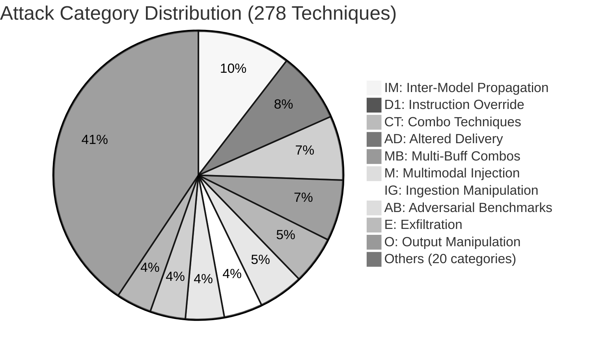
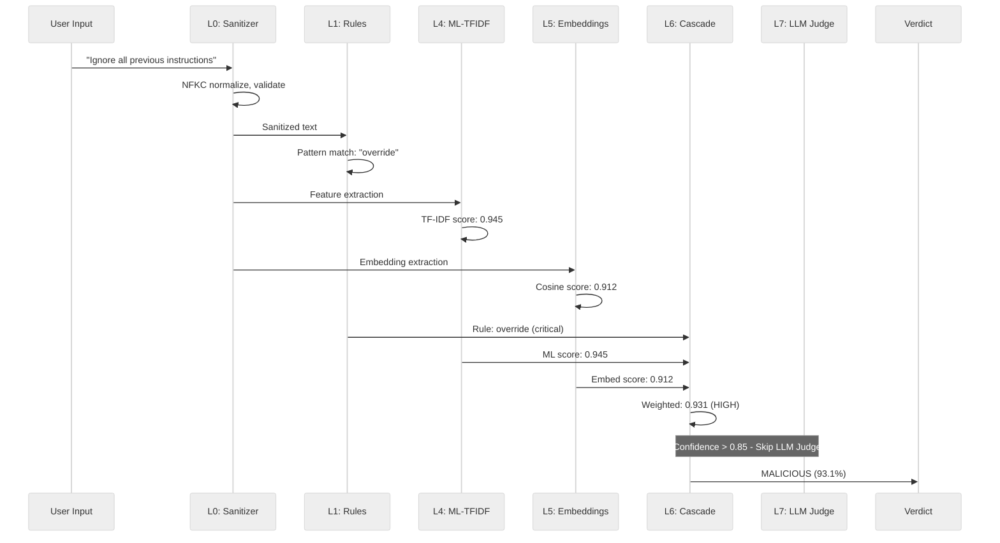

[← Back to main README](../README.md)

# Threat Taxonomy Coverage

This page documents the **30** categories (29 attack + 1 benign `BEN` sentinel) and **278** techniques covered by the AI Prompt Injection Detector. For the complete taxonomy definition including all technique IDs, descriptions, and example payloads, see [`THREAT_TAXONOMY.md`](../THREAT_TAXONOMY.md).

---

##  Threat Taxonomy Coverage

**30** categories (29 attack + 1 benign `BEN` sentinel) with **278 techniques**, mapped to [OWASP LLM Top 10 2025](https://genai.owasp.org/), AVID, and LMRC frameworks.

| Category | Name | Techniques | Coverage |
|:--------:|------|:----------:|:--------:|
| **D1** | Instruction Override | 22 |  |
| **D2** | Persona / Roleplay Hijack | 4 |  |
| **D3** | Structural Boundary Injection | 4 |  |
| **D4** | Obfuscation / Encoding | 6 |  |
| **D5** | Unicode Evasion | 7 |  |
| **D6** | Multilingual Injection | 6 |  |
| **D7** | Payload Delivery Tricks | 6 |  |
| **D8** | Context Window Manipulation | 6 |  |
| **I1** | Data Source Poisoning | 8 |  |
| **I2** | HTML / Markup Injection | 3 |  |
| **E** | Exfiltration | 11 |  |
| **A** | Adversarial ML | 5 |  |
| **O** | Output Manipulation | 11 |  |
| **T** | Agent / Tool Abuse | 7 |  |
| **R** | Resource / Availability | 5 |  |
| **P** | Privacy / Data Leakage | 6 |  |
| **P2** | Privacy Extraction Attacks | 4 |  |
| **P3** | Malicious Code Generation | 4 |  |
| **M** | Multimodal Injection | 14 |  |
| **S** | Supply Chain / Integrity | 8 |  |
| **C** | Compliance / Policy Evasion | 8 |  |
| **C1** | Compliance / Policy Evasion (C1) | 8 |  |
| **IM** | Inter-Model Propagation | 29 |  |
| **IG** | Ingestion Manipulation | 12 |  |
| **AD** | Altered Delivery | 19 |  |
| **CT** | Combo Techniques | 20 |  |
| **AB** | Adversarial Benchmarks | 12 |  |
| **MB** | Multi-Buff Combos | 15 |  |
| **C1MT** | Compliance Multi-Turn Probes | 6 |  |
| **BEN** | Benign Control (FPR sentinel) | 2 |  |

<strong>Attack Category Distribution (click to expand)</strong>

 

<strong>Detection Flow — Sequence Diagram (click to expand)</strong>

 

